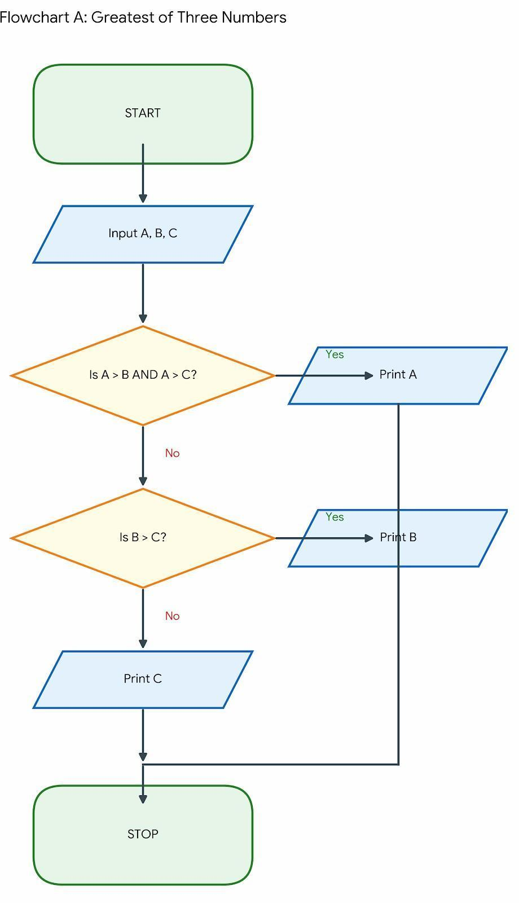
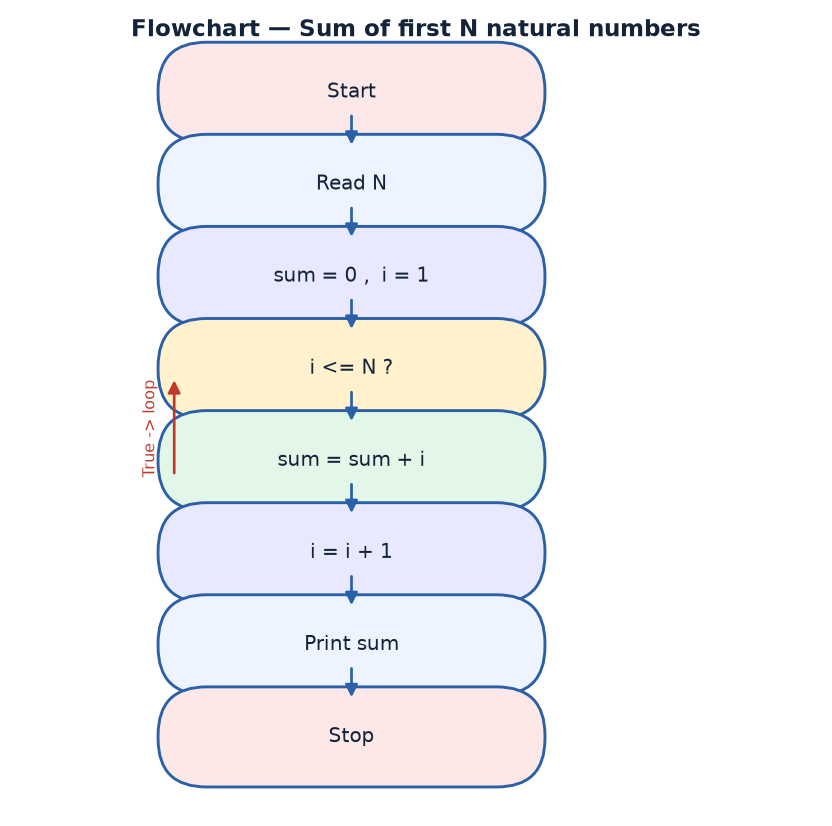
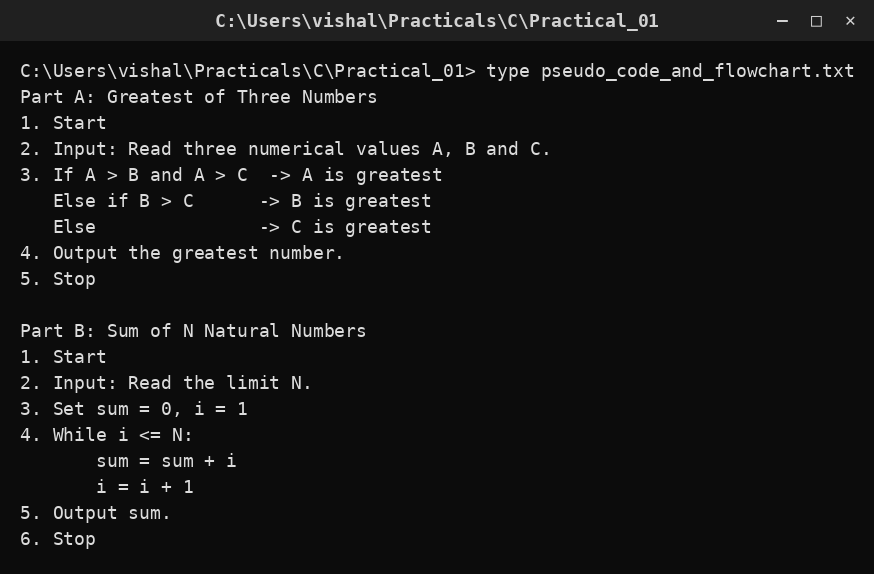

# Practical 01 — Pseudo Code & Flowchart

> Introduction to Programming with C · Lab Manual · B.Sc. (Artificial Intelligence), Semester I

## 📌 What this practical covers
- What an **algorithm** is and why we plan a solution before writing code
- **Pseudocode** — writing the steps of a solution in plain English-like language
- **Flowcharts** — drawing the same steps using standard shapes and arrows
- The five standard flowchart symbols: Oval (Start/Stop), Parallelogram (Input/Output), Rectangle (Process), Diamond (Decision), Arrows (Flow)
- How to convert a **pseudocode ↔ flowchart** (they are two views of the same logic)
- Part A: finding the **greatest of three numbers**
- Part B: finding the **sum of the first N natural numbers** (loop method + closed form `N(N+1)/2`)

## 🎯 Aim
To design pseudocode and flowcharts to determine the greatest of three numbers and to compute the sum of the first N natural numbers.

## 🧠 The big idea
Think of building a house. No one starts laying bricks on day one. First an architect draws a **plan** — where the rooms go, where the doors are. Only after the plan is approved do the masons build. Programming works the same way. Before we write a single line of C, we work out **what steps to take and in what order**. This practical is about that planning stage: no C code yet, only the *design* of the solution.

We use two planning tools. **Pseudocode** is the plan written as numbered steps in simple English, using a few special words like `IF`, `ELSE`, `WHILE`. A **flowchart** is the same plan drawn as a picture, using standard shapes connected by arrows. Pseudocode is easy to write and edit; a flowchart is easy to *see* the flow of control at a glance. Professionals sketch one or both before coding, because fixing a mistake on paper takes a minute, while fixing it in code can take an hour.

## 🔍 Deep dive

### What is an algorithm?
An **algorithm** is a finite, ordered set of clear steps that solves a problem. It has three qualities that examiners love to ask about:
1. **Finiteness** — it must end after a limited number of steps (no infinite loop).
2. **Definiteness** — each step must be unambiguous; anyone reading it should do exactly the same thing.
3. **Effectiveness** — every step must be simple enough to be carried out.

A classic non-code example is a tea recipe: boil water → add tea leaves → add milk → boil again → strain → serve. That is an algorithm for making tea. Our algorithms for this practical are "find the largest of three numbers" and "add up the first N natural numbers".

### What is pseudocode?
**Pseudocode** ("false code") is a way of writing an algorithm that looks a bit like programming but is not tied to any real language. There is no compiler for it, and no strict rules — but the conventions below are used almost everywhere.

Common pseudocode keywords:

| Keyword | Meaning |
| :--- | :--- |
| `START` / `STOP` | begin and end the algorithm |
| `READ` / `INPUT` | take a value from the user |
| `PRINT` / `DISPLAY` | show a value on the screen |
| `SET` / `←` | assign a value to a variable |
| `IF … THEN … ELSE` | make a decision |
| `WHILE … ENDWHILE` | repeat while a condition is true |
| `FOR … ENDFOR` | repeat a fixed number of times |

Pseudocode ignores the fussy details (semicolons, `#include`, data types) and keeps only the **logic**. That is exactly what we want when we are still thinking.

### What is a flowchart?
A **flowchart** is a diagram of an algorithm. Each kind of action gets its own shape, and **arrows** show the order in which the shapes are carried out. The five standard symbols are the ones you must memorise:

| Symbol | Shape | Used for |
| :--- | :--- | :--- |
| **Terminator** | Oval / rounded rectangle | `START` and `STOP` (entry and exit) |
| **Input / Output** | Parallelogram | `READ` (input) and `PRINT` (output) |
| **Process** | Rectangle | a calculation or assignment, e.g. `sum = sum + i` |
| **Decision** | Diamond | a condition with two exits — **Yes/True** and **No/False** |
| **Flow line** | Arrow | shows the direction the control moves |

A useful memory hook: **"Oval opens and closes, Parallelogram talks, Rectangle works, Diamond asks, Arrow moves."**

### Converting pseudocode ↔ flowchart
The two are translations of each other, one line at a time:

| Pseudocode line | Flowchart shape |
| :--- | :--- |
| `START` | Oval |
| `READ x` | Parallelogram |
| `SET sum = 0` | Rectangle |
| `IF x > y THEN` | Diamond (two arrows out) |
| `PRINT sum` | Parallelogram |
| `STOP` | Oval |

So if you can write the pseudocode, you can draw the flowchart, and vice-versa. Practise both directions: read a flowchart and write its pseudocode, then read pseudocode and draw its flowchart.

### Part A — Greatest of three numbers
**Problem:** read three numbers `a`, `b`, `c` and print the largest.

**Idea:** compare `a` against both others. If `a` is at least as big as `b` **and** at least as big as `c`, then `a` is the maximum. Otherwise the maximum is whichever of `b` and `c` is bigger.

**Pseudocode:**
```
START
    READ a, b, c
    IF (a >= b) AND (a >= c) THEN
        SET max = a
    ELSE
        IF (b >= c) THEN
            SET max = b
        ELSE
            SET max = c
        ENDIF
    ENDIF
    PRINT max
STOP
```

Note the two conditions joined by **AND**: `a` must beat `b` **and** `c`. Using `>=` (not `>`) means that if two numbers are equal, we still pick a correct answer.

**Flowchart logic (see the diagram section):** Oval `START` → Parallelogram reading `a, b, c` → Diamond `a >= b and a >= c?`. If **Yes**, a Rectangle sets `max = a`. If **No**, a second Diamond asks `b >= c?`; **Yes** → `max = b`, **No** → `max = c`. The two branches rejoin at a Parallelogram that prints `max`, then the Oval `STOP`.

### Part B — Sum of the first N natural numbers
**Problem:** read `N` and compute `1 + 2 + 3 + … + N`.

There are **two** correct ways, and this practical wants you to see both.

**Method 1 — the loop (repeated addition).** Start a running total at 0, then add `i` for `i = 1, 2, …, N`.

```
START
    READ N
    SET sum = 0
    SET i = 1
    WHILE (i <= N) DO
        SET sum = sum + i
        SET i = i + 1
    ENDWHILE
    PRINT sum
STOP
```

**Flowchart logic (see the diagram section):** Oval `START` → Parallelogram reading `N` → Rectangle `sum = 0, i = 1` → Diamond `i <= N?`. If **Yes**, a Rectangle does `sum = sum + i` and another does `i = i + 1`, then the arrow loops **back** to the same diamond (this loop-back arrow is what makes it a *loop*). If **No**, control leaves the loop to a Parallelogram that prints `sum`, then Oval `STOP`.

**Method 2 — the closed form (the clever shortcut).** The mathematician Carl Friedrich Gauss famously noticed that the sum of the first `N` natural numbers is:

```
sum = N × (N + 1) / 2
```

So for `N = 100` the answer is `100 × 101 / 2 = 5050` — no loop needed at all. This is why the formula is included here: **always check your loop result against the formula.** If the loop gives a different answer, the loop has a bug.

| N | Loop adds | Closed form `N(N+1)/2` |
| :--- | :--- | :--- |
| 5 | 1+2+3+4+5 = 15 | 5×6/2 = 15 |
| 10 | 1+…+10 = 55 | 10×11/2 = 55 |
| 100 | (a long loop) | 100×101/2 = 5050 |

## 📖 Key terms
| Term | Meaning |
| :--- | :--- |
| Algorithm | A finite, ordered, unambiguous set of steps that solves a problem |
| Pseudocode | An informal, English-like description of an algorithm, using keywords like IF and WHILE |
| Flowchart | A picture of an algorithm drawn with standard symbols joined by arrows |
| Terminator | The oval symbol marking START and STOP |
| Decision | The diamond symbol that asks a Yes/No question and branches two ways |
| Process | The rectangle symbol for a calculation or assignment |
| Input/Output | The parallelogram symbol for reading or printing data |
| Flow line | The arrow that shows the direction of control |
| Closed form | A direct formula (here `N(N+1)/2`) that gives the answer without a loop |
| Dry run | Tracing an algorithm by hand with sample values to check it is correct |

## 🖼️ Diagram




## 🧮 Dry run (worked example)

**Part A — greatest of three. Input: a = 12, b = 25, c = 7.**

| Step | Check | Result | Action |
| :--- | :--- | :--- | :--- |
| 1 | Read a, b, c | 12, 25, 7 | — |
| 2 | `a >= b and a >= c` → `12 >= 25 and 12 >= 7` | False | go to ELSE |
| 3 | `b >= c` → `25 >= 7` | True | `max = 25` |
| 4 | Print max | — | prints **25** |

**Part B — sum of first N. Input: N = 5.**

| Iteration | i | `i <= N`? | sum before | sum after | i after |
| :--- | :--- | :--- | :--- | :--- | :--- |
| 1 | 1 | 1 ≤ 5 True | 0 | 1 | 2 |
| 2 | 2 | True | 1 | 3 | 3 |
| 3 | 3 | True | 3 | 6 | 4 |
| 4 | 4 | True | 6 | 10 | 5 |
| 5 | 5 | True | 10 | 15 | 6 |
| 6 | 6 | 6 ≤ 5 False | — | loop ends | — |

Final `sum = 15`. Check with the formula: `5 × 6 / 2 = 15`. ✅

## ⌨️ Reading the code
There is **no C source file** for this practical. That is deliberate: Practical 1 is about designing the solution *before* coding. Your "code" here is the pseudocode above and the two flowcharts in the diagram section. Read them as if they were code:

- **Line group 1 (`START` … `READ`):** the entry point and the input. Every algorithm begins by knowing what it is given.
- **Line group 2 (the decision block):** the heart of Part A. Notice that exactly **one** of the three assignment lines can run — the branches are mutually exclusive.
- **Line group 3 (`PRINT` … `STOP`):** the output and the exit. An algorithm must always terminate.

For Part B, read the loop body carefully: `sum = sum + i` uses the *old* value of `sum` on the right and stores the new total on the left. Then `i = i + 1` moves to the next number. Getting these two lines in the wrong order is the single most common loop mistake.

## 🔑 Syntax cheat-sheet
| Syntax | Meaning |
| :--- | :--- |
| `START` / `STOP` | Begin / end the algorithm (oval) |
| `READ x` | Get a value from the user (parallelogram) |
| `PRINT x` | Display a value (parallelogram) |
| `SET x = value` | Assign a value to x (rectangle) |
| `IF cond THEN … ELSE … ENDIF` | Decision (diamond) |
| `WHILE cond DO … ENDWHILE` | Loop that repeats while a condition is true |
| `AND`, `OR`, `NOT` | Combine or negate conditions |
| `a >= b` | "a is greater than or equal to b" |

## 🖨️ Output


## ⚠️ Common mistakes
- Drawing a **decision** as a rectangle or a **process** as a diamond — each symbol has exactly one correct meaning.
- Forgetting to join the two branches of an `IF` back together before `STOP`; a flowchart must have a single exit.
- Using `>` instead of `>=` in "greatest of three", which can give a wrong answer when two numbers are equal.
- In the sum loop, writing `i = i + 1` **before** `sum = sum + i`, which then adds the wrong numbers (it skips 1 and adds one extra).
- Forgetting the loop-back arrow in the flowchart, which turns a loop into a single straight-through pass.
- Mixing up pseudocode with real C (adding semicolons, `#include`, or data types) — keep pseudocode language-neutral.

## ✅ Key takeaways
- An algorithm is the *plan*; pseudocode and flowcharts are two ways to write that plan.
- The five flowchart symbols — oval, parallelogram, rectangle, diamond, arrow — cover every algorithm you will meet this semester.
- Pseudocode and flowcharts are interchangeable: you can translate one into the other line by line.
- "Greatest of three" needs a **nested decision** because there are more than two possibilities.
- A loop-based sum should always be cross-checked against the closed form `N(N+1)/2`.

## 🏋️ Try it yourself
1. Draw the flowchart for "find the smallest of three numbers" and write its pseudocode.
2. Write pseudocode and draw a flowchart to compute the sum of the first N even numbers (2 + 4 + 6 + …), and check your loop result against the formula `N(N+1)`.
