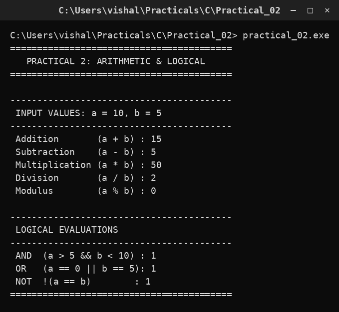

# Practical 02 — Arithmetic & Logical Operators

> **Introduction to Programming with C — Lab Manual**  
> B.Sc. (Artificial Intelligence), Semester I

---

## 🎯 Aim

To demonstrate the working of arithmetic (+, -, *, /, %) and logical (&&, ||, !) operators in C.

## 📌 Objective

Understand how arithmetic operators compute values and how logical operators combine conditions to give 1 (true) or 0 (false).

## 🧠 Concept in simple words

This program takes a = 10 and b = 5 and prints the result of every operator. Arithmetic operators do maths: + add, - subtract, * multiply, / divide (integer division drops the fraction) and % give the remainder. Logical operators join comparisons: && (AND) is true only if both sides are true, || (OR) is true if at least one side is true, and ! (NOT) flips true to false. In C any non-zero value is true and 0 is false.

## 🔑 Basic concepts used

| Concept | Meaning |
| :--- | :--- |
| `a + b` | Addition |
| `a - b` | Subtraction |
| `a * b` | Multiplication |
| `a / b` | Division (integer division truncates the fraction) |
| `a % b` | Modulus - the remainder |
| `&&` | Logical AND - true only if both conditions are true |
| `||` | Logical OR - true if any condition is true |
| `!` | Logical NOT - inverts a truth value |

## ▶️ How to use

Compile and run; the values a=10 and b=5 are fixed inside the program, so no input is needed. Read each printed line to see the operator and its result.

### Main file

[`practical_02.c`](./practical_02.c)

## 🖨️ Output

## ✅ Conclusion

Arithmetic operators produce values while logical operators produce a truth value (1 or 0), and both are the building blocks of every later program.
