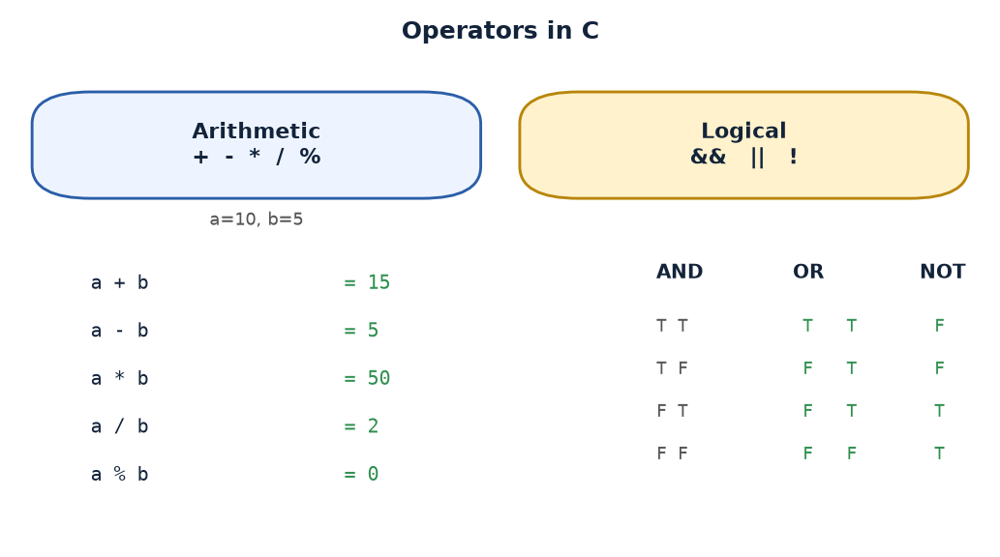

# Practical 02 — Arithmetic & Logical Operators

> Introduction to Programming with C · Lab Manual · B.Sc. (Artificial Intelligence), Semester I

## 📌 What this practical covers
- What an **operator** is, and the difference between an operator and an operand
- The five **arithmetic operators**: `+`, `-`, `*`, `/`, `%`
- **Integer division** and the **modulus** operator (and why `10 / 5` is `2`, not `2.0`)
- **Operator precedence** — which operator is applied first
- The six **relational operators**: `<`, `>`, `<=`, `>=`, `==`, `!=`
- The three **logical operators**: `&&` (AND), `||` (OR), `!` (NOT), with truth tables
- **Short-circuit evaluation** and the idea that in C "non-zero means true, zero means false"

## 🎯 Aim
To demonstrate the working of arithmetic (+, -, *, /, %) and logical (&&, ||, !) operators in C.

## 🧠 The big idea
An **operator** is a symbol that *does something* to values; the values it works on are called **operands**. In `a + b`, the `+` is the operator and `a`, `b` are the operands. This practical is simply a tour of the operators C gives you: five for arithmetic and three for logic.

Think of a calculator with two kinds of buttons. The **arithmetic** buttons (`+ - * / %`) turn two numbers into one number — the same maths you have done since school. The **logical** buttons (`&& || !`) work with *yes/no* answers instead of numbers: they combine "is a greater than 5?" and "is b less than 10?" into a single yes/no result. C stores those yes/no results as ordinary integers: **1 for true** and **0 for false**. That is the one idea that surprises newcomers — in C, a condition is really just a number.

## 🔍 Deep dive

### Operator, operand, and expression
An **expression** is a combination of operators and operands that produces a value, e.g. `a + b * 2`. The operands here are `a`, `b` and `2`; the operators are `+` and `*`. When C evaluates an expression it follows fixed rules of precedence and produces one value.

### Arithmetic operators
For our program, `a = 10` and `b = 5`.

| Operator | Name | Meaning | Example | Result |
| :--- | :--- | :--- | :--- | :--- |
| `+` | Addition | add | `a + b` | `15` |
| `-` | Subtraction | subtract | `a - b` | `5` |
| `*` | Multiplication | multiply | `a * b` | `50` |
| `/` | Division | divide | `a / b` | `2` |
| `%` | Modulus | remainder | `a % b` | `0` |

Two of these deserve special attention.

**Integer division.** Both `a` and `b` are `int`, so `a / b` does **integer division**: it keeps the whole-number part and throws away any fraction. `10 / 5 = 2` exactly here. But if the values were `7 / 2`, the answer would be `3`, not `3.5`, because the fractional part is discarded. To get `3.5` you would need at least one operand to be a floating-point number, e.g. `7.0 / 2`.

**Modulus `%`.** Modulus gives the **remainder** after division. `10 % 5 = 0` because 5 divides 10 exactly. `7 % 2 = 1` because 7 ÷ 2 leaves remainder 1. The `%` operator only works on integers, not on `float` values. It is the standard way to test "is a number even?" (`n % 2 == 0`) or to get the last digit of a number (`n % 10`).

### Operator precedence
When an expression mixes operators, C evaluates them in a fixed order, like BODMAS:

| Priority | Operators | Associativity |
| :--- | :--- | :--- |
| 1 (highest) | `()` parentheses | left to right |
| 2 | `!` | right to left |
| 3 | `*` `/` `%` | left to right |
| 4 | `+` `-` | left to right |
| 5 | `<` `<=` `>` `>=` | left to right |
| 6 | `==` `!=` | left to right |
| 7 | `&&` | left to right |
| 8 (lowest) | `\|\|` | left to right |

So `*`, `/`, `%` are all done before `+` and `-`. When in doubt, add parentheses — they cost nothing and make your intent obvious. In our program the arithmetic is kept simple, so the printed values are exactly what you expect.

### Relational operators
Relational (comparison) operators compare two values and give `1` (true) or `0` (false):

| Operator | Meaning | `10 __ 5` |
| :--- | :--- | :--- |
| `<` | less than | `10 < 5` → `0` |
| `>` | greater than | `10 > 5` → `1` |
| `<=` | less than or equal | `10 <= 5` → `0` |
| `>=` | greater than or equal | `10 >= 5` → `1` |
| `==` | equal to | `10 == 5` → `0` |
| `!=` | not equal to | `10 != 5` → `1` |

Watch out for the classic trap: `=` means **assign**, `==` means **compare**. Mixing them up is the single most common C bug.

### Logical operators and truth tables
Logical operators combine or flip truth values.

**AND (`&&`)** is true only when *both* sides are true:

| A | B | A && B |
| :--- | :--- | :--- |
| 1 | 1 | 1 |
| 1 | 0 | 0 |
| 0 | 1 | 0 |
| 0 | 0 | 0 |

**OR (`||`)** is true when *at least one* side is true:

| A | B | A \|\| B |
| :--- | :--- | :--- |
| 1 | 1 | 1 |
| 1 | 0 | 1 |
| 0 | 1 | 1 |
| 0 | 0 | 0 |

**NOT (`!`)** flips a single value:

| A | !A |
| :--- | :--- |
| 1 | 0 |
| 0 | 1 |

In our program:
- `a > 5 && b < 10` → `10 > 5` is `1`, `5 < 10` is `1`, so `1 && 1 = 1`.
- `a == 0 || b == 5` → `10 == 0` is `0`, `5 == 5` is `1`, so `0 || 1 = 1`.
- `!(a == b)` → `10 == 5` is `0`, so `!(0) = 1`.

### Short-circuit evaluation
C is lazy in a clever way. In `A && B`, if `A` is already **false**, the whole AND must be false, so C **does not bother evaluating `B`**. Similarly in `A || B`, if `A` is **true**, the whole OR is true and `B` is skipped. This is called **short-circuit evaluation**.

Why does it matter? It saves time, and it protects you from errors. For example, `if (i < n && arr[i] > 0)` is safe even when `i == n`, because when `i < n` is false the second part is never evaluated. The order of operands is therefore meaningful — put the "guard" condition first.

### True and false in C
C has no separate `bool` type in the classic style used here; it uses integers. The rule is: **0 is false, anything non-zero is true**. So `if (5)` is treated as true, and `if (0)` as false. The logical operators always *produce* a clean `1` or `0`, which is why the program prints `1` and not, say, `5`.

## 📖 Key terms
| Term | Meaning |
| :--- | :--- |
| Operator | A symbol that performs an operation, e.g. `+`, `%`, `&&` |
| Operand | A value the operator acts on |
| Expression | A combination of operators and operands that yields a value |
| Integer division | Division of two integers that discards the fractional part |
| Modulus `%` | The remainder left after division; works only on integers |
| Precedence | The fixed order in which operators are evaluated |
| Relational operator | A comparison that yields 1 (true) or 0 (false) |
| Logical operator | `&&`, `\|\|`, `!` — combine or negate truth values |
| Short-circuit | Skipping the second operand of `&&`/`\|\|` when the answer is already known |
| Truth value | In C, `0` = false and any non-zero value = true |

## 🖼️ Diagram


## 🧮 Dry run (worked example)
The program hardcodes `a = 10`, `b = 5`, so we can trace every printed line.

| Printed line | Expression | Substitution | Value shown |
| :--- | :--- | :--- | :--- |
| Addition | `a + b` | `10 + 5` | 15 |
| Subtraction | `a - b` | `10 - 5` | 5 |
| Multiplication | `a * b` | `10 * 5` | 50 |
| Division | `a / b` | `10 / 5` (integer) | 2 |
| Modulus | `a % b` | `10 % 5` | 0 |
| AND | `a > 5 && b < 10` | `1 && 1` | 1 |
| OR | `a == 0 \|\| b == 5` | `0 \|\| 1` | 1 |
| NOT | `!(a == b)` | `!(0)` | 1 |

Every arithmetic result is exact here because 10 and 5 divide evenly; remember that this is a lucky case, not the general rule for integer division.

## ⌨️ Reading the code
```c
/* Practical 2: Arithmetic and Logical Operators. a = 10, b = 5 hardcoded. */
#include <stdio.h>
#include <conio.h>
void main()
{
    int a = 10, b = 5;
    printf("=========================================\n");
    printf("   PRACTICAL 2: ARITHMETIC & LOGICAL     \n");
    printf("=========================================\n\n");
    printf("-----------------------------------------\n");
    printf(" INPUT VALUES: a = %d, b = %d\n", a, b);
    printf("-----------------------------------------\n");
    printf(" Addition       (a + b) : %d\n", a + b);
    printf(" Subtraction    (a - b) : %d\n", a - b);
    printf(" Multiplication (a * b) : %d\n", a * b);
    printf(" Division       (a / b) : %d\n", a / b);
    printf(" Modulus        (a %% b) : %d\n", a % b);
    printf("\n-----------------------------------------\n");
    printf(" LOGICAL EVALUATIONS\n");
    printf("-----------------------------------------\n");
    printf(" AND  (a > 5 && b < 10) : %d\n", (a > 5 && b < 10));
    printf(" OR   (a == 0 || b == 5): %d\n", (a == 0 || b == 5));
    printf(" NOT  !(a == b)        : %d\n", !(a == b));
    printf("=========================================\n");
    getch();
}
```

- **`#include <stdio.h>`** — brings in `printf`, which we use to print. **`#include <conio.h>`** — a non-standard Turbo C header that gives us `getch()` at the end.
- **`void main()`** — the program starts here. (In modern standard C you would write `int main()` and `return 0;`, but Turbo C accepts `void main()`.)
- **`int a = 10, b = 5;`** — declares two integers and initialises them. These are the operands for the whole program.
- **The banner `printf`s** — purely cosmetic; they print the box of `=` and `-` lines that make the output look tidy.
- **`printf(" INPUT VALUES: a = %d, b = %d\n", a, b);`** — `%d` is the placeholder for an `int`; the two values `a` and `b` are dropped into it.
- **The five arithmetic `printf`s** — each computes its expression right inside the call. `a + b`, `a - b`, etc. are evaluated first, then printed with `%d`.
- **`a %% b`** — the **double percent** is needed because `%` has a special meaning inside a `printf` format string (it starts a placeholder like `%d`). To print a literal `%` you write `%%`. The *operator* is still a single `%` in the expression `a % b`.
- **The three logical `printf`s** — the expressions are wrapped in parentheses so the comparison happens before it is passed to `printf`. Each prints `1` or `0`.
- **`getch();`** — waits for a keypress so the Turbo C console window does not vanish before you can read the output.

## 🔑 Syntax cheat-sheet
| Syntax | Meaning |
| :--- | :--- |
| `a + b`, `a - b`, `a * b` | Add, subtract, multiply |
| `a / b` | Divide (integer division if both are int) |
| `a % b` | Remainder of `a ÷ b` (integers only) |
| `a > b`, `a < b`, `a >= b`, `a <= b` | Relational comparisons → 1 or 0 |
| `a == b` | Equal to (compare, not assign) |
| `a != b` | Not equal to |
| `A && B` | Logical AND — true only if both are true |
| `A \|\| B` | Logical OR — true if at least one is true |
| `!A` | Logical NOT — flips true ↔ false |
| `%d` | Format specifier for printing an `int` |
| `%%` | Prints a literal percent sign |

## 🖨️ Output


```
=========================================
   PRACTICAL 2: ARITHMETIC & LOGICAL     
=========================================

-----------------------------------------
 INPUT VALUES: a = 10, b = 5
-----------------------------------------
 Addition       (a + b) : 15
 Subtraction    (a - b) : 5
 Multiplication (a * b) : 50
 Division       (a / b) : 2
 Modulus        (a % b) : 0

-----------------------------------------
 LOGICAL EVALUATIONS
-----------------------------------------
 AND  (a > 5 && b < 10) : 1
 OR   (a == 0 || b == 5): 1
 NOT  !(a == b)        : 1
=========================================
```

## ⚠️ Common mistakes
- Using `=` (assignment) where you meant `==` (comparison) — `if (a = b)` assigns, it does not compare.
- Forgetting that `/` between two integers **truncates**: `7 / 2` is `3`, not `3.5`.
- Using `%` on `float` values — the modulus operator is only for integers.
- Writing `%` inside a `printf` string when you mean a literal percent sign; you must write `%%`.
- Assuming `&&` or `||` always evaluates both sides — they short-circuit, so a side effect on the skipped side may never happen.
- Reading `1` and `0` in the output as numbers rather than as "true" and "false".

## ✅ Key takeaways
- An operator acts on operands; an expression is operators plus operands producing one value.
- Integer division drops the fraction; modulus gives the remainder — both are integers-only ideas.
- Precedence follows BODMAS-like rules; use parentheses to be safe and clear.
- Relational and logical operators all produce `1` (true) or `0` (false).
- `&&` and `||` short-circuit, so the order of operands can matter.

## 🏋️ Try it yourself
1. Change the program so `a = 17` and `b = 5`, then predict `a / b` and `a % b` before running it. (Answers: 3 and 2.)
2. Add a line that prints `(a > b || a % 2 == 0)` and work out whether it prints `1` or `0` for `a = 17`, `b = 5`.
