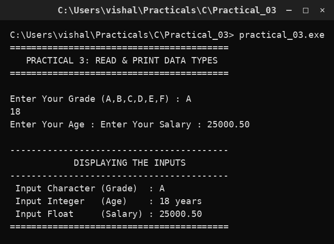

# Practical 03 — Read & Print Different Data Types

> **Introduction to Programming with C — Lab Manual**  
> B.Sc. (Artificial Intelligence), Semester I

---

## 🎯 Aim

To read values of different data types from the user and print the entered values.

## 📌 Objective

Learn how int, float and char variables store data and how the correct format specifier prints each one.

## 🧠 Concept in simple words

The program asks for a grade (a character), an age (a whole number) and a salary (a decimal number), stores them in variables of the right type and prints them back. Each type has its own format specifier: %c for char, %d for int and %f for float. Using the wrong specifier prints a meaningless value, so the type and the specifier must always match.

## 🔑 Basic concepts used

| Concept | Meaning |
| :--- | :--- |
| `char (%c)` | Stores one character, e.g. 'A'. |
| `int (%d)` | Stores a whole number, e.g. 18. |
| `float (%f)` | Stores a decimal number, e.g. 25000.50. |
| `scanf()` | Reads input from the keyboard. |
| `printf()` | Prints formatted output to the screen. |

## ▶️ How to use

Run the program and enter, for example, grade A, age 18 and salary 25000.50. The program prints the same values back with their types.

### Main file

[`practical_03.c`](./practical_03.c)

## 🖨️ Output

## ✅ Conclusion

Choosing the right data type and its matching format specifier is essential for correct input and output.
