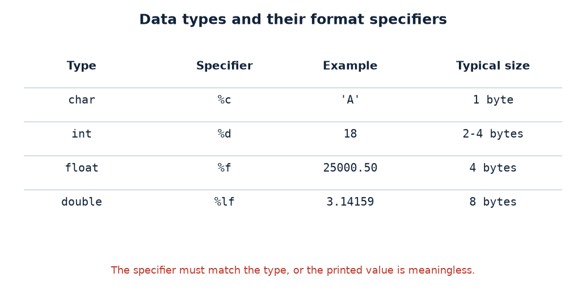

# Practical 03 — Read & Print Different Data Types

> Introduction to Programming with C · Lab Manual · B.Sc. (Artificial Intelligence), Semester I

## 📌 What this practical covers
- What a **data type** is and why C needs them
- The four basic data types: **char**, **int**, **float**, **double** — with their sizes and ranges
- **Format specifiers** (`%c`, `%d`, `%f`, `%lf`) and why they must match the data type
- Reading input with **`scanf`** and printing with **`printf`**
- Why `scanf` needs the **address-of operator `&`** but `printf` does not
- The `"%c "` **trailing-space trick** to swallow the leftover newline
- Controlling decimal places with precision, e.g. **`%.2f`**

## 🎯 Aim
To read values of different data types from the user and print the entered values.

## 🧠 The big idea
A **data type** tells C two things: **how much memory** to set aside for a value, and **how to interpret the bits** stored there. A letter like `'A'` and a number like `18` are stored differently, and a price like `25000.50` needs decimal places that a whole number does not. If you declare a variable with the wrong type, C may store the wrong bytes or print nonsense.

Think of different-sized containers in a kitchen. A **char** is a tiny spice jar — room for one character. An **int** is a normal bowl — a whole number. A **float** is a measuring cup with markings — a number with a decimal part. You would not pour a litre of water into a spice jar, and you would not expect a bowl to show you half-litres precisely. Choosing the right container (type) is half of getting input and output right; the other half is using the matching **format specifier** so `printf` and `scanf` know how to read that container.

## 🔍 Deep dive

### What is a data type?
Every variable in C has a **type**. The type fixes:
1. **Size** — how many bytes of memory it occupies.
2. **Range** — the smallest and largest values it can hold.
3. **Interpretation** — whether the stored bits mean a character, an integer, or a decimal number.
4. **Operations allowed** — e.g. you can take `%` of integers but not of floats.

### The four basic data types
| Type | Typical size | Stores | Example | Format specifier |
| :--- | :--- | :--- | :--- | :--- |
| `char` | 1 byte | a single character | `'A'`, `'7'`, `'$'` | `%c` |
| `int` | 4 bytes | whole numbers | `18`, `-250`, `1000` | `%d` |
| `float` | 4 bytes | decimals (≈7 digits precision) | `25000.50`, `3.14` | `%f` |
| `double` | 8 bytes | decimals (≈15 digits precision) | `3.1415926535` | `%lf` |

**Ranges (typical modern C):**
- `char` — from `-128` to `127` (or `0` to `255` if `unsigned`).
- `int` — roughly `-2,147,483,648` to `2,147,483,647`.
- `float` — about 6–7 significant decimal digits.
- `double` — about 15 significant decimal digits.

A note for old Turbo C users: there, `int` is only **2 bytes** (range about `-32,768` to `32,767`). The source below uses `int age`, which is fine for values like 18 on any compiler.

A `char` is really a small integer under the hood — it stores the **ASCII code** of the character. `'A'` is 65, `'B'` is 66, and so on. That is why a `char` can be printed with `%c` (the letter) or with `%d` (its code).

### Format specifiers and why they must match
A **format specifier** is the `%`-code inside a `printf`/`scanf` string that says "put a value of this type here". The specifier must match the type of the variable you pass:

| Specifier | For type | Prints as |
| :--- | :--- | :--- |
| `%c` | char | the character |
| `%d` | int | the whole number |
| `%f` | float | decimal number (default 6 places) |
| `%lf` | double | decimal number (in `scanf`) |
| `%.2f` | float/double | decimal number rounded to 2 places |

If the specifier and the variable type disagree (say you use `%d` for a `float`), C will not warn you — it will simply read the wrong bytes and print garbage. This is one of the most common beginner bugs.

### `scanf` vs `printf`, and the `&` operator
- **`printf`** sends values **out** to the screen. You pass the *values* themselves: `printf("%d", age);`
- **`scanf`** brings values **in** from the keyboard. It must know *where to store* them, so you pass the **address** of the variable, written with the address-of operator **`&`**: `scanf("%d", &age);`

Think of it this way: `printf` only needs to *see* the value to print it. `scanf` needs to *find the box* in memory to put the value into, so you hand it the box's address. **Forgetting the `&` in `scanf` is a classic crash-or-garbage bug.** (An exception is a string/array name, which is already an address.)

### The `"%c "` trailing-space trick
Here is a subtlety that trips up almost everyone. When you type a character and press **Enter**, the keyboard buffer holds *two* characters: the letter you typed **and** the newline `'\n'` from the Enter key. The `scanf("%c", &grade)` reads only the letter, leaving the `'\n'` behind. The *next* `scanf` might then read that leftover newline instead of the value you intended.

The code writes the format as `"%c "` — with a **space after the `%c`**. A whitespace character in a `scanf` format string tells `scanf` to **skip any whitespace** (spaces, tabs, newlines) that follows. So it consumes the stray newline before the next read, keeping the input stream clean.

A friendly warning: because that trailing space keeps skipping whitespace, some compilers will make the program wait until you type a *non-whitespace* character before it returns. The tidier and more common idiom is to put the space **before** the conversion — `" %c"` — which skips *leading* whitespace. Both appear in real code; knowing what the space means is the important part.

### Precision with `%.2f`
By default, `%f` prints six digits after the decimal point (e.g. `25000.500000`). The **precision** is set by putting a `.n` between `%` and `f`: `%.2f` prints exactly **two** digits, rounding as needed. So `25000.50` prints as `25000.50`, and `3.14159` prints as `3.14`. Precision only changes the *display* — the stored value keeps its full accuracy.

### Input and output basics
- Input always goes through `scanf` with the address (`&`), output through `printf` without it.
- The order of `scanf` calls must match the order in which you expect the user to type (or the order of the prompts).
- `\n` at the end of a `printf` moves the cursor to the next line; forgetting it makes the next output appear on the same line.

## 📖 Key terms
| Term | Meaning |
| :--- | :--- |
| Data type | The kind of value a variable holds; fixes its size, range and interpretation |
| `char` | Type for a single character (stores its ASCII code) |
| `int` | Type for whole numbers |
| `float` | Type for decimal numbers with about 7 digits of precision |
| `double` | Type for decimal numbers with about 15 digits of precision |
| Format specifier | The `%`-code (`%d`, `%c`, `%f`…) telling printf/scanf the type |
| Address-of operator `&` | Gives the memory address of a variable; required by `scanf` |
| `scanf` | Reads typed input into variables (needs `&`) |
| `printf` | Displays values on screen (no `&`) |
| Precision `%.2f` | Number of digits printed after the decimal point |

## 🖼️ Diagram


## 🧮 Dry run (worked example)
**Input typed by the user: grade `A`, age `18`, salary `25000.50`.**

| Step | Statement | What happens | Buffer/state after |
| :--- | :--- | :--- | :--- |
| 1 | `scanf("%c ", &grade)` | reads `'A'` into `grade`; the space skips the leftover `'\n'` | `grade = 'A'` |
| 2 | `scanf("%d", &age)` | reads `18` into `age` | `age = 18` |
| 3 | `scanf("%f", &salary)` | reads `25000.50` into `salary` | `salary = 25000.50` |
| 4 | `printf("... %c\n", grade)` | prints the character | `A` |
| 5 | `printf("... %d years\n", age)` | prints the integer | `18 years` |
| 6 | `printf("... %.2f\n", salary)` | prints with 2 decimal places | `25000.50` |

Displayed output:

```
-----------------------------------------
            DISPLAYING THE INPUTS         
-----------------------------------------
 Input Character (Grade)  : A
 Input Integer   (Age)    : 18 years
 Input Float     (Salary) : 25000.50
=========================================
```

## ⌨️ Reading the code
```c
#include <stdio.h>
#include <conio.h>
void main()
{
    int age; float salary; char grade;
    printf("=========================================\n");
    printf("   PRACTICAL 3: READ & PRINT DATA TYPES  \n");
    printf("=========================================\n\n");
    printf("Enter Your Grade (A,B,C,D,E,F) : "); scanf("%c ", &grade);
    printf("Enter Your Age : "); scanf("%d", &age);
    printf("Enter Your Salary : "); scanf("%f", &salary);
    printf("\n-----------------------------------------\n");
    printf("            DISPLAYING THE INPUTS         \n");
    printf("-----------------------------------------\n");
    printf(" Input Character (Grade)  : %c\n", grade);
    printf(" Input Integer   (Age)    : %d years\n", age);
    printf(" Input Float     (Salary) : %.2f\n", salary);
    printf("=========================================\n");
    getch();
}
```

- **`#include <stdio.h>`** — gives us `printf` and `scanf`. **`#include <conio.h>`** — gives `getch()`.
- **`int age; float salary; char grade;`** — declares three variables of three different types. This is the heart of the practical: one of each kind.
- **The banner `printf`s** — cosmetic box drawing only.
- **`printf("Enter Your Grade ... : "); scanf("%c ", &grade);`** — prints the prompt (no `\n`, so the cursor stays on the same line for typing), then reads **one character** with `%c`. The trailing space in the format skips the leftover newline. The `&` gives the address of `grade`.
- **`scanf("%d", &age);`** — reads an **integer** with `%d`. Note it stops at the first non-digit.
- **`scanf("%f", &salary);`** — reads a **float** with `%f`. The user may type `25000.50` or `25000.5`; both work.
- **The "DISPLAYING THE INPUTS" block** — prints a heading, then echoes each value back:
  - `%c` prints the character `grade`.
  - `%d` prints the integer `age`, followed by the literal word `years`.
  - `%.2f` prints `salary` rounded to two decimal places.
- **`getch();`** — waits for a keypress so the console window stays open (Turbo C behaviour).

## 🔑 Syntax cheat-sheet
| Syntax | Meaning |
| :--- | :--- |
| `int age;` | Declare an integer variable |
| `float salary;` | Declare a float variable |
| `char grade;` | Declare a character variable |
| `scanf("%d", &age);` | Read an int from the keyboard into `age` |
| `scanf("%c", &grade);` | Read one character |
| `scanf("%f", &salary);` | Read a float |
| `printf("%d", age);` | Print an int |
| `printf("%c", grade);` | Print a char |
| `printf("%.2f", salary);` | Print a float to 2 decimal places |
| `&variable` | The address of a variable (needed by scanf) |
| `" %c"` | Format that skips leading whitespace before reading a char |

## 🖨️ Output


## ⚠️ Common mistakes
- Forgetting the `&` in `scanf` — `scanf("%d", age)` instead of `scanf("%d", &age)` — which reads into a garbage address.
- Mismatching specifier and type, e.g. printing a `float` with `%d`, which shows a wrong number.
- Ignoring the leftover newline after reading a `char`, so the next `scanf` reads `'\n'` instead of the typed value.
- Using `%f` where `%lf` is required for a `double` in `scanf` (C needs the `l` there).
- Expecting `%f` to show two decimals by default — it shows six; you need `%.2f` for two.
- Declaring a variable but forgetting to read it before printing, so old garbage is displayed.

## ✅ Key takeaways
- A data type sets a variable's size, range and interpretation.
- `char` (1 byte), `int`, `float` (≈7 digits) and `double` (≈15 digits) are the basic types.
- The format specifier must match the variable's type.
- `scanf` needs the address-of operator `&`; `printf` does not.
- Whitespace in a `scanf` format (like the space in `"%c "`) skips leftover whitespace such as the newline after Enter.
- `%.2f` controls the number of digits shown after the decimal point.

## 🏋️ Try it yourself
1. Add a `double` variable `pi` set to `3.14159265` and print it with `%lf` and then with `%.4lf`. Compare the two outputs.
2. Change the grade prompt to read a `char` without the trailing space (`"%c"`), then run it and observe what goes wrong with the next input. Explain why.
