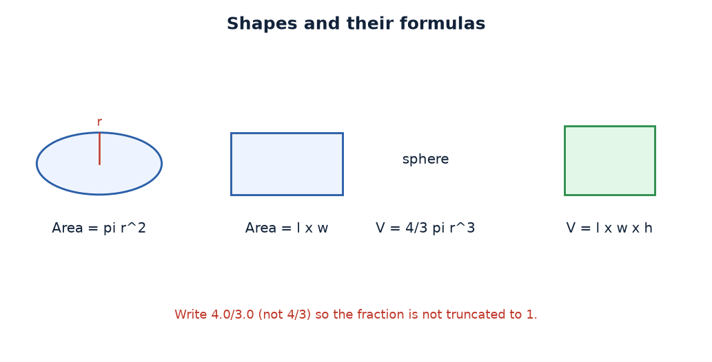

# Practical 04 — Area & Volume of Shapes

> Introduction to Programming with C · Lab Manual · B.Sc. (Artificial Intelligence), Semester I

## 📌 What this practical covers
- Translating a **maths formula** into a **C expression**
- Using the **`float`** data type for values with decimals
- The constant **π (pi)** and how to use it
- Why **`(4.0 / 3.0)`** must not be written as **`(4 / 3)`** — integer division truncates
- Computing **powers by repeated multiplication** (`r²` = `r * r`, `r³` = `r * r * r`)
- **Operator precedence** and why parentheses keep expressions correct and readable
- Computing the **area of a circle** and a **rectangle**, and the **volume of a sphere** and a **box**

## 🎯 Aim
To calculate the area of a circle and a rectangle and the volume of a sphere and a box.

## 🧠 The big idea
A maths formula like *Area of a circle = π r²* is a recipe, and a **C expression** is how you write that recipe so the computer can follow it. The only real skill is a careful, word-by-word translation: `π` becomes `3.14`, `r²` becomes `radius * radius`, and the implicit multiplication becomes a `*`.

There is one trap that catches everybody. In maths, `4/3` is just the fraction "four-thirds". In C, if both numbers are whole numbers, `4 / 3` means **integer division** and gives `1` (the fraction is thrown away). So writing `(4/3) * 3.14 * r * r * r` would make every sphere too small by a quarter. The fix is to write at least one of them with a decimal point: `(4.0 / 3.0)`. Then C treats them as `float` values and gives the true `1.333…`. Remember this rule for the rest of your programming life: **to keep a fraction, make at least one operand a decimal.**

## 🔍 Deep dive

### From formula to expression
Take each formula and read it left to right, replacing maths symbols with C operators:

| Shape | Maths formula | C expression |
| :--- | :--- | :--- |
| Circle area | π r² | `3.14 * radius * radius` |
| Rectangle area | length × width | `length * width` |
| Sphere volume | (4/3) π r³ | `(4.0 / 3.0) * 3.14 * radius * radius * radius` |
| Box volume | length × width × height | `length * width * height` |

Notice that in C we must write every multiplication explicitly with `*`. There is no "juxtaposition" — `radius radius` or `3.14 r` means nothing to the compiler.

### Using `float` for decimals
Areas and volumes are rarely whole numbers, so we declare the variables as **`float`**:
```c
float radius, length, width, height;
float circleArea, rectArea, sphereVol, boxVol;
```
If you declared these as `int`, then `28.26` would be stored as `28` and every decimal would be lost. Rule of thumb: **if the answer can have a decimal point, use `float` (or `double`).**

### The constant π
C does not have a built-in π symbol in the classic style used here, so we type its value directly: **`3.14`**. That is accurate enough for a first lab. More precise values are `3.14159` or the standard `3.14159265358979`. If you wanted a named constant you could write `#define PI 3.14` at the top of the file and then use `PI` everywhere — that is cleaner and avoids typos, but this program simply writes `3.14` inline.

### Why `(4.0 / 3.0)` and not `(4 / 3)`
This is the most important lesson of the practical. Look at the two versions:

| Written as | C sees | Result | Effect on the sphere volume |
| :--- | :--- | :--- | :--- |
| `(4 / 3)` | two `int`s → integer division | `1` | volume comes out 25% too small |
| `(4.0 / 3.0)` | two `float`s → real division | `1.333…` | volume is correct |

Because `4` and `3` are both integers, `4 / 3` truncates to `1`. Adding `.0` makes them floats, so the division keeps the fraction. This single character difference — the decimal point — is the difference between a right answer and a wrong one.

### Powers by repeated multiplication
C has no `**` operator for powers in this style. To get `r²` you multiply `r` by itself once, and `r³` you multiply three copies together:
- `r²` → `radius * radius`
- `r³` → `radius * radius * radius`

It looks repetitive, but it is exact and fast, and it is how these classic lab programs are written.

### Operator precedence and parentheses
Recall the order: `*`, `/` are evaluated **before** `+`, `-`, and parentheses are evaluated first of all. In `(4.0 / 3.0) * 3.14 * radius * radius * radius`, the parentheses force the `4.0 / 3.0` division to happen first, producing `1.333…`, and then the multiplications run left to right. Without the parentheses, `4.0 / 3.0 * 3.14 ...` would still be *arithmetically* the same here (because `*` and `/` are equal priority and go left to right), but the parentheses make the intent unmistakable. **When a formula has a fraction, always wrap it in parentheses.**

## 📖 Key terms
| Term | Meaning |
| :--- | :--- |
| `float` | Data type for numbers with a decimal part |
| Expression | A combination of operators and operands that produces a value |
| Integer division | Division of two integers that discards the fractional part |
| π (pi) | The circle constant ≈ 3.14, used for circles and spheres |
| r² | "r squared" — r multiplied by itself once |
| r³ | "r cubed" — r multiplied by itself twice |
| Precedence | The order in which operators are evaluated |
| Parentheses `()` | Force the enclosed part to be evaluated first |
| Truncation | Cutting off the fractional part of a number |

## 🖼️ Diagram


## 🧮 Dry run (worked example)
**Inputs: radius = 3, length = 4, width = 5, height = 6.**

| Quantity | Expression | Substitution | Value | Printed (2 dp) |
| :--- | :--- | :--- | :--- | :--- |
| Circle area | `3.14 * radius * radius` | `3.14 * 3 * 3` | 28.26 | 28.26 |
| Rectangle area | `length * width` | `4 * 5` | 20.00 | 20.00 |
| Sphere volume | `(4.0/3.0) * 3.14 * r³` | `1.333… * 3.14 * 27` | 113.04 | 113.04 |
| Box volume | `length * width * height` | `4 * 5 * 6` | 120.00 | 120.00 |

Step-by-step for the sphere: `4.0 / 3.0 = 1.333…`; times `3.14 = 4.186…`; times `27 (r³) = 113.04`. ✅

## ⌨️ Reading the code
```c
#include <stdio.h>
#include <conio.h>
void main()
{
    float radius, length, width, height;
    float circleArea, rectArea, sphereVol, boxVol;
    printf("Enter radius for Circle/Sphere : "); scanf("%f", &radius);
    printf("Enter length of rectangle     : "); scanf("%f", &length);
    printf("Enter width of rectangle      : "); scanf("%f", &width);
    printf("Enter height of box           : "); scanf("%f", &height);
    circleArea = 3.14 * radius * radius;
    rectArea   = length * width;
    sphereVol  = (4.0 / 3.0) * 3.14 * radius * radius * radius;
    boxVol     = length * width * height;
    printf(" Area of Circle      : %.2f\n", circleArea);
    printf(" Area of Rectangle   : %.2f\n", rectArea);
    printf(" Volume of Sphere    : %.2f\n", sphereVol);
    printf(" Volume of Box       : %.2f\n", boxVol);
    getch();
}
```

- **`#include <stdio.h>` / `#include <conio.h>`** — standard I/O and the Turbo C `getch()`.
- **`float radius, length, width, height;`** — the four **input** measurements, all floats.
- **`float circleArea, rectArea, sphereVol, boxVol;`** — the four **result** variables, also floats so they can hold decimals.
- **The four `printf` + `scanf` pairs** — each prints a prompt and reads one float with `%f` and `&`. The radius is used twice (for both the circle and the sphere), so it is read only once.
- **`circleArea = 3.14 * radius * radius;`** — π r². The right-hand side is computed first, then stored in `circleArea`.
- **`rectArea = length * width;`** — length × width.
- **`sphereVol = (4.0 / 3.0) * 3.14 * radius * radius * radius;`** — the (4/3)πr³ formula. The parentheses guarantee a real (non-truncated) `1.333…`.
- **`boxVol = length * width * height;`** — length × width × height.
- **The four output `printf`s** — each uses `%.2f` so the answer shows exactly two decimal places.
- **`getch();`** — waits for a keypress before closing.

## 🔑 Syntax cheat-sheet
| Syntax | Meaning |
| :--- | :--- |
| `float x;` | Declare a decimal-number variable |
| `scanf("%f", &x);` | Read a float from the keyboard |
| `printf("%.2f", x);` | Print a float to 2 decimal places |
| `a * b` | Multiplication |
| `(4.0 / 3.0)` | Real division (keeps the fraction) |
| `(4 / 3)` | Integer division (truncates to 1) — avoid here |
| `x * x` | x squared |
| `x * x * x` | x cubed |
| `3.14` | Approximate value of π |

## 🖨️ Output


## ⚠️ Common mistakes
- Writing `(4/3)` instead of `(4.0/3.0)` for the sphere, which truncates to `1` and shrinks the volume.
- Declaring the result variables as `int`, which throws away every decimal place.
- Forgetting a `*` between factors, e.g. `3.14 radius` instead of `3.14 * radius`.
- Using `%d` to print a `float` — the number shown will be wrong.
- Omitting the `&` in `scanf`.
- Reading `radius` twice (once for the circle, once for the sphere) when the same value is meant for both.

## ✅ Key takeaways
- A maths formula becomes a C expression by replacing each maths symbol with a C operator and writing every `*` explicitly.
- Use `float` for any value that can have a decimal point.
- Integer division truncates; write `(4.0 / 3.0)` to keep the fraction.
- Compute powers with repeated multiplication: `r²` = `r * r`, `r³` = `r * r * r`.
- Parentheses make fractions correct and code readable.
- `%.2f` displays results neatly to two decimal places.

## 🏋️ Try it yourself
1. Add a calculation for the **volume of a cylinder**, `π r² h`, using the `height` you already read. (Formula: `3.14 * radius * radius * height`.)
2. Change the program to read a `radius` of `5` and predict the circle area before running it. (Answer: `3.14 * 5 * 5 = 78.50`.)
