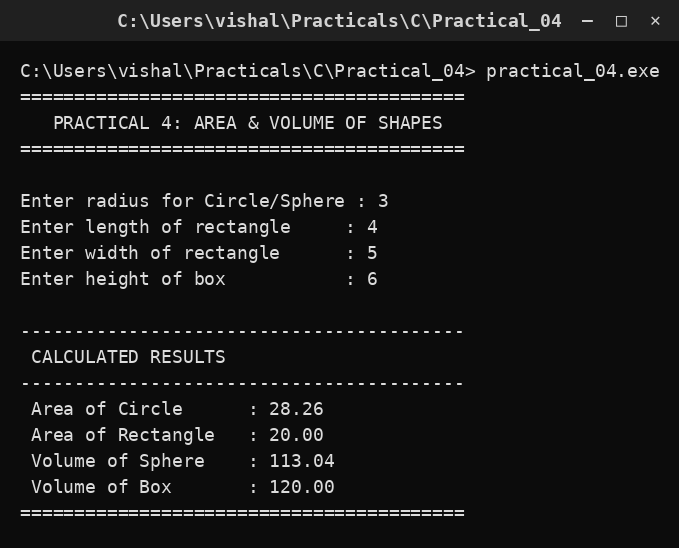

# Practical 04 — Area & Volume of Shapes

> **Introduction to Programming with C — Lab Manual**  
> B.Sc. (Artificial Intelligence), Semester I

---

## 🎯 Aim

To calculate the area of a circle and a rectangle and the volume of a sphere and a box.

## 📌 Objective

Translate geometric formulas into C expressions using floating-point arithmetic.

## 🧠 Concept in simple words

The program reads a radius, a length, a width and a height and applies four formulas: circle area = pi*r*r, rectangle area = length*width, sphere volume = (4/3)*pi*r*r*r and box volume = length*width*height. Decimal results need the float type. Careful: 4/3 in integer maths becomes 1, so it must be written as 4.0/3.0 to keep the fraction.

## 🔑 Basic concepts used

| Concept | Meaning |
| :--- | :--- |
| `Area of circle` | pi * r * r |
| `Area of rectangle` | length * width |
| `Volume of sphere` | (4.0/3.0) * pi * r * r * r |
| `Volume of box` | length * width * height |
| `pi` | The constant 3.14 used for circle/sphere formulas. |

## ▶️ How to use

Run and enter radius 3, length 4, width 5 and height 6. The program prints all four results.

### Main file

[`practical_04.c`](./practical_04.c)

## 🖨️ Output

## ✅ Conclusion

A formula is turned into code by writing each term as an expression, taking care that fractions stay in floating point.
