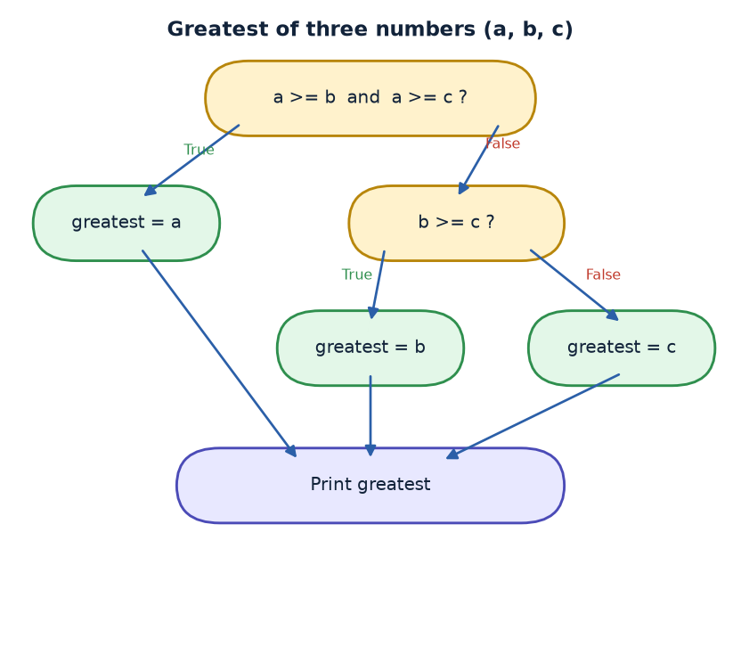
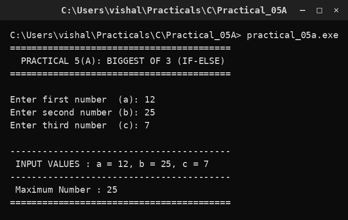

# Practical 05A — Biggest of Three Numbers (if-else)

> **Introduction to Programming with C — Lab Manual**  
> B.Sc. (Artificial Intelligence), Semester I

---

## 🎯 Aim

To find the biggest among three numbers using an if-else decision structure.

## 📌 Objective

Use relational operators and an if-else-if ladder to pick exactly one of three outcomes.

## 🧠 Concept in simple words

The program reads three numbers a, b and c. It first checks whether a is greater than or equal to both b and c; if so a is the biggest. Otherwise it checks whether b is greater than or equal to c, and if not, c must be the biggest. Because the conditions are checked in order, exactly one branch is always chosen.

## 🔑 Basic concepts used

| Concept | Meaning |
| :--- | :--- |
| `if-else` | Runs one block when a condition is true, another when it is false. |
| `Relational operators` | >, <, >=, <=, == test a relationship between two values. |
| `&&` | Joins two conditions so both must be true. |
| `if-else-if ladder` | A chain of conditions checked from top to bottom. |

## ▶️ How to use

Run and enter three numbers such as 12, 25 and 7; the program prints the maximum (25).

### Main file

[`practical_05a.c`](./practical_05a.c)

## 🖨️ Output

## ✅ Conclusion

An if-else ladder lets a program choose one correct result out of many possibilities.
