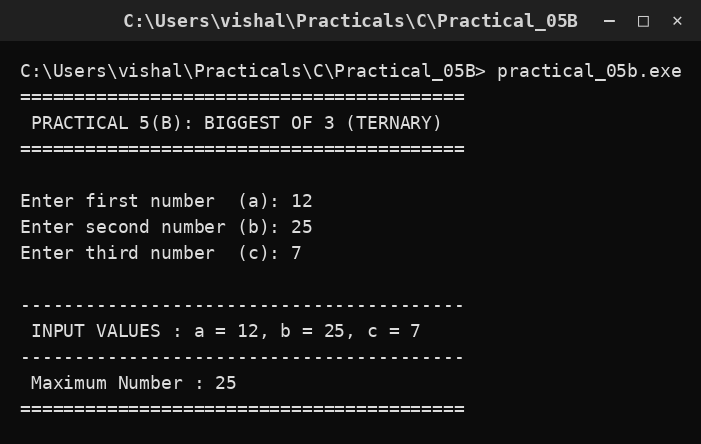

# Practical 05B — Biggest of Three Numbers (Ternary)

> **Introduction to Programming with C — Lab Manual**  
> B.Sc. (Artificial Intelligence), Semester I

---

## 🎯 Aim

To find the biggest among three numbers using the ternary (?:) operator.

## 📌 Objective

Write the same decision logic as a single compact conditional expression.

## 🧠 Concept in simple words

The ternary operator has the form condition ? value_if_true : value_if_false. The greatest of three is found by nesting two ternaries: max = (a > b) ? ((a > c) ? a : c) : ((b > c) ? b : c). It does the same job as an if-else but in one line. The trade-off is that a nested ternary is shorter yet harder to read.

## 🔑 Basic concepts used

| Concept | Meaning |
| :--- | :--- |
| `Ternary operator` | condition ? value_if_true : value_if_false |
| `Nested ternary` | A ternary placed inside another ternary. |
| `Equivalent to if-else` | Both produce exactly the same result. |

## ▶️ How to use

Run and enter three numbers such as 12, 25 and 7; the maximum (25) is printed.

### Main file

[`practical_05b.c`](./practical_05b.c)

## 🖨️ Output

## ✅ Conclusion

The ternary operator is a compact replacement for if-else when a single value must be chosen.
