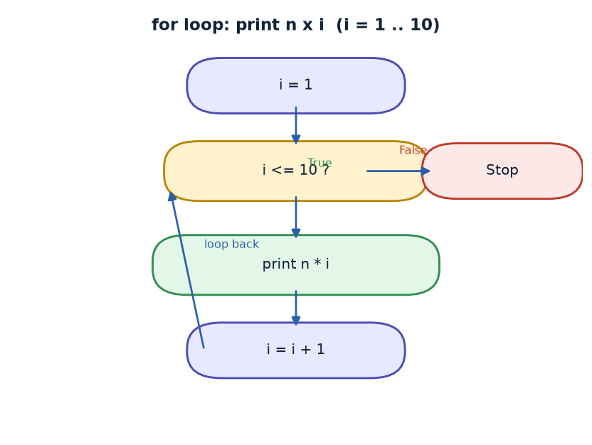
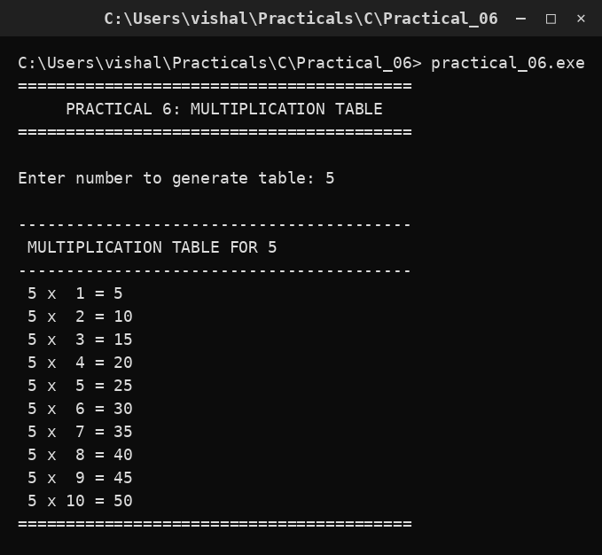

# Practical 06 — Multiplication Table

> Introduction to Programming with C · Lab Manual · B.Sc. (Artificial Intelligence), Semester I

## 📌 What this practical covers
- Why loops exist and when to use them instead of writing repeated statements
- The `for` loop: initialisation, condition and update written together
- How a counter variable (`i`) controls how many times a block repeats
- Reading an integer with `scanf` and printing it with `printf`
- Neat, aligned output using the width specifier `%2d`
- Tracing a loop by hand (dry run) to predict the exact output

## 🎯 Aim
To print the multiplication table of a given number from 1 to 10 using a `for` loop.

## 🧠 The big idea
Imagine you must print "5 x 1 = 5", then "5 x 2 = 10", and so on up to "5 x 10 = 50". You *could* write ten separate `printf` statements. But look closely: only one thing changes each time — the multiplier (1, 2, 3, … 10). When a job is **the same work repeated with one changing value**, we should not repeat the code. We write the job **once** and ask the computer to run it again and again. That repeated block of code is called a **loop**.

A `for` loop is the most common way to say "do this exactly N times". Think of it like a checklist: start counting at 1, keep going while the count is 10 or less, and after every round add 1 to the count. The loop does the counting for you, so you can concentrate on the real work — here, multiplying and printing.

## 🔍 Deep dive

### Why do we need loops?
Without a loop, printing a table would need ten almost identical `printf` lines. If you later wanted the table up to 20, you would have to add ten more lines by hand. A loop solves both problems at once: the code stays short, and changing one small number (the bound `10`) changes how long the table is. This idea — **write once, repeat automatically** — is one of the most powerful tools in programming.

### Anatomy of a for loop
A `for` loop has three parts, separated by semicolons, inside the parentheses:

```c
for (initialisation ; condition ; update)
```

- **Initialisation** (`i = 1`): runs once, before the loop starts. It sets the counter's starting value.
- **Condition** (`i <= 10`): checked before *every* round. If it is true, the body runs; if it is false, the loop stops.
- **Update** (`i++`): runs after every round. Here it adds 1 to `i`, so the counter moves forward.

The **loop body** — the statements inside `{ }` — is what gets repeated. In our program the body is a single `printf`.

The order of events is always: initialise → test condition → run body → update → test condition → run body → update → … until the condition becomes false.

### The counter variable i
`i` is just an ordinary `int` variable that we agree to use as a counter; `i` is a common naming convention. Because the update is `i++`, `i` takes the values 1, 2, 3, … one per round. The condition `i <= 10` allows values 1 through 10, then stops the loop when `i` becomes 11. So the body runs exactly **10 times** — perfect for a table from 1 to 10.

### The %2d width specifier
Look at the format string:

```c
printf(" %d x %2d = %d\n", num, i, num * i);
```

`%d` prints an integer in the smallest space it needs. But `%2d` prints the integer in a field at least **2 characters wide**, padding with a space on the left if the number has only one digit. So `1` prints as `" 1"` (a space, then 1) while `10` prints as `"10"`. This keeps the `=` signs lined up in a straight column — a small trick that makes output look tidy and professional.

## 📖 Key terms
| Term | Meaning |
| :--- | :--- |
| Loop | A block of code that repeats while a condition is true |
| `for` loop | A loop whose initialisation, condition and update are written together |
| Counter | A variable (here `i`) that tracks the current round |
| Condition | A test that decides whether the loop body runs again |
| Iteration | One single pass through the loop body |
| `%d` | Format specifier that prints an integer |
| `%2d` | Prints an integer in a field at least 2 characters wide (right-aligned) |
| `scanf` | Reads typed input from the user into a variable |

## 🖼️ Diagram


## 🧮 Dry run (worked example)
Suppose the user enters `5`. The program stores 5 in `num`, prints the heading, and then the loop runs like this:

| Round | `i` at start | Condition `i <= 10` | Printed line | `i` after `i++` |
| :--- | :--- | :--- | :--- | :--- |
| 1 | 1 | true | ` 5 x  1 = 5` | 2 |
| 2 | 2 | true | ` 5 x  2 = 10` | 3 |
| 3 | 3 | true | ` 5 x  3 = 15` | 4 |
| 4 | 4 | true | ` 5 x  4 = 20` | 5 |
| 5 | 5 | true | ` 5 x  5 = 25` | 6 |
| 6 | 6 | true | ` 5 x  6 = 30` | 7 |
| 7 | 7 | true | ` 5 x  7 = 35` | 8 |
| 8 | 8 | true | ` 5 x  8 = 40` | 9 |
| 9 | 9 | true | ` 5 x  9 = 45` | 10 |
| 10 | 10 | true | ` 5 x 10 = 50` | 11 |
| — | 11 | false | (loop ends) | — |

So the program prints exactly ten lines of the table.

## ⌨️ Reading the code
- `#include <stdio.h>` — brings in `printf` and `scanf`.
- `#include <conio.h>` — an old Turbo C header that provides `clrscr()` and `getch()`. The lab uses this compiler; modern compilers such as GCC do not need it.
- `void main()` — the starting point of the program.
- `int num, i;` — declares two integers: `num` holds the user's number, `i` is the loop counter.
- `clrscr();` — clears the screen so the output starts on a clean slate.
- `printf(...); scanf("%d", &num);` — asks for a number and reads it into `num`. The `&` passes the *address* of `num` so `scanf` knows where to store the typed value.
- `printf(" MULTIPLICATION TABLE FOR %d\n", num);` — prints a heading containing the chosen number.
- `for (i = 1; i <= 10; i++)` — the loop that drives everything.
- `printf(" %d x %2d = %d\n", num, i, num * i);` — the loop body: prints one row of the table. `num * i` computes the product.
- `getch();` — waits for a key press so the console window does not close instantly.

## 🔑 Syntax cheat-sheet
| Syntax | Meaning |
| :--- | :--- |
| `for (i = 1; i <= 10; i++)` | Repeat the body for `i` = 1 … 10 |
| `i++` | Add 1 to `i` after each round |
| `num * i` | Multiply the two variables |
| `%d` | Print an integer |
| `%2d` | Print an integer right-aligned in a 2-wide field |
| `scanf("%d", &num);` | Read an integer into `num` |

## 🖨️ Output


## ⚠️ Common mistakes
- Forgetting the `&` in `scanf("%d", num);` — the program may misbehave or crash.
- Writing the condition as `i < 10` instead of `i <= 10`, which prints only 9 rows (up to 9).
- Omitting the update `i++` — the loop never advances and runs forever (an infinite loop).
- Putting a semicolon right after `for (...);` — this makes the body empty, so the next line runs only once.
- Forgetting `\n` at the end of the format string, so all rows print on one line.

## ✅ Key takeaways
- A loop repeats a block of code, so you never copy-paste repeated statements.
- A `for` loop bundles initialisation, condition and update in one tidy line.
- The condition is tested *before* each round; when it becomes false the loop stops.
- `%2d` aligns numbers neatly by reserving a minimum field width.
- Changing the bound (10 → 20) instantly changes how long the table is.

## 🏋️ Try it yourself
1. Modify the program to print the table from 1 to 20 instead of 1 to 10.
2. Print the multiplication tables of all numbers from 1 to 5 using a loop inside a loop.
3. Print the table in reverse: start at 10 and count down to 1.
