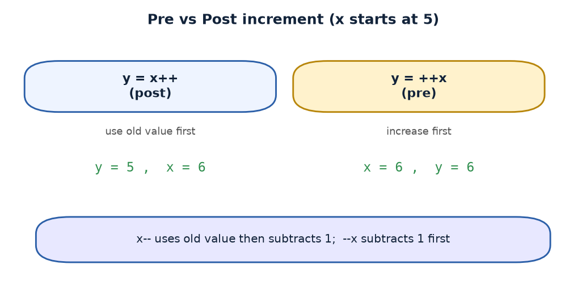
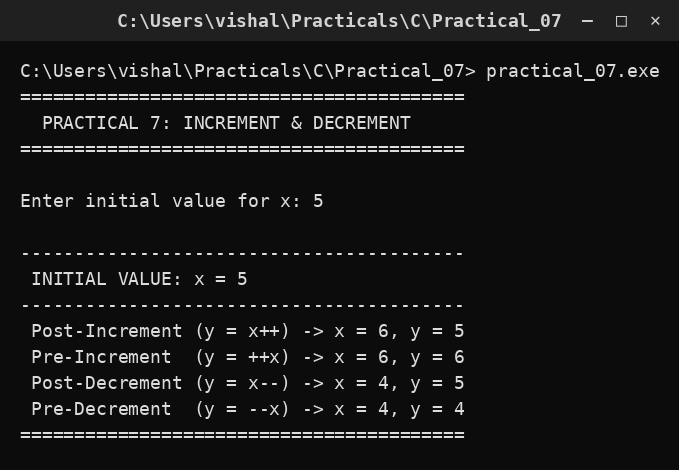

# Practical 07 — Increment & Decrement Operators

> Introduction to Programming with C · Lab Manual · B.Sc. (Artificial Intelligence), Semester I

## 📌 What this practical covers
- What the increment (`++`) and decrement (`--`) operators do
- The difference between the **pre** form (`++x`) and the **post** form (`x++`)
- The value of an expression versus the side-effect on the variable
- How the order of these two things changes the result
- Building a small comparison table for a starting value of 5
- Why mixing `++`/`--` into larger expressions can cause bugs

## 🎯 Aim
To demonstrate the pre-increment, post-increment, pre-decrement and post-decrement operators.

## 🧠 The big idea
Increment and decrement are shortcuts. Instead of writing `x = x + 1;`, you can write `x++;` or `++x;`. Both add 1 to `x`. Likewise `x--;` and `--x;` subtract 1. The *value of the variable afterwards* is the same in both forms. So why do we have two forms?

Because an assignment like `y = x++;` asks two questions at once: **what value goes into `y`?** and **when does `x` change?** The difference between pre and post is simply the **order** in which those two things happen. Post means "use the old value first, then update". Pre means "update first, then use the new value". That tiny change in timing is the whole topic of this practical.

## 🔍 Deep dive

### Value of an expression vs. side-effect on the variable
Every expression in C produces a **value**. The expression `x++` also has a **side-effect**: it changes the variable `x`. These are two separate ideas:

- The **value** of `x++` (or `++x`) is the number the expression "hands back" to whatever is around it (for example, to `y = ...`).
- The **side-effect** is that `x` itself ends up one bigger.

Post and pre differ only in the *value they hand back*, not in the side-effect — in both cases `x` increases by 1.

### Post-increment: x++
`y = x++;` means: put the **current** value of `x` into `y` first, *then* increase `x` by 1. So `y` receives the old value, and `x` becomes old + 1. Think "post" = "afterwards": the update happens afterwards.

### Pre-increment: ++x
`y = ++x;` means: increase `x` by 1 first, *then* put the **new** value into `y`. So both `x` and `y` end up equal to old + 1. Think "pre" = "beforehand": the update happens beforehand.

### Decrement: x-- and --x
Decrement works exactly the same way, only subtracting 1.
- `y = x--;` puts the old `x` into `y`, then `x` becomes old − 1.
- `y = --x;` makes `x` become old − 1 first, then puts that new value into `y`.

### The results at a glance (starting x = 5)
| Statement | Value given to `y` | Final `x` | Final `y` |
| :--- | :--- | :--- | :--- |
| `y = x++;` | old value | 6 | 5 |
| `y = ++x;` | new value | 6 | 6 |
| `y = x--;` | old value | 4 | 5 |
| `y = --x;` | new value | 4 | 4 |

### Why this can cause bugs
When `++` or `--` is used **alone** on its own line (`i++;`), there is no confusion — everybody knows what happens. Trouble starts when they are buried inside bigger expressions, such as `a = b++ + ++b;`. Now the result depends on the exact order the compiler evaluates things, and different compilers may even disagree. This is called **undefined behaviour**. The safe habit: use `++`/`--` only as complete statements, and write the arithmetic out fully when the order matters.

## 📖 Key terms
| Term | Meaning |
| :--- | :--- |
| Increment | Adding 1 to a variable (`x++` or `++x`) |
| Decrement | Subtracting 1 from a variable (`x--` or `--x`) |
| Post form | `x++` / `x--` — the value used is the **old** one |
| Pre form | `++x` / `--x` — the value used is the **new** one |
| Value of expression | The number the expression produces |
| Side-effect | The change the expression makes to a variable |
| Undefined behaviour | A result that the C standard does not fix; different compilers may differ |

## 🖼️ Diagram

## 🧮 Dry run (worked example)
The user enters an initial value of `5`. Each line resets `x` to 5 first, so the four tests are independent.

1. `x = 5; y = x++;`
   - `y` takes the old value of `x` → `y = 5`.
   - Then `x` increases → `x = 6`.
   - Printed: `x = 6, y = 5`.

2. `x = 5; y = ++x;`
   - `x` increases first → `x = 6`.
   - Then `y` takes the new value → `y = 6`.
   - Printed: `x = 6, y = 6`.

3. `x = 5; y = x--;`
   - `y` takes the old value of `x` → `y = 5`.
   - Then `x` decreases → `x = 4`.
   - Printed: `x = 4, y = 5`.

4. `x = 5; y = --x;`
   - `x` decreases first → `x = 4`.
   - Then `y` takes the new value → `y = 4`.
   - Printed: `x = 4, y = 4`.

| Test | `x` after | `y` after |
| :--- | :--- | :--- |
| Post-Increment `y = x++` | 6 | 5 |
| Pre-Increment `y = ++x` | 6 | 6 |
| Post-Decrement `y = x--` | 4 | 5 |
| Pre-Decrement `y = --x` | 4 | 4 |

## ⌨️ Reading the code
- `int x, y, initialValue;` — three integers: `initialValue` remembers what the user typed, `x` and `y` are used in the tests.
- `scanf("%d", &initialValue);` — reads the starting number.
- `x = initialValue; y = x++;` — resets `x` to the start, then runs the post-increment test.
- `printf(" Post-Increment (y = x++) -> x = %d, y = %d\n", x, y);` — prints the result. Notice the format string prints `x` first, then `y`.
- The next three blocks repeat the same pattern for `++x`, `x--` and `--x`, each time resetting `x = initialValue;` so the previous test does not interfere.
- `getch();` — waits for a key press before closing.

The key trick is that **`x = initialValue;` is repeated before every test**. Without it, each test would start from wherever the previous one left `x`, and the results would be muddled.

## 🔑 Syntax cheat-sheet
| Syntax | Meaning |
| :--- | :--- |
| `x++` | Use old value, then add 1 |
| `++x` | Add 1, then use new value |
| `x--` | Use old value, then subtract 1 |
| `--x` | Subtract 1, then use new value |
| `x = x + 1;` | Long form of `x++` (same effect) |
| `y = x++;` | Assign then update |
| `y = ++x;` | Update then assign |

## 🖨️ Output

## ⚠️ Common mistakes
- Believing `x++` and `++x` give the same result in `y = x++;` — they do **not**; the value handed to `y` differs.
- Forgetting to reset `x` between tests, so the later results look wrong.
- Using `++` twice on the same variable in one expression (e.g. `x++ + ++x`) — undefined behaviour.
- Assuming `x++` updates `x` *before* the assignment — it updates *after*.
- Writing `x++++` by mistake — that is not valid C.

## ✅ Key takeaways
- `++` adds 1 and `--` subtracts 1; both change the variable either way.
- **Post** uses the old value, **pre** uses the new value.
- The variable's final value is the same in both forms — only the expression's value differs.
- `x++` alone on a line is always clear; avoid burying it inside larger expressions.
- These operators appear constantly in loops, so understanding them early pays off.

## 🏋️ Try it yourself
1. Change the starting value to 10 and predict each result before running the program.
2. Write a small program that prints `x` and `y` when both are changed in a single expression `y = x++ + 1;` and explain the result.
3. Use `++` inside a `for` loop counter and confirm the loop still behaves as expected.
