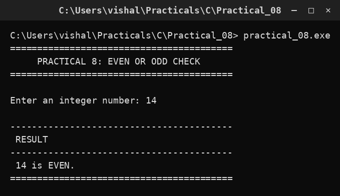

# Practical 08 — Even or Odd Check

> Introduction to Programming with C · Lab Manual · B.Sc. (Artificial Intelligence), Semester I

## 📌 What this practical covers
- What "divisible" means and how a number can be split into equal groups
- The modulus (remainder) operator `%` and what `n % 2` produces
- The definitions of even and odd numbers
- The two-way decision using `if` / `else`
- Reading an integer and printing a labelled result
- Why this test is the foundation of many number problems

## 🎯 Aim
To check whether a given integer is even or odd using the modulus operator.

## 🧠 The big idea
Take a pile of coins and try to split them into pairs. If every coin finds a partner and nothing is left over, the number is **even**. If one coin is left stranded at the end, the number is **odd**. That leftover coin is exactly what the modulus operator measures.

In C, the `%` operator gives the **remainder** after division. When you divide any whole number by 2, the remainder can only be `0` (nothing left over → even) or `1` (one left over → odd). So the entire question "is this number even or odd?" reduces to a single test: does `n % 2` equal `0`?

## 🔍 Deep dive

### What does "divisible" mean?
A number `a` is **divisible** by `b` if `a ÷ b` leaves no remainder. For example, 14 is divisible by 2 (14 ÷ 2 = 7 exactly), but 9 is not (9 ÷ 2 = 4 with 1 left over). Divisibility is about what is left after the division, and the modulus operator hands us that leftover directly.

### The modulus operator and what n % 2 gives
`%` returns the remainder. A few examples:

| Expression | Result | Why |
| :--- | :--- | :--- |
| `14 % 2` | 0 | 14 = 7 × 2, nothing left |
| `9 % 2` | 1 | 9 = 4 × 2 + 1, one left |
| `0 % 2` | 0 | 0 is even |
| `7 % 3` | 1 | 7 = 2 × 3 + 1 |
| `10 % 5` | 0 | 10 = 2 × 5 exactly |

Because we are dividing by 2, the remainder is always either 0 or 1 — never anything else. That is why the test is so simple.

### Even vs odd definitions
- **Even number:** an integer that is exactly divisible by 2 — that is, `n % 2 == 0`. Examples: 0, 2, 4, 6, 14.
- **Odd number:** an integer that leaves a remainder of 1 when divided by 2 — that is, `n % 2 == 1`. Examples: 1, 3, 5, 9, 21.

### The if / else two-way branch
This practical introduces a **two-way decision**. The shape is:

```c
if (condition)
    statement_when_true;
else
    statement_when_false;
```

The condition is tested once. If it is true, the first statement runs and the `else` part is skipped. If it is false, the `if` statement is skipped and the `else` statement runs. Exactly one of the two paths is ever taken — never both, never neither. Here the condition is `num % 2 == 0`; true means even, false means odd.

### Why this matters
Deciding even or odd is the first example of the wider idea "test a condition and branch". The same pattern — compute a remainder, compare it, branch — reappears when checking for prime numbers, leap years, palindromes, and divisibility by 3, 5 or 11. Master this small program and you have the skeleton for dozens of others.

## 📖 Key terms
| Term | Meaning |
| :--- | :--- |
| Modulus `%` | Operator that gives the remainder after division |
| Remainder | What is left over after dividing one number by another |
| Divisible | Divides exactly, leaving no remainder |
| Even number | An integer with `n % 2 == 0` |
| Odd number | An integer with `n % 2 == 1` |
| Condition | An expression that is either true or false |
| `if` / `else` | A two-way branch: one path when true, another when false |

## 🧮 Dry run (worked example)
Suppose the user enters `14`.

1. `num = 14`.
2. The condition `num % 2 == 0` is evaluated: `14 % 2` gives `0`, and `0 == 0` is **true**.
3. Because the condition is true, the `if` branch runs and prints: ` 14 is EVEN.`
4. The `else` branch is skipped entirely.

Now suppose the user enters `9` instead.

1. `num = 9`.
2. `9 % 2` gives `1`, and `1 == 0` is **false**.
3. The `if` branch is skipped; the `else` branch runs and prints: ` 9 is ODD.`

So the same program answers both cases correctly by changing which branch is taken.

## ⌨️ Reading the code
- `#include <stdio.h>` — provides `printf` and `scanf`.
- `#include <conio.h>` — old Turbo C header for `clrscr()` and `getch()`.
- `void main()` — program entry point.
- `int num;` — a single integer to hold the user's number.
- `clrscr();` — clears the screen.
- `printf("Enter an integer number: "); scanf("%d", &num);` — prompts and reads the number into `num`.
- `if (num % 2 == 0)` — computes the remainder and compares it with 0. Note the double `==` (comparison), not a single `=` (assignment).
- `printf(" %d is EVEN.\n", num);` — runs when the condition is true.
- `else` — the alternative path.
- `printf(" %d is ODD.\n", num);` — runs when the condition is false.
- `getch();` — pauses the console.

## 🔑 Syntax cheat-sheet
| Syntax | Meaning |
| :--- | :--- |
| `num % 2` | Remainder when `num` is divided by 2 |
| `num % 2 == 0` | True when `num` is even |
| `num % 2 == 1` | True when `num` is odd |
| `if (cond) A; else B;` | Run A if cond is true, otherwise run B |
| `==` | Comparison (is-equal-to) |
| `=` | Assignment (store a value) |

## 🖨️ Output


## ⚠️ Common mistakes
- Writing `if (num % 2 = 0)` with a single `=` — that tries to *assign* 0 and will not compile as intended; use `==`.
- Forgetting that `%` is remainder, not percentage. In C, `%` between integers means "remainder".
- Adding a semicolon after the `if` condition (`if (num % 2 == 0);`) — this makes the `if` body empty, so the wrong message prints.
- Assuming `%` works on floating-point numbers — it does not; it needs integers.
- Worrying about negative numbers: in C, an even negative like `-8` still gives `-8 % 2 == 0`, so the test remains correct.

## ✅ Key takeaways
- The `%` operator returns the remainder of a division.
- `n % 2` is 0 for even numbers and 1 for odd numbers.
- `if` / `else` makes a two-way decision: exactly one branch runs.
- Use `==` to compare and `=` to assign — mixing them is a classic bug.
- This remainder-and-branch pattern is the basis of many number-checking programs.

## 🏋️ Try it yourself
1. Change the program to also report whether the number is divisible by 5.
2. Print "Even and a multiple of 4" when the number is even and divisible by 4.
3. Write a program that reads three numbers and prints how many of them are even.
