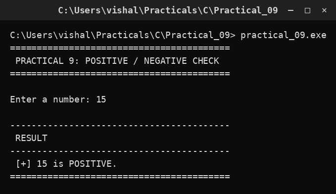

# Practical 09 — Positive, Negative or Zero

> Introduction to Programming with C · Lab Manual · B.Sc. (Artificial Intelligence), Semester I

## 📌 What this practical covers
- The number line and what "sign" of a number means
- A three-way decision using `if` / `else if` / `else`
- Why the conditions in a ladder must not overlap
- Why the final `else` acts as a catch-all for zero
- Reading a number and labelling it with a symbol
- How the order of checks affects the outcome

## 🎯 Aim
To check whether a given number is positive, negative or zero.

## 🧠 The big idea
Picture the number line with 0 in the middle. Every number lives either **to the right** of 0 (positive, like 15), **to the left** of 0 (negative, like −8), or **exactly on** 0 itself (zero). There is no fourth option — every integer falls into exactly one of these three places. So the program has to sort the input into one of three boxes.

Two boxes are easy with a single `if`/`else`. Three boxes need one extra rung: an `else if`. This gives us an **if / else-if / else ladder**, where the computer checks the conditions from top to bottom and stops at the first one that is true.

## 🔍 Deep dive

### The number line intuition
A number's sign tells you which side of zero it sits on:
- Numbers greater than 0 (`n > 0`) are **positive**.
- Numbers less than 0 (`n < 0`) are **negative**.
- The single number equal to 0 (`n == 0`) is **zero** — neither positive nor negative.

These three regions cover the whole number line without any gap and without any overlap. That is important: because they do not overlap, a number can never be counted twice.

### A three-way decision: if / else-if / else
The shape is:

```c
if (condition1)
    action1;
else if (condition2)
    action2;
else
    action3;
```

The computer evaluates `condition1` first. If it is true, `action1` runs and the whole ladder is finished — the remaining conditions are never even looked at. If `condition1` is false, it moves down to `condition2`. If that is true, `action2` runs and it stops. If both are false, the final `else` runs `action3`. Only **one** rung is ever executed.

### Why the conditions must not overlap
Here the conditions are `num > 0` and `num < 0`. These are mutually exclusive: a number cannot be both greater than 0 and less than 0. Because of this, it does not matter that we do not also write `num != 0` anywhere — the logic is already airtight. Overlapping conditions (for example `num > 0` and `num > 5`) would be a design mistake, because a large number could satisfy both, and the ladder would silently take only the first.

### Why zero falls into the final else
Zero is neither greater than 0 nor less than 0, so both `if` and `else if` fail. Whatever is left must fall into the final `else`. That is exactly where we put the "ZERO" message. The final `else` is a **catch-all**: it catches everything that no earlier condition claimed. This is a very common and safe pattern — handle the special cases explicitly, and let the `else` mop up the rest.

## 📖 Key terms
| Term | Meaning |
| :--- | :--- |
| Sign of a number | Whether it is positive, negative or zero |
| Number line | A line with 0 at the centre, positives to the right, negatives to the left |
| `if` / `else if` / `else` | A multi-way ladder of decisions |
| Ladder | Conditions checked in order, top to bottom, stopping at the first true one |
| Catch-all `else` | The final branch that runs when no earlier condition is true |
| Mutually exclusive | Conditions that cannot both be true at once |
| `>`, `<` | Greater-than and less-than comparison operators |

## 🧮 Dry run (worked example)

**Case 1: the user enters 15.**
- `num > 0` → `15 > 0` is **true** → print ` [+] 15 is POSITIVE.`
- The rest of the ladder is skipped.

**Case 2: the user enters −8.**
- `num > 0` → `-8 > 0` is **false**.
- `num < 0` → `-8 < 0` is **true** → print ` [-] -8 is NEGATIVE.`
- The final `else` is skipped.

**Case 3: the user enters 0.**
- `num > 0` → `0 > 0` is **false**.
- `num < 0` → `0 < 0` is **false**.
- Neither rung fired, so the `else` runs → print ` [0] The number is ZERO.`

| Input | `num > 0` | `num < 0` | Branch taken | Message |
| :--- | :--- | :--- | :--- | :--- |
| 15 | true | — | `if` | POSITIVE |
| −8 | false | true | `else if` | NEGATIVE |
| 0 | false | false | `else` | ZERO |

## ⌨️ Reading the code
- `int num;` — one integer to hold the input.
- `scanf("%d", &num);` — reads the number into `num`.
- `if (num > 0)` — the first test: is the number positive?
- `printf(" [+] %d is POSITIVE.\n", num);` — runs if the first test is true. The `[+]` is just a friendly label.
- `else if (num < 0)` — the second test, checked only if the first was false.
- `printf(" [-] %d is NEGATIVE.\n", num);` — runs if the second test is true.
- `else` — the catch-all, reached only when both tests were false (so the number must be 0).
- `printf(" [0] The number is ZERO.\n");` — the message for zero.
- `getch();` — pauses the console.

## 🔑 Syntax cheat-sheet
| Syntax | Meaning |
| :--- | :--- |
| `if (cond) A;` | Run A if cond is true |
| `else if (cond2) B;` | If the earlier test failed, try cond2 |
| `else C;` | Run C when nothing above was true |
| `num > 0` | True when the number is positive |
| `num < 0` | True when the number is negative |
| `num == 0` | True when the number is exactly zero |

## 🖨️ Output


## ⚠️ Common mistakes
- Using `num >= 0` for the positive test — this wrongly counts 0 as positive, so the ZERO case never prints.
- Writing `else if (num < 0)` as a separate `if`, which could let more than one branch run.
- Using `=` instead of `==` if you compare to zero directly.
- Ordering the ladder wrongly (e.g. testing `num < 0` before `num > 0` is fine here, but overlapping ranges would break).
- Forgetting that the final `else` has no condition — writing `else (num == 0)` is a syntax error.

## ✅ Key takeaways
- The number line splits cleanly into positive, negative and zero.
- `if` / `else if` / `else` builds a multi-way decision, checked top to bottom.
- Only the first true condition's branch runs; the rest are skipped.
- A final `else` without a condition is a safe catch-all.
- Keeping conditions mutually exclusive prevents double-counting a value.

## 🏋️ Try it yourself
1. Modify the program to read a number and print "Positive and even" when it is both positive and even.
2. Extend it to classify a number as positive, negative, zero, and additionally state whether its absolute value is greater than 100.
3. Read three numbers and print how many are positive, how many negative, and how many are zero.
