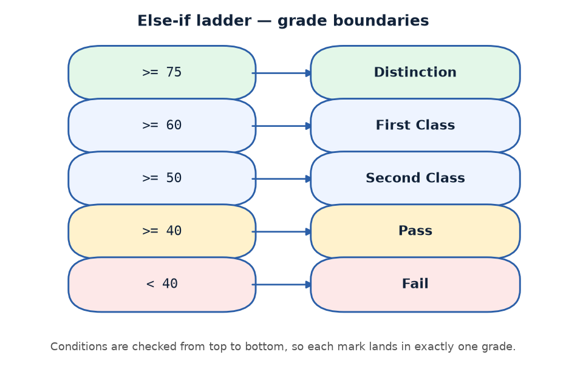

# Practical 10 — Grade Calculation (Else-If Ladder)

> Introduction to Programming with C · Lab Manual · B.Sc. (Artificial Intelligence), Semester I

## 📌 What this practical covers
- Mapping a continuous range of marks onto discrete grades
- Building an else-if ladder for many-way decisions
- How the ladder is evaluated top-to-bottom and stops at the first match
- Why thresholds must be ordered highest-first
- The role of the final `else` as the catch-all (Fail)
- Reading a floating-point value with `%f`

## 🎯 Aim
To assign a grade to student marks (0-100) using an else-if ladder.

## 🧠 The big idea
Marks can be **any** value from 0 to 100 — 82.5, 67, 39.9 — a smooth, continuous range. But a grade is a **label**: Distinction, First Class, Second Class, Pass, Fail. Only five labels. The job is to squeeze a continuous number into one of a few discrete buckets.

An **else-if ladder** does exactly this. Imagine a series of gates lined up one after another, from the highest bar to the lowest. The marks walk in and hit the first gate they clear; once a gate lets them through, they stop — they never reach the gates behind it. If they clear no gate at all, they fall through to the bottom (Fail).

## 🔍 Deep dive

### From a continuous range to discrete grades
The rule for this program is:

| Marks | Grade |
| :--- | :--- |
| 75 and above | Distinction |
| 60 to 74.99… | First Class |
| 50 to 59.99… | Second Class |
| 40 to 49.99… | Pass |
| Below 40 | Fail |

Every mark from 0 to 100 lands in exactly one row, because the ranges are contiguous and do not overlap. Our task is to express these five rules as a ladder of conditions.

### How an else-if ladder is evaluated
The computer reads the ladder from the top:

```c
if (marks >= 75)      ...
else if (marks >= 60) ...
else if (marks >= 50) ...
else if (marks >= 40) ...
else                  ...
```

It tests the first condition. If true, that branch runs and the entire ladder is done — nothing below is checked. If false, it slides down to the next condition, and so on. The moment one condition is true, the ladder stops. This "first match wins" behaviour is the heart of the practical.

### Why thresholds must be ordered highest-first
This is the crucial insight. Notice that the second condition is only `marks >= 60`, not `marks >= 60 && marks < 75`. Why is that enough? Because if we have already reached the second rung, the first test (`marks >= 75`) must have been **false** — so we already know the marks are below 75. The ladder itself enforces the upper bound for us.

If the thresholds were ordered lowest-first (say `>= 40` first), then a mark of 82 would match `>= 40` immediately and be graded "Pass" — clearly wrong. So the conditions **must** go from the highest threshold down to the lowest.

### The final else as catch-all
After all four explicit thresholds, whatever remains is any mark below 40. We do not need to write `marks < 40` explicitly — the final `else` catches it. This is the same catch-all idea you met when checking for zero: handle the listed cases, let `else` take the rest.

### A note on float and %f
Marks can have decimals, so `marks` is declared `float` and read with `scanf("%f", &marks)`. The `%f` format specifier reads and prints floating-point numbers. Because of this, marks like `74.9` are handled correctly — a value of 74.9 is below 75, so it correctly becomes First Class, not Distinction.

## 📖 Key terms
| Term | Meaning |
| :--- | :--- |
| Continuous range | Values that can take any in-between value (e.g. any mark 0-100) |
| Discrete grade | One of a fixed set of labels (Distinction, Pass, …) |
| Else-if ladder | A chain of `if` / `else if` / `else` decisions |
| Threshold | The boundary mark at which the grade changes |
| First-match-wins | The ladder stops at the first true condition |
| Catch-all `else` | The final branch for everything not matched above |
| `float` | Data type for numbers with a decimal point |
| `%f` | Format specifier for `float` values |

## 🖼️ Diagram


## 🧮 Dry run (worked example)
Suppose the user enters marks `82.5`.

1. `marks = 82.5`.
2. `marks >= 75` → `82.5 >= 75` is **true** → print ` Grade: Distinction`.
3. The ladder stops; the lower rungs are never tested.

Now look at the boundary cases, which is where ladders are easy to get wrong:

| Marks | First true condition | Grade printed |
| :--- | :--- | :--- |
| 100 | `>= 75` | Distinction |
| 75 | `>= 75` | Distinction |
| 74.9 | `>= 60` | First Class |
| 60 | `>= 60` | First Class |
| 59.9 | `>= 50` | Second Class |
| 50 | `>= 50` | Second Class |
| 40 | `>= 40` | Pass |
| 39.9 | (none — falls to `else`) | Fail |
| 0 | (none — falls to `else`) | Fail |

Notice that the exact boundary value 75 becomes Distinction, while 74.9 becomes First Class. That is because the test is `>= 75` (greater-than-or-equal).

## ⌨️ Reading the code
- `float marks;` — holds the marks, which may have decimals.
- `printf("Enter student marks (0-100): "); scanf("%f", &marks);` — prompts and reads a float.
- `if (marks >= 75)` — the highest gate; if cleared, it is a Distinction and everything below is skipped.
- `else if (marks >= 60)` — reached only if marks were below 75, so it means 60-74.99.
- `else if (marks >= 50)` — reached only if marks were below 60, so it means 50-59.99.
- `else if (marks >= 40)` — reached only if marks were below 50, so it means 40-49.99.
- `else` — everything left is below 40 → Fail.
- Each branch has a single `printf`; `getch();` pauses the console at the end.

## 🔑 Syntax cheat-sheet
| Syntax | Meaning |
| :--- | :--- |
| `float marks;` | Declare a decimal-number variable |
| `scanf("%f", &marks);` | Read a float from the user |
| `marks >= 75` | True when marks are 75 or more |
| `else if (cond)` | Next rung of the ladder, tried only if earlier ones failed |
| `else` | Catch-all for anything unmatched |
| `&&` | Logical AND, used if you want to write an explicit upper bound |

## 🖨️ Output


## ⚠️ Common mistakes
- Ordering the thresholds lowest-first — then high marks wrongly get a low grade.
- Using `>` instead of `>=`, which pushes a mark of exactly 75 down to First Class.
- Declaring `marks` as `int` when decimals are expected — a value like 74.9 would be truncated.
- Using `%d` with a `float` variable (or `%f` with an `int`), which prints garbage.
- Forgetting the final `else`, leaving marks below 40 with no message at all.

## ✅ Key takeaways
- An else-if ladder maps a continuous range onto discrete labels.
- The ladder is checked top-to-bottom and stops at the first true condition.
- Thresholds must run highest-first so each value matches exactly one grade.
- The final `else` safely catches everything not matched above.
- Use `float` and `%f` when values can have decimals.

## 🏋️ Try it yourself
1. Add a sixth grade, "Outstanding", for marks of 90 and above, keeping the ladder highest-first.
2. Change the thresholds to your college's actual grading scheme.
3. Read marks for three students and print each student's grade using the same ladder logic inside a loop.
