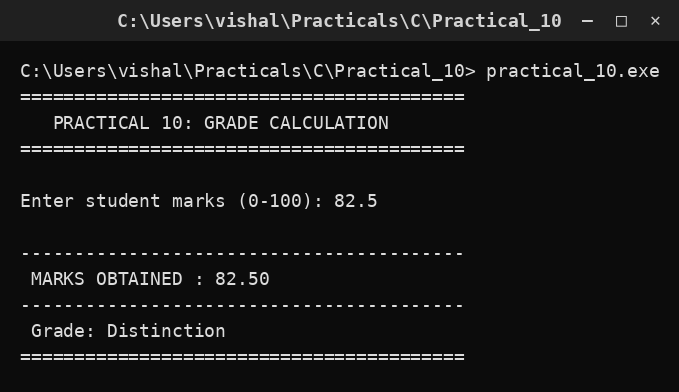

# Practical 10 — Grade Calculation (Else-If Ladder)

> **Introduction to Programming with C — Lab Manual**  
> B.Sc. (Artificial Intelligence), Semester I

---

## 🎯 Aim

To assign a grade to student marks (0-100) using an else-if ladder.

## 📌 Objective

Map a continuous range of marks onto a small set of grades.

## 🧠 Concept in simple words

The program reads marks and compares them against thresholds from the top down: 75 and above is Distinction, 60 and above First Class, 50 and above Second Class, 40 and above Pass, and anything below 40 is Fail. Because the checks go from highest to lowest, each mark falls into exactly one grade.

## 🔑 Basic concepts used

| Concept | Meaning |
| :--- | :--- |
| `else-if ladder` | A chain of conditions checked in order. |
| `Thresholds` | 75 / 60 / 50 / 40 decide the grade boundaries. |
| `Final else` | Catches everything that failed every earlier test. |

## ▶️ How to use

Run and enter marks such as 82.5; the program prints the grade (Distinction).

### Main file

[`practical_10.c`](./practical_10.c)

## 🖨️ Output

## ✅ Conclusion

Ordering the conditions from highest to lowest guarantees that exactly one grade is assigned.
