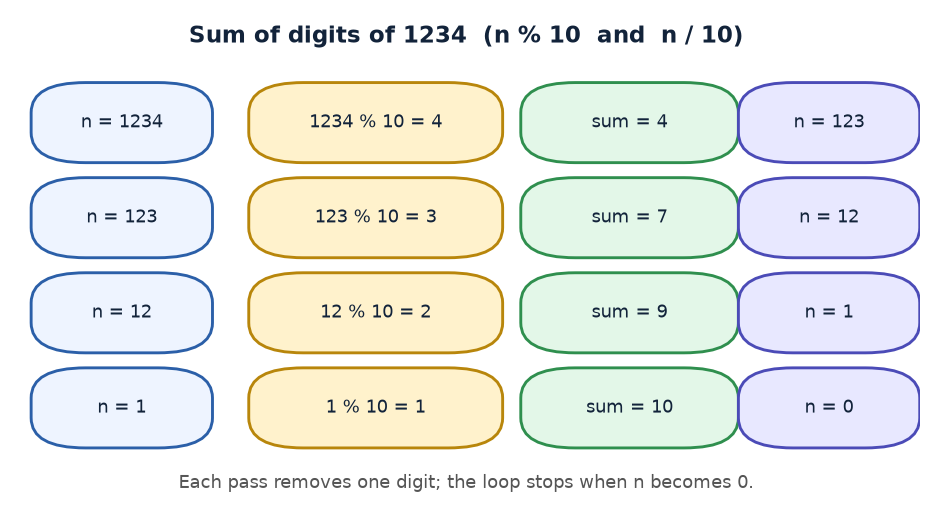
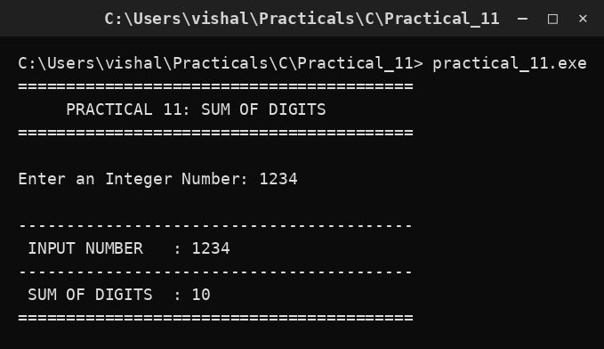

# Practical 11 — Sum of Digits

> **Introduction to Programming with C — Lab Manual**  
> B.Sc. (Artificial Intelligence), Semester I

---

## 🎯 Aim

To find the sum of the digits of an integer using a while loop.

## 📌 Objective

Learn the digit-extraction pattern with % 10 and / 10.

## 🧠 Concept in simple words

The program takes each last digit of the number with digit = n % 10, adds it to a running sum and removes that digit with n = n / 10. It repeats while n is not zero. Each pass peels off one digit from the right, so a number with d digits needs d passes.

## 🔑 Basic concepts used

| Concept | Meaning |
| :--- | :--- |
| `n % 10` | Gives the last digit of n. |
| `n / 10` | Removes the last digit of n (integer division). |
| `Running sum` | A variable that adds up the digits one by one. |
| `while loop` | Repeats until n becomes 0. |

## ▶️ How to use

Run and enter a number such as 1234; the program prints the sum of digits (10).

### Main file

[`practical_11.c`](./practical_11.c)

## 🖨️ Output

## ✅ Conclusion

Extracting digits with % 10 and / 10 is a reusable pattern used again in the palindrome and Armstrong programs.
