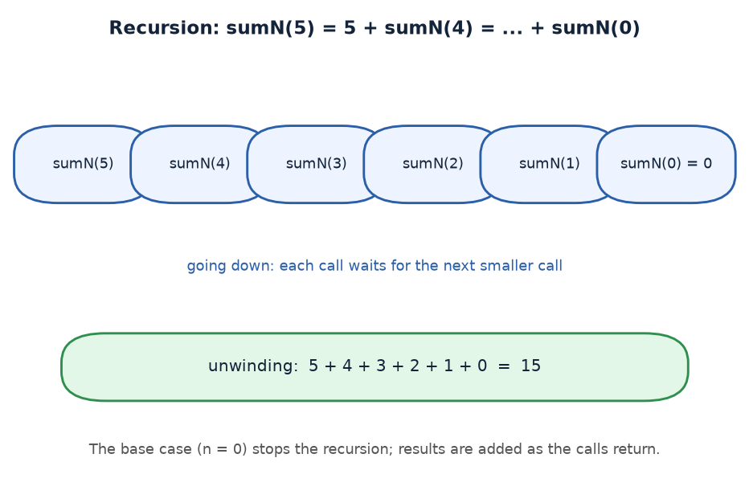
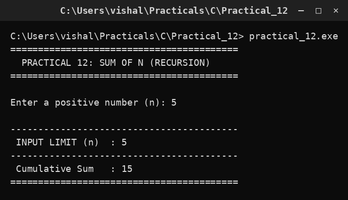

# Practical 12 — Sum of N Natural Numbers (Recursion)

> **Introduction to Programming with C — Lab Manual**  
> B.Sc. (Artificial Intelligence), Semester I

---

## 🎯 Aim

To find the sum of the first N natural numbers using recursion.

## 📌 Objective

Understand how a function calling itself with a smaller input builds up a result.

## 🧠 Concept in simple words

A recursive function uses the rule S(n) = n + S(n-1) with the base case S(0) = 0. For n = 5 it computes 5 + S(4) = 5 + 4 + 3 + 2 + 1 + 0 = 15. The base case stops the recursion, and the answers are added as the calls unwind. This is the recursive form of the formula N(N+1)/2.

## 🔑 Basic concepts used

| Concept | Meaning |
| :--- | :--- |
| `Recursion` | A function that calls itself to solve a smaller version of the problem. |
| `Base case` | The stopping condition, here n <= 0 returns 0. |
| `Recursive step` | return n + sumN(n-1) |
| `N(N+1)/2` | Closed-form formula to check the answer. |

## ▶️ How to use

Run and enter N, e.g. 5; the program prints the cumulative sum (15).

### Main file

[`practical_12.c`](./practical_12.c)

## 🖨️ Output

## ✅ Conclusion

Recursion solves a problem by reducing it to a smaller instance of itself until a base case is reached.
