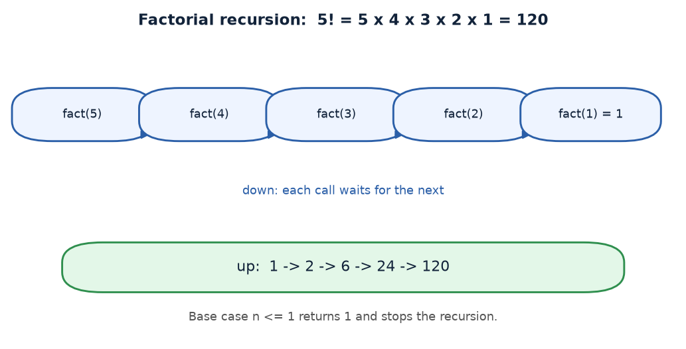

# Practical 12A — Factorial using Recursion

> Introduction to Programming with C · Lab Manual · B.Sc. (Artificial Intelligence), Semester I

## 📌 What this practical covers
- What a **factorial** (`n!`) means and why `0! = 1`.
- The recursive definition `n! = n × (n-1)!`.
- The base case `n <= 1` returning `1` and the recursive step `n * fact(n-1)`.
- A full trace of `fact(5) = 120`, including the unwind.
- Why large inputs **overflow** the `int` type.

## 🎯 Aim
To find the factorial of a given number using recursion.

## 🧠 The big idea
The **factorial** of a whole number `n`, written `n!`, is the product of all whole numbers from `1` up to `n`:

```text
n! = n × (n-1) × (n-2) × … × 2 × 1
```

For example, `5! = 5 × 4 × 3 × 2 × 1 = 120`. Factorials grow extremely fast — they are used to count arrangements (permutations and combinations), so `n!` tells you in how many orders `n` different items can be lined up.

The clever part: `5! = 5 × 4!`. So the factorial of a number is just that number times the factorial of the number just below it. That self-similar shape is *exactly* what recursion loves. We write the same fact as a rule:

- `n! = n × (n-1)!` (the recursive step), and
- `1! = 1`, and by convention `0! = 1` (the base case).

## 🔍 Deep dive

### What factorial means
Factorial is a product, not a sum. `4! = 4 × 3 × 2 × 1 = 24`. Notice that `0!` is defined as `1` — not because there is anything to multiply, but because "there is exactly one way to arrange nothing" and because it keeps the formula `n! = n × (n-1)!` working: if `1! = 1`, then `0!` must be `1` so that `1! = 1 × 0! = 1`. This special case is why the code uses `n <= 1` and not just `n == 1`.

### The recursive definition
```text
fact(0) = 1
fact(1) = 1
fact(n) = n × fact(n-1)   for n > 1
```
Each call multiplies `n` by the factorial of a *smaller* number, marching down toward the base case.

### Base case n <= 1 returns 1
The line `if (n <= 1) return 1;` handles both `0` and `1` in one check. When we reach it, no further calls happen — the chain stops and starts returning values.

### Tracing fact(5) with the unwind
**Winding phase (going down):**
| Call | Waiting on |
| :--- | :--- |
| fact(5) | 5 × fact(4) |
| fact(4) | 4 × fact(3) |
| fact(3) | 3 × fact(2) |
| fact(2) | 2 × fact(1) |
| fact(1) | base case → returns 1 |

**Unwinding phase (coming back up):**
| Call | Computes | Returns |
| :--- | :--- | :--- |
| fact(1) | base case | 1 |
| fact(2) | 2 × 1 | 2 |
| fact(3) | 3 × 2 | 6 |
| fact(4) | 4 × 6 | 24 |
| fact(5) | 5 × 24 | 120 |

So `fact(5) = 120`. Correct: `5 × 4 × 3 × 2 × 1 = 120`.

### Overflow for large n
A C `int` on most systems holds values up to `2,147,483,647` (about 2.1 billion). Let us see how far factorial stays inside that:
| n | n! | Fits in `int`? |
| :--- | :--- | :--- |
| 5 | 120 | Yes |
| 10 | 3,628,800 | Yes |
| 12 | 479,001,600 | Yes |
| 13 | 6,227,020,800 | **No — overflow!** |

`13!` is larger than the maximum `int`, so the stored result becomes a wrong (wrapped-around) number. To handle bigger factorials you would use `long long int`, `unsigned long long`, or floating point — but even those run out eventually. This is a real limitation, not a bug in the logic.

## 📖 Key terms
| Term | Meaning |
| :--- | :--- |
| Factorial (`n!`) | Product of all whole numbers from 1 to n. |
| `0!` | Defined as 1, the base value that makes the recursion consistent. |
| Base case | The stopping line `if (n <= 1) return 1;`. |
| Recursive step | `return n * fact(n - 1);` — multiply n by the smaller factorial. |
| Call stack | Memory holding each paused call during winding. |
| Overflow | When a result is too big to fit in the variable's type. |

## 🖼️ Diagram


## 🧮 Dry run (worked example)
Input: `n = 5`.

1. `main` reads `n = 5`, calls `fact(5)`.
2. `fact(5)`: `5 <= 1`? No → return `5 * fact(4)` → pause.
3. `fact(4)`: `4 <= 1`? No → return `4 * fact(3)` → pause.
4. `fact(3)`: `3 <= 1`? No → return `3 * fact(2)` → pause.
5. `fact(2)`: `2 <= 1`? No → return `2 * fact(1)` → pause.
6. `fact(1)`: `1 <= 1`? Yes → return `1`.
7. Unwind: `fact(2) = 2×1 = 2`; `fact(3) = 3×2 = 6`; `fact(4) = 4×6 = 24`; `fact(5) = 5×24 = 120`.
8. `result = 120`. Program prints the input and the factorial.

## ⌨️ Reading the code
```c
#include <stdio.h>
#include <conio.h>

int fact(int n)
{
    if (n <= 1)
        return 1;             /* base case: 0! and 1! are both 1 */
    return n * fact(n - 1);   /* recursive step: n times the smaller factorial */
}

void main()
{
    int n, result;
    clrscr();                                    /* clear screen (Turbo C) */
    printf("Enter a number (n): ");
    scanf("%d", &n);                             /* read n */
    result = fact(n);                            /* start the recursion */
    printf(" INPUT NUMBER (n) : %d\n", n);
    printf(" Factorial (%d!)   : %d\n", n, result);
    getch();                                     /* wait for key (Turbo C) */
}
```
- The base case `n <= 1` covers `0` and `1` in a single line.
- The recursive step multiplies `n` by `fact(n-1)`, so the product builds up on the way back out.
- `printf(" Factorial (%d!)   : %d\n", n, result)` prints the number and its factorial together.

## 🔑 Syntax cheat-sheet
| Syntax | Meaning |
| :--- | :--- |
| `int fact(int n)` | Function taking an integer, returning an integer. |
| `if (n <= 1) return 1;` | Base case handling 0! and 1!. |
| `return n * fact(n - 1);` | Recursive step: multiply n by the smaller factorial. |
| `scanf("%d", &n);` | Read an integer from the keyboard. |
| `%d` | Format specifier for printing/reading an `int`. |

## 🖨️ Output


## ⚠️ Common mistakes
- **Using `n == 1` instead of `n <= 1`** — then `fact(0)` recurses to `fact(-1)` forever, or gives a wrong answer for input 0.
- **Forgetting the base case** — infinite recursion and a crash.
- **Not knowing about overflow** — input like 13 or 20 gives a nonsense (negative or wrapped) result because the value does not fit in `int`.
- **Adding instead of multiplying** — `n + fact(n-1)` computes a sum, not a factorial.
- **Trying negative input** — the code assumes `n >= 0`; negative numbers have no ordinary factorial.

## ✅ Key takeaways
- `n! = n × (n-1) × … × 1`, and by convention `0! = 1`.
- The recursive rule is `n! = n × (n-1)!`, with base case `n <= 1 → 1`.
- `fact(5) = 120`; the calls wind down to `fact(1)` then multiply back up.
- Factorials grow very fast — `13!` already overflows a 32-bit `int`.
- Base cases and overflow are the two things to watch in this program.

## 🏋️ Try it yourself
1. Change the return type to `long long int` (and use `%lld`) and check up to which `n` the result is still correct.
2. Write a recursive function `nCr = fact(n) / (fact(r) * fact(n-r))` using your `fact` function to compute combinations.
