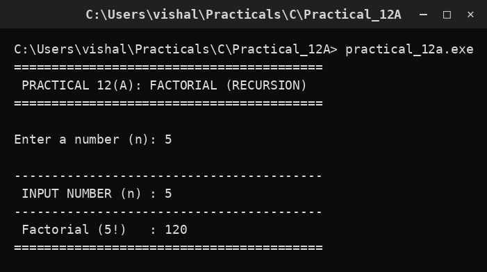

# Practical 12A — Factorial using Recursion

> **Introduction to Programming with C — Lab Manual**  
> B.Sc. (Artificial Intelligence), Semester I

---

## 🎯 Aim

To find the factorial of a given number using recursion.

## 📌 Objective

Apply the definition n! = n * (n-1)! with base case 0! = 1.

## 🧠 Concept in simple words

Factorial multiplies all whole numbers from 1 up to n. The recursive function uses fact(n) = n * fact(n-1) and stops at fact(0) = fact(1) = 1. So 5! = 5 x 4 x 3 x 2 x 1 = 120. The intermediate results are held on the call stack while the calls unwind.

## 🔑 Basic concepts used

| Concept | Meaning |
| :--- | :--- |
| `Factorial` | n! = n x (n-1) x ... x 1 |
| `Base case` | n <= 1 returns 1. |
| `Recursive step` | return n * fact(n-1) |
| `Call stack` | Memory that holds each pending call. |

## ▶️ How to use

Run and enter a number such as 5; the program prints 5! = 120.

### Main file

[`practical_12a.c`](./practical_12a.c)

## 🖨️ Output

## ✅ Conclusion

A single recursive line plus a base case is enough to compute a factorial.
