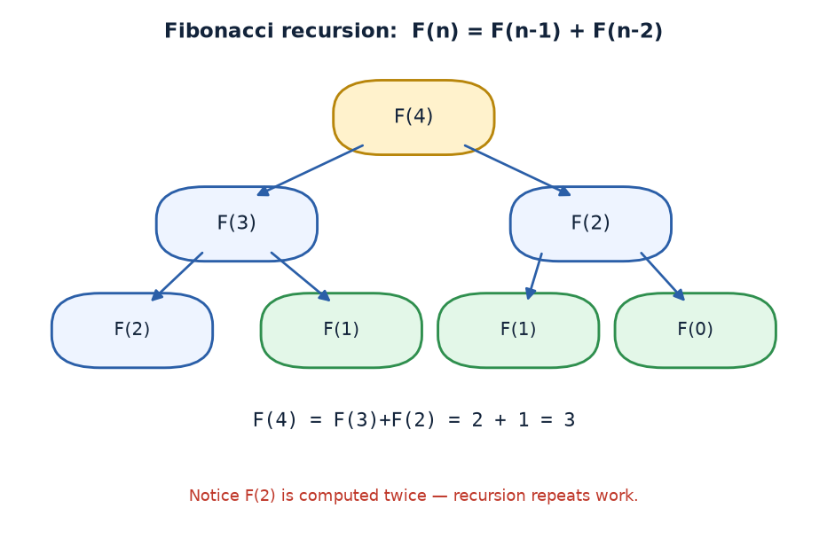
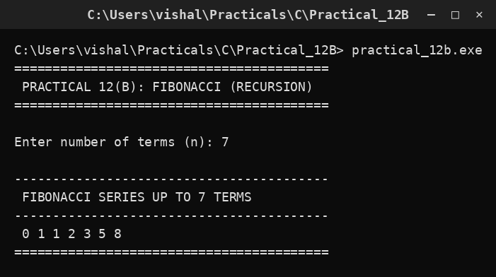

# Practical 12B — Fibonacci Series using Recursion

> Introduction to Programming with C · Lab Manual · B.Sc. (Artificial Intelligence), Semester I

## 📌 What this practical covers
- What a **recurrence** / sequence is, using the Fibonacci series as the example.
- The Fibonacci rule `F(n) = F(n-1) + F(n-2)` and its **two base cases** `F(0)=0`, `F(1)=1`.
- How the `main` loop prints terms `0` to `n-1`.
- The **recursion tree** for `F(4)` and why repeated (overlapping) work makes recursion slow.
- A dry run for `n = 7` producing `0 1 1 2 3 5 8`.

## 🎯 Aim
To generate and display the Fibonacci series using recursion.

## 🧠 The big idea
A **sequence** is an ordered list of numbers built by a rule. The **Fibonacci sequence** is one of the most famous: each new number is the sum of the two numbers before it.

```text
0, 1, 1, 2, 3, 5, 8, 13, 21, 34, …
```

A rule that defines each term using earlier terms of the same sequence is called a **recurrence**. Fibonacci's recurrence is:

```text
F(n) = F(n-1) + F(n-2)
```

Think of a family tree: to know how many leaves a branch has, you must count the leaves on its two sub-branches. Each sub-branch again splits into two — and so on, down to a single leaf. That branching is why Fibonacci recursion forms a *tree* of calls, and why the same term gets computed again and again.

## 🔍 Deep dive

### What a recurrence/sequence is
A recurrence gives a term in terms of earlier terms. Because it needs *earlier* terms, it must stop somewhere — at the very beginning of the sequence. Those starting values are the **base cases**. For Fibonacci there are **two** base cases because the rule reaches back two steps: `F(0) = 0` and `F(1) = 1`. Without them, the rule `F(n) = F(n-1) + F(n-2)` would have nothing to build from.

### Two base cases: F(0)=0, F(1)=1
```c
if (n <= 0) return 0;   /* F(0) = 0 */
if (n == 1) return 1;   /* F(1) = 1 */
```
The first check catches `0` (and any negative, though we never pass negatives here). The second catches `1`. Everything from `2` onward uses the recursive step.

### The recursive step and the main loop
The recursive step is the definition itself:
```c
return fibo(n - 1) + fibo(n - 2);
```
This one line makes **two** calls, so the number of calls grows like a tree. In `main`:
```c
for (i = 0; i < n; i++)
    printf("%d ", fibo(i));
```
The loop runs `i` from `0` to `n-1` and prints `fibo(i)` each time, so the output is the first `n` Fibonacci terms (F(0) through F(n-1)).

### The recursion tree for F(4) and overlapping work
`fibo(4)` calls `fibo(3)` and `fibo(2)`. Let us draw it:

```text
                fibo(4)
               /       \
           fibo(3)      fibo(2)
          /      \      /      \
      fibo(2)  fibo(1) fibo(1) fibo(0)
      /    \
  fibo(1) fibo(0)
```

Count the calls: `fibo(2)` is computed **twice**, `fibo(1)` three times, `fibo(0)` twice. This is **overlapping subproblems** — the same value is recomputed many times. For `fibo(4)` it is harmless, but the number of calls roughly doubles each time `n` grows, so `fibo(40)` makes over a hundred million calls. That is why the plain recursive Fibonacci is considered *slow*, and why people often use the iterative (loop) version instead, which computes each term once.

### Iterative alternative (for comparison)
```c
int a = 0, b = 1, c, i;
for (i = 0; i < n; i++)
{
    printf("%d ", a);
    c = a + b;
    a = b;
    b = c;
}
```
This prints the same series in `O(n)` time and constant memory — far faster than the recursive tree.

## 📖 Key terms
| Term | Meaning |
| :--- | :--- |
| Sequence | An ordered list of numbers. |
| Recurrence | A rule defining a term using earlier terms of the same sequence. |
| Base case | Starting value(s) that stop the recursion (`F(0)=0`, `F(1)=1`). |
| Recursive step | `F(n) = F(n-1) + F(n-2)`. |
| Recursion tree | The branching picture of all the calls made. |
| Overlapping subproblems | The same sub-value computed many times (inefficient). |

## 🖼️ Diagram


## 🧮 Dry run (worked example)
Input: `n = 7` (number of terms).

The loop asks for `fibo(0)` through `fibo(6)`:

| i | fibo(i) | Value | Running output |
| :--- | :--- | :--- | :--- |
| 0 | fibo(0) | 0 | `0 ` |
| 1 | fibo(1) | 1 | `0 1 ` |
| 2 | fibo(1)+fibo(0) | 1 | `0 1 1 ` |
| 3 | fibo(2)+fibo(1) | 2 | `0 1 1 2 ` |
| 4 | fibo(3)+fibo(2) | 3 | `0 1 1 2 3 ` |
| 5 | fibo(4)+fibo(3) | 5 | `0 1 1 2 3 5 ` |
| 6 | fibo(5)+fibo(4) | 8 | `0 1 1 2 3 5 8 ` |

Output: `0 1 1 2 3 5 8`. Correct.

## ⌨️ Reading the code
```c
#include <stdio.h>
#include <conio.h>

int fibo(int n)
{
    if (n <= 0) return 0;            /* F(0) = 0  (base case 1) */
    if (n == 1) return 1;            /* F(1) = 1  (base case 2) */
    return fibo(n - 1) + fibo(n - 2); /* recursive step: sum of two previous */
}

void main()
{
    int n, i;
    clrscr();                                        /* clear screen (Turbo C) */
    printf("Enter number of terms (n): ");
    scanf("%d", &n);                                 /* how many terms to print */
    printf(" FIBONACCI SERIES UP TO %d TERMS\n", n);
    for (i = 0; i < n; i++)
        printf("%d ", fibo(i));                      /* print F(0) ... F(n-1) */
    getch();                                         /* wait for key (Turbo C) */
}
```
- The two `if` lines are the two base cases.
- The recursive step makes two calls, forming the tree.
- The `for` loop in `main` prints the first `n` terms by calling `fibo` with `0, 1, 2, …`.

## 🔑 Syntax cheat-sheet
| Syntax | Meaning |
| :--- | :--- |
| `int fibo(int n)` | Function returning the n-th Fibonacci number. |
| `if (n <= 0) return 0;` | Base case F(0)=0. |
| `if (n == 1) return 1;` | Base case F(1)=1. |
| `return fibo(n-1) + fibo(n-2);` | Recursive step using two earlier terms. |
| `for (i = 0; i < n; i++)` | Loop that prints the first n terms. |
| `printf("%d ", fibo(i));` | Print term i followed by a space. |

## 🖨️ Output


## ⚠️ Common mistakes
- **Forgetting one of the two base cases** — infinite recursion, or wrong values, because the rule needs both `F(0)` and `F(1)`.
- **Off-by-one in the loop** — using `i <= n` prints `n+1` terms instead of `n`.
- **Expecting the series to start at 1** — the standard series starts at `F(0) = 0`.
- **Using recursion for large `n`** — it is extremely slow due to repeated calls; a loop is far better.
- **Ignoring that `fibo` is called twice per term** — students often think each term costs one call; it costs a whole subtree.

## ✅ Key takeaways
- A recurrence defines each term from earlier terms; it needs base cases to stop.
- Fibonacci: `F(n) = F(n-1) + F(n-2)`, with `F(0)=0` and `F(1)=1`.
- The `main` loop prints `fibo(0)` … `fibo(n-1)`.
- The recursion tree shows **overlapping subproblems** — the same values recomputed.
- For `n = 7` the output is `0 1 1 2 3 5 8`; for speed, use the iterative version.

## 🏋️ Try it yourself
1. Rewrite `fibo` as a loop and compare how fast it prints 40 terms versus the recursive version.
2. Modify the program to print only the *n-th* Fibonacci number (a single value) instead of the whole series.
