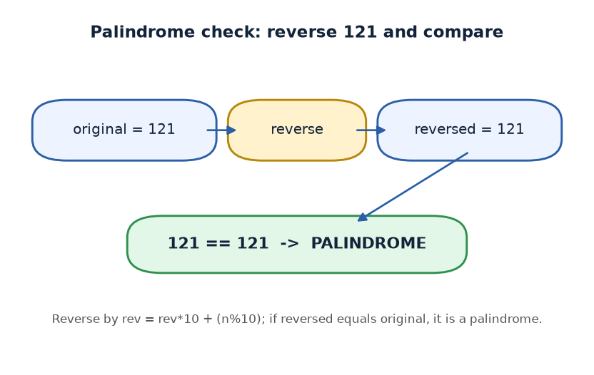
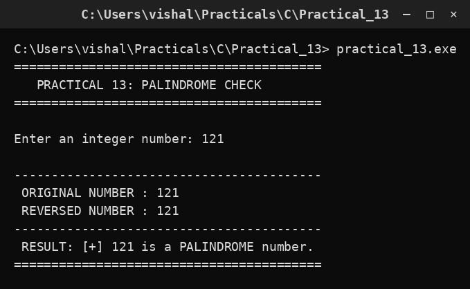

# Practical 13 — Palindrome Number Check

> Introduction to Programming with C · Lab Manual · B.Sc. (Artificial Intelligence), Semester I

## 📌 What this practical covers
- What a **palindrome** is, for both numbers and words.
- How to **reverse a number digit by digit** using `rev = rev * 10 + n % 10`.
- Why we work on a **copy** (`temp`) so the original number survives.
- The final **equality test** between the original and the reversed number.
- Dry runs for `121` (palindrome) and `123` (not), with a reverse-step table.

## 🎯 Aim
To check whether a number is a palindrome (reads the same backward as forward).

## 🧠 The big idea
A **palindrome** is something that reads the same forwards and backwards. The word "madam" is a palindrome — reverse the letters and you get "madam" again. Numbers can be palindromes too: `121`, `1331`, `7`, and `9009` all read the same both ways, while `123` does not (reversed it is `321`).

To check a number, the plan is simple and physical: **reverse it, then compare**. If the reversed number equals the original, it is a palindrome. Think of writing the digits on a strip of paper, turning the strip around, and holding it next to the original — if the two strips match, you have a palindrome. Our program does exactly that, but with arithmetic instead of paper.

## 🔍 Deep dive

### What a palindrome is
A palindrome reads identically left-to-right and right-to-left. Single digits (`0`–`9`) are trivially palindromes. Multi-digit examples: `11`, `121`, `12321`, `4554`. Non-examples: `123`, `1000`, `1234`. The check never depends on the *value* of the digits — only on their *order*.

### How to reverse a number digit by digit
The key trick uses two operators:
- `temp % 10` gives the **last digit** of `temp`.
- `temp / 10` (integer division) **removes** the last digit.

Build the reversed number one digit at a time:
```c
rev = rev * 10 + rem;   /* shift existing digits left, append the new last digit */
```
`rev * 10` moves all current digits one place to the left (adding a zero at the end), and `+ rem` puts the freshly pulled-out digit into that empty spot. Repeat until `temp` becomes `0`.

### Why we work on a copy (temp)
We must keep the original number to compare with at the end. If we repeatedly did `num = num / 10`, the original would be destroyed (turned into `0`) and there would be nothing to compare against. So we copy `num` into `temp` once and let the loop eat away `temp`, leaving `num` untouched:
```c
temp = num;   /* keep a copy; work only on temp */
```

### The final equality test
After the loop, `rev` holds the reversed digits. The check is a single comparison:
```c
if (num == rev)   /* palindrome */ else /* not a palindrome */
```
Because both `num` and `rev` are plain integers, C compares their values directly.

### Dry run 121 (palindrome) — reverse step table
Start: `num = 121`, `temp = 121`, `rev = 0`.

| Step | `temp` | `rem = temp % 10` | `rev = rev*10 + rem` | `temp = temp / 10` |
| :--- | :--- | :--- | :--- | :--- |
| 1 | 121 | 1 | 0*10+1 = 1 | 12 |
| 2 | 12 | 2 | 1*10+2 = 12 | 1 |
| 3 | 1 | 1 | 12*10+1 = 121 | 0 |
| stop | 0 | — | — | — |

`rev = 121` and `num = 121`, so `121 == 121` → **palindrome**.

### Dry run 123 (not a palindrome)
Start: `num = 123`, `temp = 123`, `rev = 0`.

| Step | `temp` | `rem` | `rev` | `temp` after |
| :--- | :--- | :--- | :--- | :--- |
| 1 | 123 | 3 | 3 | 12 |
| 2 | 12 | 2 | 32 | 1 |
| 3 | 1 | 1 | 321 | 0 |
| stop | 0 | — | — | — |

`rev = 321`, but `num = 123`, so `123 != 321` → **not a palindrome**.

## 📖 Key terms
| Term | Meaning |
| :--- | :--- |
| Palindrome | A number/word that reads the same forwards and backwards. |
| `%` (modulus) | Remainder operator; `n % 10` gives the last digit. |
| `/` (integer division) | `n / 10` drops the last digit. |
| `rev` | The reversed number we are building. |
| `temp` | A copy of the original number used inside the loop. |
| `rem` | The digit pulled out at each step (remainder). |

## 🖼️ Diagram


## 🧮 Dry run (worked example)
Input: `num = 121`.

1. `temp = 121`, `rev = 0`.
2. Loop iteration 1: `rem = 1`, `rev = 1`, `temp = 12`.
3. Loop iteration 2: `rem = 2`, `rev = 12`, `temp = 1`.
4. Loop iteration 3: `rem = 1`, `rev = 121`, `temp = 0`.
5. `temp != 0` is now false → exit loop.
6. Print original (`121`) and reversed (`121`).
7. `num == rev` → `121 == 121` is true → prints "is a PALINDROME number".

## ⌨️ Reading the code
```c
#include <stdio.h>
#include <conio.h>

void main()
{
    int num, rev = 0, rem, temp;
    clrscr();                                   /* clear screen (Turbo C) */
    printf("Enter an integer number: ");
    scanf("%d", &num);                          /* read the number */
    temp = num;                                 /* work on a copy */

    while (temp != 0)
    {
        rem = temp % 10;                        /* last digit */
        rev = rev * 10 + rem;                   /* append it to reversed */
        temp /= 10;                             /* drop the last digit */
    }

    printf(" ORIGINAL NUMBER : %d\n", num);
    printf(" REVERSED NUMBER : %d\n", rev);

    if (num == rev)
        printf(" RESULT: [+] %d is a PALINDROME number.\n", num);
    else
        printf(" RESULT: [-] %d is NOT a PALINDROME number.\n", num);

    getch();                                    /* wait for key (Turbo C) */
}
```
- `rev` is initialised to `0` — essential, because we build it up.
- The `while` loop runs until every digit has been moved into `rev`.
- `num` is never modified, so the final `if (num == rev)` is a fair comparison.

## 🔑 Syntax cheat-sheet
| Syntax | Meaning |
| :--- | :--- |
| `int rev = 0;` | Start the reversed number at zero. |
| `rem = temp % 10;` | Extract the last digit. |
| `rev = rev * 10 + rem;` | Shift left and append the digit. |
| `temp /= 10;` | Remove the last digit (integer division). |
| `while (temp != 0)` | Repeat until no digits remain. |
| `if (num == rev)` | Palindrome test: original equals reversed. |

## 🖨️ Output


## ⚠️ Common mistakes
- **Not copying to `temp`** and shrinking `num` directly — then the original is `0` at the end and the test always fails.
- **Forgetting `rev = 0` at the start** — leftover garbage in `rev` gives a wrong reversal.
- **Writing `rev = rev + rem`** instead of `rev = rev * 10 + rem` — this just sums the digits, not reverses them.
- **Using `if` instead of `while`** — only the last digit would be handled.
- **Assuming it works for decimals** — this method only applies to whole numbers (integers).

## ✅ Key takeaways
- A palindrome reads the same both ways; check by reversing and comparing.
- Reverse a number with `rev = rev * 10 + temp % 10`, then `temp /= 10`.
- Always work on a **copy** so the original stays intact.
- `121` reverses to `121` (palindrome); `123` reverses to `321` (not).
- The whole program is a loop to build `rev`, plus one equality test.

## 🏋️ Try it yourself
1. Extend the program to check whether a *string* (word) is a palindrome using array indices.
2. Count and print how many digits the number has, in addition to checking the palindrome.
