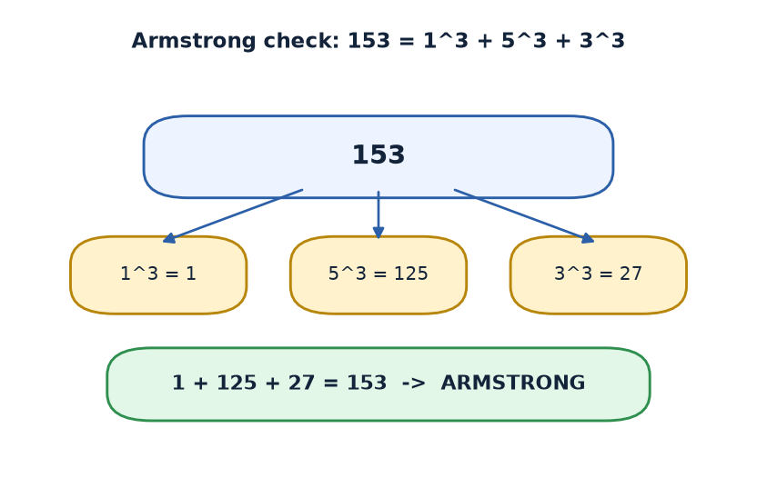
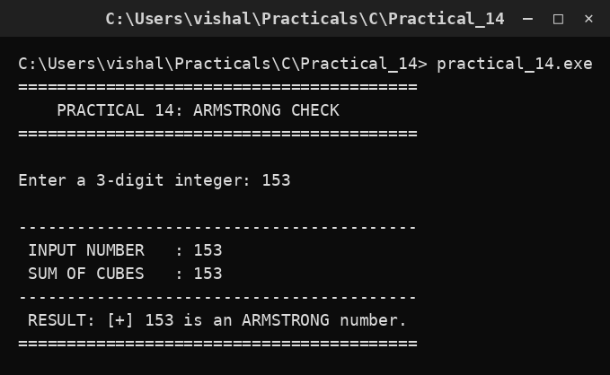

# Practical 14 — Armstrong Number Check

> Introduction to Programming with C · Lab Manual · B.Sc. (Artificial Intelligence), Semester I

## 📌 What this practical covers
- What an **Armstrong** (narcissistic) number is.
- The rule: a number equals the sum of its digits each raised to the **number of digits**.
- How to **extract digits** with `% 10` and `/ 10`.
- **Cubing a digit** by repeated multiplication (`rem * rem * rem`).
- The comparison, plus dry runs for `153` (Armstrong) and `123` (not).

## 🎯 Aim
To check whether a three-digit number is an Armstrong number.

## 🧠 The big idea
An **Armstrong number** (also called a *narcissistic number*) is a number that is exactly equal to the sum of its own digits, where each digit is raised to the power of *how many digits there are*.

For a **three-digit** number, that power is 3, so each digit is **cubed**:

```text
abc is Armstrong  ⟺  a³ + b³ + c³ = abc
```

The name comes from the idea that the number is "self-powered" — it is built entirely from its own digits. A neat example is `153`, because `1³ + 5³ + 3³ = 1 + 125 + 27 = 153`. It is as if the digits, when powered up, add back to the number they came from. Only a few such numbers exist, which makes them special.

## 🔍 Deep dive

### What an Armstrong number is
The general rule for a number with `d` digits is:
```text
sum of (each digit)^d = the number itself
```
- 3-digit example: `153 → 1³ + 5³ + 3³ = 153`. ✔
- 4-digit example: `1634 → 1⁴ + 6⁴ + 3⁴ + 4⁴ = 1 + 1296 + 81 + 256 = 1634`. ✔
- Non-example: `123 → 1³ + 2³ + 3³ = 1 + 8 + 27 = 36 ≠ 123`. ✘

In this practical we assume a **three-digit** input, so the exponent is always 3. (The same idea generalises, but you would first need to count the digits.)

### Extracting the digits
We reuse the digit trick from the palindrome program:
- `temp % 10` → the **last digit**.
- `temp / 10` → **remove** the last digit.

By repeating this, we visit every digit of the number, from right to left.

### Cubing by repeated multiplication
Instead of a power function, we simply multiply the digit by itself three times:
```c
sum += rem * rem * rem;   /* cube the digit and add to the running total */
```
`rem * rem * rem` is `rem³`. The `+=` adds it to `sum`, which accumulates the total of all cubes.

### The comparison
After the loop, `sum` holds the total of the cubes:
```c
if (num == sum)   /* Armstrong */ else /* not Armstrong */
```
We compare the original number with this sum. If they match, it is an Armstrong number.

### Dry run 153 (Armstrong)
Start: `num = 153`, `temp = 153`, `sum = 0`.

| Step | `temp` | `rem` | `rem³` | `sum` | `temp` after |
| :--- | :--- | :--- | :--- | :--- | :--- |
| 1 | 153 | 3 | 27 | 27 | 15 |
| 2 | 15 | 5 | 125 | 152 | 1 |
| 3 | 1 | 1 | 1 | 153 | 0 |
| stop | 0 | — | — | — | — |

`sum = 153` and `num = 153` → **Armstrong number**.

### Dry run 123 (not Armstrong)
Start: `num = 123`, `temp = 123`, `sum = 0`.

| Step | `temp` | `rem` | `rem³` | `sum` | `temp` after |
| :--- | :--- | :--- | :--- | :--- | :--- |
| 1 | 123 | 3 | 27 | 27 | 12 |
| 2 | 12 | 2 | 8 | 35 | 1 |
| 3 | 1 | 1 | 1 | 36 | 0 |
| stop | 0 | — | — | — | — |

`sum = 36`, but `num = 123`, so `123 != 36` → **not an Armstrong number**.

## 📖 Key terms
| Term | Meaning |
| :--- | :--- |
| Armstrong number | A number equal to the sum of its digits each raised to the digit-count power. |
| Narcissistic number | Another name for an Armstrong number. |
| Digit extraction | Pulling digits out one by one using `% 10` and `/ 10`. |
| Cube | A number multiplied by itself three times (`x³ = x*x*x`). |
| `sum` | Accumulator holding the total of the cubes. |
| `temp` | A copy of the original number used in the loop. |

## 🖼️ Diagram


## 🧮 Dry run (worked example)
Input: `num = 153`.

1. `temp = 153`, `sum = 0`.
2. Iteration 1: `rem = 3`, `sum = 0 + 27 = 27`, `temp = 15`.
3. Iteration 2: `rem = 5`, `sum = 27 + 125 = 152`, `temp = 1`.
4. Iteration 3: `rem = 1`, `sum = 152 + 1 = 153`, `temp = 0`.
5. `temp != 0` is false → exit loop.
6. Print input (`153`) and sum of cubes (`153`).
7. `num == sum` → `153 == 153` is true → prints "is an ARMSTRONG number".

## ⌨️ Reading the code
```c
#include <stdio.h>
#include <conio.h>

void main()
{
    int num, sum = 0, rem, temp;
    clrscr();                                   /* clear screen (Turbo C) */
    printf("Enter a 3-digit integer: ");
    scanf("%d", &num);                          /* read the number */
    temp = num;                                 /* work on a copy */

    while (temp != 0)
    {
        rem = temp % 10;                        /* last digit */
        sum += rem * rem * rem;                 /* add its cube to the total */
        temp /= 10;                             /* drop the last digit */
    }

    printf(" INPUT NUMBER   : %d\n", num);
    printf(" SUM OF CUBES   : %d\n", sum);

    if (num == sum)
        printf(" RESULT: [+] %d is an ARMSTRONG number.\n", num);
    else
        printf(" RESULT: [-] %d is NOT an ARMSTRONG number.\n", num);

    getch();                                    /* wait for key (Turbo C) */
}
```
- `sum` starts at `0` and accumulates the cubes.
- The `while` loop walks through every digit of `temp`.
- `num` is untouched, so the final `if (num == sum)` is a fair test.

## 🔑 Syntax cheat-sheet
| Syntax | Meaning |
| :--- | :--- |
| `int sum = 0;` | Start the cube-total at zero. |
| `rem = temp % 10;` | Get the last digit. |
| `sum += rem * rem * rem;` | Cube the digit and add it to `sum`. |
| `temp /= 10;` | Remove the last digit. |
| `while (temp != 0)` | Loop until all digits are processed. |
| `if (num == sum)` | Armstrong test: number equals sum of cubes. |

## 🖨️ Output


## ⚠️ Common mistakes
- **Forgetting `sum = 0`** — a leftover value in `sum` makes every number look wrong.
- **Not copying to `temp`** — shrinking `num` destroys the original and the test fails.
- **Cubing the wrong thing** — writing `rem * rem` (square) instead of `rem * rem * rem` (cube).
- **Using the program on non-3-digit numbers** — the rule here fixes the power at 3, so `1634` would be judged by cubes and wrongly rejected.
- **Writing `sum = rem*rem*rem`** instead of `+=` — this keeps only the last digit's cube.

## ✅ Key takeaways
- An Armstrong number equals the sum of its digits each raised to the number of digits.
- For three digits, cube each digit and sum them.
- Digits are extracted with `% 10` and `/ 10`, always on a copy (`temp`).
- `153 = 1³ + 5³ + 3³` is an Armstrong number; `123` gives `36` and is not.
- The whole check is one loop plus one equality test.

## 🏋️ Try it yourself
1. Extend the program to handle numbers of *any* length by first counting the digits, then raising each to that count.
2. Print all three-digit Armstrong numbers between 100 and 999 by wrapping the logic in a loop.
