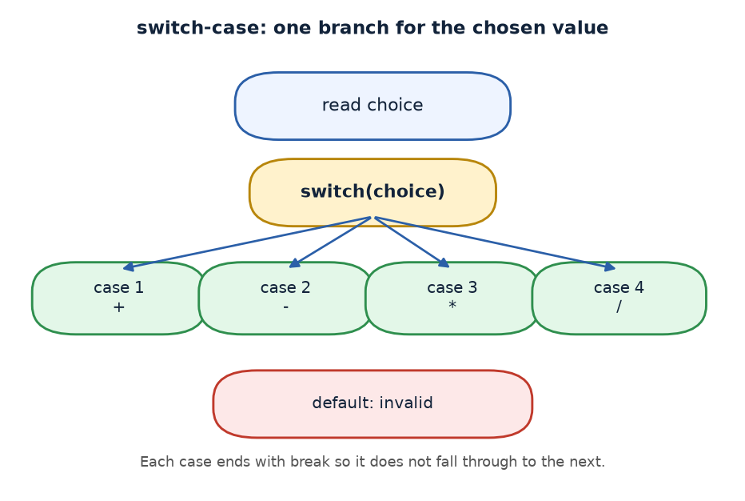
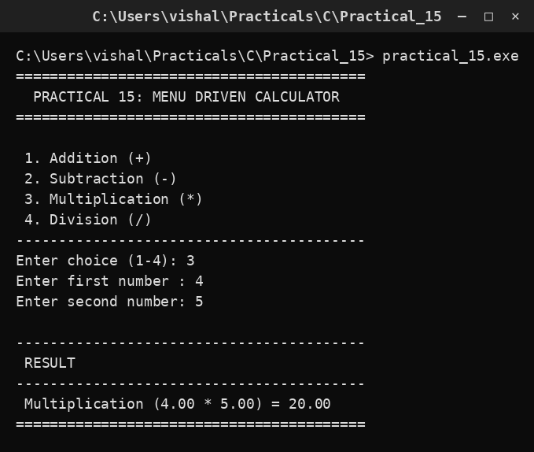

# Practical 15 — Menu-Driven Calculator (switch-case)

> Introduction to Programming with C · Lab Manual · B.Sc. (Artificial Intelligence), Semester I

## 📌 What this practical covers
- **Multi-way branching** — choosing one action from several options.
- The `switch-case` statement and how it compares an expression to each `case` label.
- The role of **`break`** and what **fall-through** means.
- Using **`default`** to handle invalid input.
- Why a menu is user-friendly, and how to **guard against division by zero**.

## 🎯 Aim
To create a menu-driven calculator using the switch-case statement.

## 🧠 The big idea
A **menu** lets the user pick one option from a list — just like a restaurant menu, or the "Press 1 for English, 2 for Hindi" prompt on a phone call. In C, the cleanest tool for "pick exactly one of these many choices" is the **`switch-case`** statement.

Think of a set of labelled mailboxes. The user's choice is a number; `switch` walks to the mailbox with that number and drops the task there. `case 1` is the mailbox for addition, `case 2` for subtraction, and so on. If the number matches no mailbox, `default` is the "everything else" tray. This is far tidier than writing a long chain of `if … else if … else if …`.

## 🔍 Deep dive

### Multi-way branching
Sometimes a program must choose among *several* possibilities, not just true/false. You could write:
```c
if (choice == 1) { ... }
else if (choice == 2) { ... }
else if (choice == 3) { ... }
else if (choice == 4) { ... }
else { ... }
```
This works, but it is long and repetitive. When all the choices compare the *same expression* against *constant values*, `switch-case` is clearer and easier to read.

### switch-case syntax and how it works
```c
switch (choice)
{
    case 1: /* do addition */      break;
    case 2: /* do subtraction */   break;
    ...
    default: /* invalid choice */
}
```
How it runs:
1. C evaluates the expression in the parentheses — here `choice`.
2. It compares the value against each `case` label **in order**.
3. When a label matches, execution **jumps** to that point and runs the statements.
4. `default` runs only if no label matched.

`case` labels must be **constant** integers (or characters), and no two labels may have the same value.

### The role of break (prevent fall-through)
`break` tells C: "stop the switch here, do not run any more cases." **Without `break`, execution falls through** into the next case and keeps running — this is called **fall-through**, and it is usually a bug.

Example of the danger (missing `break`):
```c
case 1: printf("Add");     /* no break! */
case 2: printf("Subtract"); /* this runs too! */
```
If the user picks `1`, they would see *both* "Add" and "Subtract". Putting `break;` at the end of each case prevents this. (Occasionally fall-through is *intended* — e.g. grouping cases — but for a calculator, every case must `break`.)

### default for invalid input
If the user types `9` or `0`, no case matches. The `default` block catches it and prints a friendly message:
```c
default: printf(" Invalid choice! Please enter between 1 and 4.\n");
```
`default` is optional but strongly recommended for robustness.

### Why a menu is user-friendly
A menu shows the user exactly what the program can do, in one place, with numbers to type. The user does not need to remember commands — the options are right there on screen. This makes the program easy to use and reduces input mistakes.

### Guarding division by zero
Dividing by zero is **undefined** in mathematics and crashes or gives garbage in C. So before dividing, we check:
```c
if (b != 0) printf(" ... = %.2f\n", a / b);
else        printf(" Error! Division by zero is undefined.\n");
```
Only `case 4` (division) needs this check; the other operations are safe for any numbers.

## 📖 Key terms
| Term | Meaning |
| :--- | :--- |
| switch | Statement that selects one block based on the value of an expression. |
| case | A constant label compared against the switch expression. |
| break | Exits the switch, preventing fall-through into the next case. |
| default | Block that runs when no case matches. |
| Fall-through | Running into the next case because `break` is missing. |
| Division by zero | Undefined operation; must be guarded with an `if` check. |

## 🖼️ Diagram


## 🧮 Dry run (worked example)
Input: `choice = 3`, `a = 4`, `b = 5`.

1. Program prints the menu (1 Add, 2 Sub, 3 Mul, 4 Div).
2. `choice = 3` is read.
3. `a = 4` and `b = 5` are read.
4. `switch (choice)` evaluates `choice = 3`.
5. `case 1`? No. `case 2`? No. `case 3`? **Yes** → jump here.
6. Runs `printf(" Multiplication (%.2f * %.2f) = %.2f\n", a, b, a * b);`
7. `a * b = 4.00 * 5.00 = 20.00` → prints `Multiplication (4.00 * 5.00) = 20.00`.
8. `break;` exits the switch.
9. `getch()` waits for a key.

Output line: ` Multiplication (4.00 * 5.00) = 20.00`.

## ⌨️ Reading the code
```c
#include <stdio.h>
#include <conio.h>

void main()
{
    int choice; float a, b;
    clrscr();                                        /* clear screen (Turbo C) */

    printf(" 1. Addition (+)\n 2. Subtraction (-)\n 3. Multiplication (*)\n 4. Division (/)\n");
    printf("Enter choice (1-4): ");
    scanf("%d", &choice);                            /* read the menu choice */

    printf("Enter first number : ");
    scanf("%f", &a);                                 /* read first operand */
    printf("Enter second number: ");
    scanf("%f", &b);                                 /* read second operand */

    switch (choice)
    {
    case 1:
        printf(" Addition (%.2f + %.2f) = %.2f\n", a, b, a + b);
        break;
    case 2:
        printf(" Subtraction (%.2f - %.2f) = %.2f\n", a, b, a - b);
        break;
    case 3:
        printf(" Multiplication (%.2f * %.2f) = %.2f\n", a, b, a * b);
        break;
    case 4:
        if (b != 0)
            printf(" Division (%.2f / %.2f) = %.2f\n", a, b, a / b);
        else
            printf(" Error! Division by zero is undefined.\n");
        break;
    default:
        printf(" Invalid choice! Please enter between 1 and 4.\n");
    }

    getch();                                         /* wait for key (Turbo C) */
}
```
- `choice` is an `int`; `a` and `b` are `float` so decimals work.
- Each `case` prints the operation and its result, then `break`s.
- `case 4` adds an extra `if` to guard against `b == 0`.
- `default` catches any choice outside 1–4.

## 🔑 Syntax cheat-sheet
| Syntax | Meaning |
| :--- | :--- |
| `switch (choice)` | Evaluate `choice` and jump to the matching case. |
| `case 1:` | A label matched against the switch expression. |
| `break;` | Exit the switch; prevents fall-through. |
| `default:` | Runs when no case matches. |
| `%.2f` | Print a float with two decimal places. |
| `if (b != 0)` | Guard so division only happens for a non-zero divisor. |

## 🖨️ Output


## ⚠️ Common mistakes
- **Forgetting `break`** — fall-through runs the next case(s) too, giving extra output.
- **Missing `default`** — an invalid choice produces no message at all.
- **Not guarding division by zero** — `case 4` with `b = 0` crashes or prints garbage.
- **Using `%d` for a float** — `a` and `b` are `float`, so use `%f`/`%.2f`, not `%d`.
- **Duplicate `case` values** — two cases with the same number cause a compile error.

## ✅ Key takeaways
- `switch-case` is the clean way to choose one action among many.
- Each `case` needs a `break` to avoid fall-through.
- `default` handles invalid input gracefully.
- A menu makes a program self-explanatory and easy to use.
- Always guard division by zero before dividing.

## 🏋️ Try it yourself
1. Add `case 5` for modulo (remainder) using `fmod(a, b)` from `<math.h>`.
2. Wrap the whole menu in a `do-while` loop so the user can keep calculating until they choose to exit.
