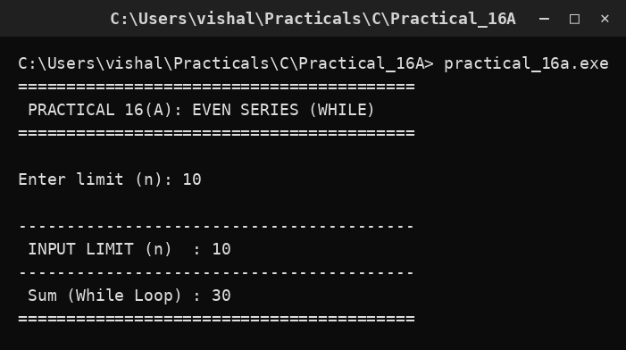

# Practical 16A — Even Series Sum using While Loop

> Introduction to Programming with C · Lab Manual · B.Sc. (Artificial Intelligence), Semester I

## 📌 What this practical covers
- What a **loop** is and why we need one to add a series of numbers.
- The **`while` loop**: its three ingredients (start value, condition, update).
- How to **generate even numbers** by stepping the counter by 2 instead of 1.
- How to build a **running total** with `sumWhile += i`.
- A shortcut formula for the sum of the first `k` even numbers: `k(k+1)`.
- Tracing the program by hand (a **dry run**) so you can predict the output.

## 🎯 Aim
To display the sum of the even-number series 2 + 4 + 6 + ... + n using a while loop.

## 🧠 The big idea
Imagine you must add up a pile of coins, but you are allowed to pick up **one coin at a time**. You keep a running total in your head: pick a coin, add it to the total, move to the next coin, repeat. You stop when the coins run out. A **loop** does exactly this — it repeats the same small action again and again, and each repeat updates a total.

Here the "coins" are the even numbers 2, 4, 6, 8, ... up to the limit `n`. We keep a box called `sumWhile` that starts empty (0), and every time we pick up the next even number we drop it into the box. The `while` loop is the instruction that says "keep picking up the next even number as long as you haven't passed `n`."

## 🔍 Deep dive

### The `while` loop
A `while` loop repeats a block of code **as long as a condition stays true**. Its shape is:

```c
while (condition)
{
    /* body: the steps to repeat */
}
```

The order is important: **test the condition first, then run the body**. If the condition is false at the very start, the body never runs even once. This "check before each pass" behaviour is called a **pre-test loop**.

For our program:

```c
i = 2;
while (i <= n)
{
    sumWhile += i;
    i += 2;
}
```

Read it in plain English: *"Set `i` to 2. While `i` is less than or equal to `n`: add `i` to the sum, then increase `i` by 2."*

### Generating even numbers by stepping by 2
An even number is any number divisible by 2 (2, 4, 6, 8, ...). Notice they are always **2 apart**. So we do not need to test whether a number is even — we simply start at 2 and jump by 2 each time with `i += 2`.

- If we wrote `i++` (step by 1), we would visit 2, 3, 4, 5, ... and we would have to add an `if` check to skip odd numbers.
- By stepping by 2, **every value `i` takes is guaranteed even**. This is simpler and faster.

The variable `i` here is called a **loop counter** (or loop control variable) because it controls how many times the loop runs.

### The running sum
The line `sumWhile += i;` is shorthand for `sumWhile = sumWhile + i;`. On the first pass `sumWhile` is 0, so it becomes `0 + 2 = 2`. On the next pass it becomes `2 + 4 = 6`, then `6 + 6 = 12`, and so on. This pattern — adding each new value onto an accumulated total — is called a **running sum** or **accumulator**.

Two rules keep an accumulator correct:
1. **Initialise it to 0** before the loop (`int sumWhile = 0;`).
2. **Update it inside the loop** so it changes on every pass.

### Why the counter must change
If `i` never changed inside the loop, the condition `i <= n` would stay true forever and the program would hang — an **infinite loop**. The statement `i += 2` is what guarantees the loop eventually stops. Always make sure *something* inside the loop moves it toward making the condition false.

### The shortcut formula
The even numbers 2, 4, 6, ..., 2k are just `2 × (1, 2, 3, ..., k)`. The sum of the first `k` natural numbers is `k(k+1)/2`, so the sum of the first `k` even numbers is `2 × k(k+1)/2 = k(k+1)`.

For `n = 10`, the even numbers are 2, 4, 6, 8, 10 — that is `k = 5` terms, and `5 × 6 = 30`. This matches our loop result, which is a nice way to **check** your program's answer.

## 📖 Key terms
| Term | Meaning |
| :--- | :--- |
| Loop | A block of code that repeats while a condition holds true. |
| `while` loop | A pre-test loop: condition is checked *before* each pass. |
| Condition | A true/false test (`i <= n`) that decides whether to loop again. |
| Loop counter | The variable (`i`) that changes each pass and drives the loop. |
| Running sum / accumulator | A variable (`sumWhile`) that gathers a total across passes. |
| `+=` operator | Short for "add to": `sumWhile += i` means `sumWhile = sumWhile + i`. |
| Infinite loop | A loop whose condition never becomes false, so it never stops. |

## 🖼️ Diagram


## 🧮 Dry run (worked example)
Let us trace the program with `n = 10`. Before the loop: `sumWhile = 0`, `i = 2`.

| Pass | Check `i <= 10` | Action: `sumWhile += i` | Action: `i += 2` | `sumWhile` after | `i` after |
| :--- | :--- | :--- | :--- | :--- | :--- |
| 1 | 2 <= 10 → true | 0 + 2 = 2 | 2 + 2 = 4 | 2 | 4 |
| 2 | 4 <= 10 → true | 2 + 4 = 6 | 4 + 2 = 6 | 6 | 6 |
| 3 | 6 <= 10 → true | 6 + 6 = 12 | 6 + 2 = 8 | 12 | 8 |
| 4 | 8 <= 10 → true | 12 + 8 = 20 | 8 + 2 = 10 | 20 | 10 |
| 5 | 10 <= 10 → true | 20 + 10 = 30 | 10 + 2 = 12 | 30 | 12 |
| 6 | 12 <= 10 → **false** | loop ends | — | 30 | 12 |

The loop runs 5 times and the final sum is **30**, which equals 2 + 4 + 6 + 8 + 10. The shortcut formula also gives `k(k+1) = 5 × 6 = 30`. ✅

## ⌨️ Reading the code
```c
#include <stdio.h>
#include <conio.h>
void main()
{
    int n, i, sumWhile = 0;
    clrscr();
    printf("Enter limit (n): "); scanf("%d", &n);
    i = 2;
    while (i <= n)
    {
        sumWhile += i;
        i += 2;
    }
    printf(" INPUT LIMIT (n)  : %d\n", n);
    printf(" Sum (While Loop) : %d\n", sumWhile);
    getch();
}
```

- `#include <stdio.h>` brings in `printf` and `scanf`. `#include <conio.h>` brings in `clrscr()` and `getch()` (Turbo C / lab environment).
- `int n, i, sumWhile = 0;` declares the limit `n`, the counter `i`, and the accumulator `sumWhile`, which is initialised to **0**.
- `clrscr();` clears the screen so the output looks neat.
- `printf("Enter limit (n): ");` asks the user for a value; `scanf("%d", &n);` reads an integer into `n`. The `&` gives `scanf` the **address** of `n` so it can store the value there.
- `i = 2;` sets the first even number before the loop begins.
- The `while` loop adds each even number to `sumWhile` and advances `i` by 2 until `i` passes `n`.
- The two `printf` lines print the limit and the total. `%d` is the placeholder for an integer.
- `getch();` waits for a key press so the output window does not close immediately.

## 🔑 Syntax cheat-sheet
| Syntax | Meaning |
| :--- | :--- |
| `while (cond) { ... }` | Repeat the block while `cond` is true (checked first). |
| `i = 2;` | Initialise the loop counter before the loop. |
| `i <= n` | Condition: keep going while `i` has not passed `n`. |
| `sumWhile += i;` | Add `i` to the running total. |
| `i += 2;` | Advance the counter to the next even number. |
| `scanf("%d", &n);` | Read an integer from the user into `n`. |
| `printf("%d\n", sumWhile);` | Print an integer followed by a newline. |

## 🖨️ Output


## ⚠️ Common mistakes
- **Forgetting `sumWhile = 0`.** If the accumulator is not initialised, it holds junk and the answer is wrong.
- **Forgetting `i += 2` inside the loop.** The condition never becomes false, so you get an **infinite loop**.
- **Stepping by 1 (`i++`) instead of 2.** This visits odd numbers too, so the sum includes 3, 5, 7, ... and the total is wrong.
- **Using `i < n` instead of `i <= n`.** With `n = 10` you would stop at 8 and miss the 10, giving 20 instead of 30.
- **Writing `scanf("%d", n)` without the `&`.** The value never reaches `n`; the program may crash or read garbage.

## ✅ Key takeaways
- A `while` loop **checks its condition before each pass**, so a false condition at the start means the body never runs.
- Even numbers are generated cleanly by **starting at 2 and stepping by 2**.
- A **running sum** needs an accumulator initialised to 0 and updated every pass.
- **Something inside the loop must change** so the condition eventually becomes false — otherwise the loop runs forever.
- The sum of the first `k` even numbers is `k(k+1)`, a handy way to check your answer.

## 🏋️ Try it yourself
1. Change the program so it sums the **odd** numbers 1 + 3 + 5 + ... + n using a `while` loop. (Hint: start at `i = 1` and step by 2.)
2. Read a number `n` and use a `while` loop to compute the sum 1 + 2 + 3 + ... + n, then compare the result with the formula `n(n+1)/2`.
3. Modify the program to also **count** how many even numbers were added, and print that count alongside the sum.
