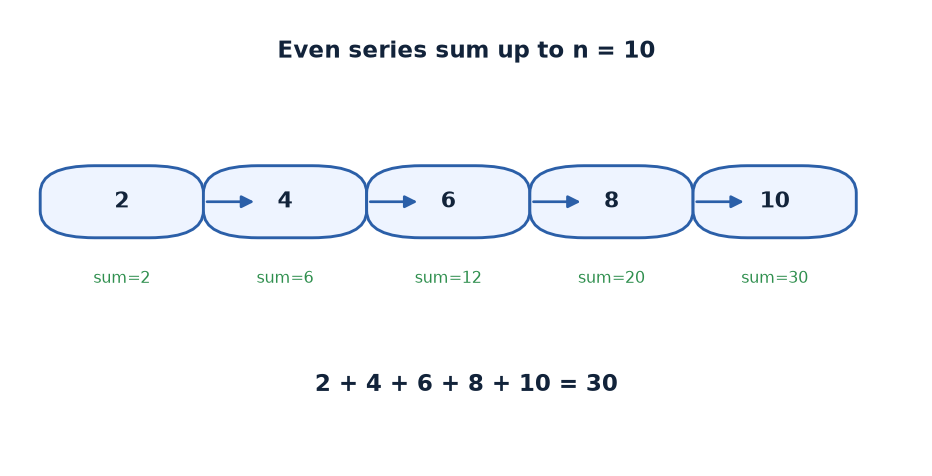
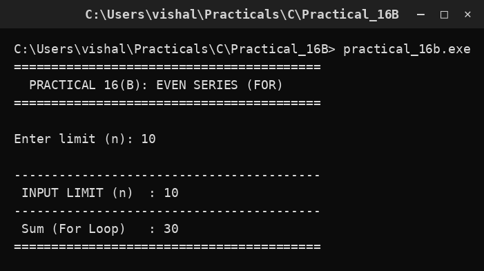

# Practical 16B — Even Series Sum using For Loop

> Introduction to Programming with C · Lab Manual · B.Sc. (Artificial Intelligence), Semester I

## 📌 What this practical covers
- The **`for` loop** and its three parts: initialisation, condition, update.
- How to add the even series 2 + 4 + 6 + ... + n with a `for` loop.
- Why `for` and `while` are **two spellings of the same idea**.
- Stepping the counter by 2 to generate even numbers.
- Building a running total with `sumFor += i`.
- A side-by-side comparison with **Practical 16A** to prove the results match.

## 🎯 Aim
To display the sum of the even-number series 2 + 4 + 6 + ... + n using a for loop.

## 🧠 The big idea
Think of a `for` loop as a **"do this a fixed number of times"** instruction, written like a train ticket: *"start here, keep going while this is true, move forward this much."* All three pieces of information — where you begin, when you stop, and how you move — sit together on one line, which makes the loop easy to read at a glance.

In Practical 16A you wrote those same three pieces on separate lines around a `while`. A `for` loop simply **bundles them together**. The work done inside is identical, so both programs produce the same answer. Learning to see `for` and `while` as interchangeable is one of the most useful skills in C.

## 🔍 Deep dive

### The anatomy of a `for` loop
A `for` loop has three parts inside the parentheses, separated by **semicolons**:

```c
for (initialisation; condition; update)
{
    /* body */
}
```

- **Initialisation** — runs **once**, before the loop starts. Here: `i = 2`.
- **Condition** — checked **before every pass**. Here: `i <= n`.
- **Update** — runs **after every pass**. Here: `i += 2`.

The order of execution is: *initialise once → check condition → run body → update → check condition → run body → update → ...* until the condition becomes false.

Our loop:

```c
for (i = 2; i <= n; i += 2)
{
    sumFor += i;
}
```

Read it as: *"Start `i` at 2; while `i <= n`; after each pass add 2 to `i`. Each time, add `i` to the total."*

### How it differs from `while` (and why it doesn't really)
Here is Practical 16A's `while` version and this `for` version side by side:

```c
/* while version (16A) */          /* for version (16B) */
i = 2;                             for (i = 2; i <= n; i += 2)
while (i <= n)                     {
{                                      sumFor += i;
    sumWhile += i;                 }
    i += 2;
}
```

Look closely: the **same three jobs** appear in both — set `i = 2`, test `i <= n`, advance `i += 2`. The `for` loop just gathers the initialisation and update onto the same line as the condition. That is a **stylistic** difference, not a logical one. Both give identical results.

**Rule of thumb:** use `for` when you know the loop's three parts up front (a counting loop, like this one). Use `while` when the stopping condition is more open-ended (e.g. "keep reading numbers until the user types 0").

### Stepping by 2 to get even numbers
Even numbers are 2 apart, so we move the counter with `i += 2` rather than `i++`. Starting at `i = 2` and adding 2 each time visits exactly 2, 4, 6, 8, ... — every value is even by construction, so no `if` test is needed. The third slot of the `for` header is precisely where this step belongs.

### The running sum
`sumFor += i;` is shorthand for `sumFor = sumFor + i;`. Because `sumFor` starts at 0, it grows: 0 → 2 → 6 → 12 → 20 → 30 for `n = 10`. An accumulator like this must be **initialised to 0** and **updated on every pass**, exactly as in 16A.

### Scope note
In this classic lab style, `i` is declared at the top (`int n, i, sumFor = 0;`). Modern C also allows declaring the counter right inside the `for`: `for (int i = 2; ...)`. Both are fine; the lab's Turbo C compiler expects the older style, so the counter is declared up top here.

## 📖 Key terms
| Term | Meaning |
| :--- | :--- |
| `for` loop | A loop that bundles initialisation, condition, and update in one header line. |
| Initialisation | The part that runs once before the loop (here `i = 2`). |
| Condition | The true/false test checked before each pass (`i <= n`). |
| Update | The part that runs after each pass (`i += 2`). |
| Running sum / accumulator | A variable (`sumFor`) that collects a total across passes. |
| `+=` operator | "Add to": `sumFor += i` means `sumFor = sumFor + i`. |
| Loop equivalence | `for` and `while` can express the same repetition; the choice is style. |

## 🖼️ Diagram


## 🧮 Dry run (worked example)
Trace the program with `n = 10`. Initialisation sets `i = 2` and `sumFor = 0`.

| Pass | Check `i <= 10` | Body: `sumFor += i` | Update: `i += 2` | `sumFor` after | `i` after |
| :--- | :--- | :--- | :--- | :--- | :--- |
| 1 | 2 <= 10 → true | 0 + 2 = 2 | 2 + 2 = 4 | 2 | 4 |
| 2 | 4 <= 10 → true | 2 + 4 = 6 | 4 + 2 = 6 | 6 | 6 |
| 3 | 6 <= 10 → true | 6 + 6 = 12 | 6 + 2 = 8 | 12 | 8 |
| 4 | 8 <= 10 → true | 12 + 8 = 20 | 8 + 2 = 10 | 20 | 10 |
| 5 | 10 <= 10 → true | 20 + 10 = 30 | 10 + 2 = 12 | 30 | 12 |
| 6 | 12 <= 10 → **false** | loop ends | — | 30 | 12 |

Final sum = **30** = 2 + 4 + 6 + 8 + 10. This is **identical** to the `while` result in Practical 16A — as expected, since the loops do the same job. ✅

## ⌨️ Reading the code
```c
#include <stdio.h>
#include <conio.h>
void main()
{
    int n, i, sumFor = 0;
    clrscr();
    printf("Enter limit (n): "); scanf("%d", &n);
    for (i = 2; i <= n; i += 2)
    {
        sumFor += i;
    }
    printf(" INPUT LIMIT (n)  : %d\n", n);
    printf(" Sum (For Loop)   : %d\n", sumFor);
    getch();
}
```

- `#include <stdio.h>` and `#include <conio.h>` provide the input/output and screen/keyboard functions.
- `int n, i, sumFor = 0;` declares the limit, the counter, and the accumulator (initialised to 0).
- `clrscr();` clears the screen.
- `printf(...); scanf("%d", &n);` prompt for and read the limit `n`.
- `for (i = 2; i <= n; i += 2)` is the whole loop in one line: start at 2, go while `<= n`, step by 2.
- The body `sumFor += i;` adds the current even number to the total.
- The two `printf` statements report the limit and the final sum; `%d` prints integers.
- `getch();` pauses the output window until a key is pressed.

## 🔑 Syntax cheat-sheet
| Syntax | Meaning |
| :--- | :--- |
| `for (init; cond; update) { ... }` | Repeat the block; the three parts run in a fixed order. |
| `i = 2` (slot 1) | Initialisation — runs once before the loop. |
| `i <= n` (slot 2) | Condition — checked before each pass. |
| `i += 2` (slot 3) | Update — runs after each pass. |
| `sumFor += i;` | Add the current value to the running total. |
| `for (...) ;` | A `for` with an empty body loops without doing work (avoid). |
| `printf("%d\n", sumFor);` | Print an integer and a newline. |

## 🖨️ Output


## ⚠️ Common mistakes
- **Using commas instead of semicolons** in the header (`for (i=2, i<=n, i+=2)`) — the three parts must be separated by `;`.
- **Putting a semicolon right after the header** (`for (...);`) — this makes the loop body empty, so the sum stays 0.
- **Forgetting `sumFor = 0`.** An uninitialised accumulator gives a garbage answer.
- **Stepping by 1 instead of 2**, which drags odd numbers into the sum.
- **Using `i < n` instead of `i <= n`**, which drops the final term when `n` is even.

## ✅ Key takeaways
- A `for` loop has three slots: **initialisation (once), condition (before each pass), update (after each pass)**.
- `for` and `while` are **interchangeable** — 16A and 16B compute the same 30, just written differently.
- Even numbers come from **starting at 2 and stepping by 2** in the update slot.
- A running sum needs an accumulator **initialised to 0** and **updated every pass**.
- Choose `for` for counting loops and `while` for open-ended conditions; the logic is what matters.

## 🏋️ Try it yourself
1. Rewrite Practical 16A's odd-number sum (1 + 3 + 5 + ...) using a `for` loop, and confirm it matches the `while` version.
2. Print the even numbers **and** their running total on each pass (e.g. "after 4, sum = 6") so you can watch the accumulator grow.
3. Modify the program to count how many even numbers were added (the number of passes) and print that count next to the sum.
