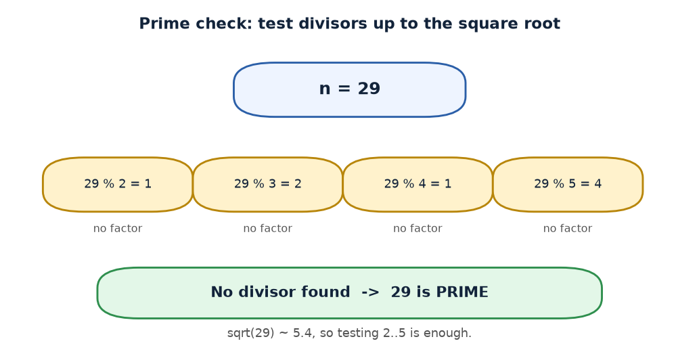
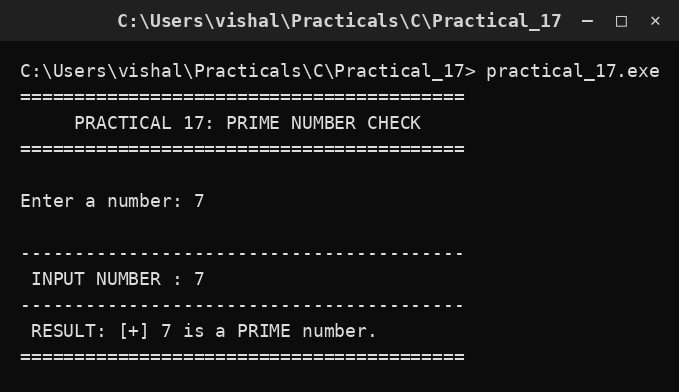

# Practical 17 — Prime Number Check

> Introduction to Programming with C · Lab Manual · B.Sc. (Artificial Intelligence), Semester I

## 📌 What this practical covers
- What a **prime number** is and what makes it special.
- **Trial division**: testing a number by dividing it by smaller numbers.
- Why checking divisors only up to **√n** is enough (and why `num/2` also works but is slower).
- Using a **flag variable** (`isPrime`) to remember a decision.
- **Early exit** with `break` as soon as a divisor is found.
- Handling the special cases **0, 1, and negative numbers**.

## 🎯 Aim
To check whether an entered integer is prime.

## 🧠 The big idea
A **prime number** is a whole number greater than 1 that cannot be made by multiplying two smaller whole numbers. In other words, its **only factors are 1 and itself**. For example, 7 is prime (you can only make 7 as 1 × 7), but 6 is not (1 × 6, but also 2 × 3).

To test whether a number is prime, we can be very direct: **try dividing it by every smaller number and see if anything divides it exactly.** If nothing (other than 1) divides it cleanly, it is prime. This plain approach is called **trial division**. Think of it like checking a locked door: you try every key you own, and the moment one opens it, you know it is *not* a special "unpickable" door.

## 🔍 Deep dive

### What exactly is a prime number?
A number is prime if it has **exactly two factors**: 1 and itself. Let us apply this strictly:

- **2** → factors 1, 2 → prime (the smallest prime).
- **3** → factors 1, 3 → prime.
- **4** → factors 1, 2, 4 → three factors → not prime.
- **1** → only one factor (itself) → **not prime** by definition (a prime must be *greater than 1*).
- **0** → divisible by every number → not prime.
- **Negative numbers** → not prime; primes are positive by definition.

So before any trial division, we must **reject numbers less than or equal to 1**. In the code that is the first check: `if (num <= 1) isPrime = 0;`.

### Trial division
If a number `num` has a factor other than 1 and itself, that factor must be between 2 and `num - 1`. So we test each candidate divisor `i` from 2 upward:

```c
for (i = 2; i <= num / 2; i++)
{
    if (num % i == 0)
    {
        isPrime = 0;
        break;
    }
}
```

`num % i` gives the **remainder** of `num ÷ i`. If the remainder is 0, `i` divides `num` exactly, so `num` has an extra factor and is **not prime**.

### Why we can stop early (√n and num/2)
Naively you might test divisors all the way up to `num - 1`. But there is a smarter limit.

**The √n insight:** if `num` is not prime, it can be written as `num = a × b` where both `a` and `b` are ≥ 2. One of these two factors must be **≤ √num** (because if both were bigger than √num, their product would exceed `num`). So if any factor exists at all, a factor exists at or below √num. Testing divisors only up to `√num` is therefore **enough** to decide primality.

This program uses `num / 2` as the upper limit instead. This also works, because no number greater than `num/2` (and less than `num`) can divide `num` — the smallest possible co-factor would be 2, giving `2 × (num/2) = num`. But `num/2` is **larger than √num**, so the loop does more work than necessary. For example, for `num = 29`, `num/2 = 14`, but `√29 ≈ 5.4`. Testing up to 14 is safe but slower than testing up to 5. For small lab numbers the difference is invisible; for large numbers, using `i * i <= num` is much faster.

### The flag variable `isPrime`
We start by **assuming the number is prime**: `int isPrime = 1;` (1 = true). Then, if we ever find a divisor, we flip the flag to 0 (`isPrime = 0;`). At the end we simply ask "is the flag still 1?". This "assume true, disprove if possible" pattern is called a **flag** or **sentinel** variable — a very common technique in programming.

### Early exit with `break`
The moment we find a single divisor, we already **know** the number is not prime — there is no need to keep testing. The `break` statement jumps out of the `for` loop immediately, saving time. Without `break`, the loop would keep dividing even though the answer is already decided.

### A note on the output
The program prints `[+]` for a prime and `[-]` for a non-prime, a small visual marker so the result stands out on screen.

## 📖 Key terms
| Term | Meaning |
| :--- | :--- |
| Prime number | A whole number > 1 whose only factors are 1 and itself. |
| Factor / divisor | A number that divides another exactly, leaving no remainder. |
| Trial division | Testing primality by dividing by candidate divisors. |
| `%` (modulus) | Gives the remainder: `num % i == 0` means `i` divides `num`. |
| Flag variable | A variable (`isPrime`) that records a yes/no decision. |
| `break` | Exits the nearest loop immediately. |
| √n limit | Testing divisors only up to √num is sufficient to prove primality. |

## 🖼️ Diagram


## 🧮 Dry run (worked example)

**Example 1: `num = 29` (expected: prime).** Start with `isPrime = 1`. `num <= 1`? No. `num / 2 = 14`, so we test `i = 2, 3, ..., 14`.

| `i` | `29 % i` | Zero? | Action |
| :--- | :--- | :--- | :--- |
| 2 | 1 | No | continue |
| 3 | 2 | No | continue |
| 4 | 1 | No | continue |
| 5 | 4 | No | continue |
| 6 | 5 | No | continue |
| 7 | 1 | No | continue |
| ... | ... | No | continue |
| 14 | 1 | No | loop ends |

No divisor found, so `isPrime` stays **1** → prints "**29 is a PRIME number**". ✅

**Example 2: `num = 9` (expected: not prime).** Start with `isPrime = 1`. `num / 2 = 4`, so we test `i = 2, 3, 4`.

| `i` | `9 % i` | Zero? | Action |
| :--- | :--- | :--- | :--- |
| 2 | 1 | No | continue |
| 3 | 0 | **Yes** | set `isPrime = 0`, `break` |

The flag becomes **0** → prints "**9 is NOT a PRIME number**". Notice the loop stopped at `i = 3` thanks to `break`, and never tested `i = 4`. ✅

## ⌨️ Reading the code
```c
#include <stdio.h>
#include <conio.h>
void main()
{
    int num, i, isPrime = 1;
    clrscr();
    printf("Enter a number: "); scanf("%d", &num);
    if (num <= 1)
        isPrime = 0;
    for (i = 2; i <= num / 2; i++)
    {
        if (num % i == 0)
        {
            isPrime = 0;
            break;
        }
    }
    printf(" INPUT NUMBER : %d\n", num);
    if (isPrime)
        printf(" RESULT: [+] %d is a PRIME number.\n", num);
    else
        printf(" RESULT: [-] %d is NOT a PRIME number.\n", num);
    getch();
}
```

- `#include <stdio.h>` / `#include <conio.h>` give us `printf`, `scanf`, `clrscr`, and `getch`.
- `int num, i, isPrime = 1;` declares the number, the divisor counter, and the flag **pre-set to 1 (assume prime)**.
- `clrscr();` clears the screen.
- `printf(...); scanf("%d", &num);` prompt for and read the number.
- `if (num <= 1) isPrime = 0;` handles 0, 1, and negatives immediately — none of these are prime.
- The `for` loop tests every divisor `i` from 2 to `num / 2`.
- Inside, `if (num % i == 0)` finds a divisor → set `isPrime = 0` and `break` out.
- The two `printf` calls after the loop report the number, then use `if (isPrime)` to print the prime/non-prime message. Note `if (isPrime)` is shorthand for `if (isPrime != 0)` — any non-zero value is "true".
- `getch();` holds the window open.

## 🔑 Syntax cheat-sheet
| Syntax | Meaning |
| :--- | :--- |
| `int isPrime = 1;` | Flag initialised to "true" (assume prime). |
| `if (num <= 1) isPrime = 0;` | Reject 0, 1, and negatives. |
| `for (i = 2; i <= num / 2; i++)` | Test divisors from 2 up to `num/2`. |
| `num % i == 0` | True when `i` divides `num` exactly (a factor). |
| `break;` | Leave the loop at once. |
| `if (isPrime)` | True when the flag is any non-zero value. |
| `i * i <= num` | Faster equivalent limit (test up to √num). |

## 🖨️ Output


## ⚠️ Common mistakes
- **Not handling `num <= 1`.** Without it, 1 and 0 are wrongly reported as prime.
- **Starting the loop at `i = 1`.** Since 1 divides everything, every number would be marked non-prime.
- **Forgetting `break`.** Not wrong, but wasteful — the loop keeps running after the answer is known.
- **Setting `isPrime = 1` inside the loop.** This resets the flag each pass and can wrongly report a composite as prime.
- **Using `=` instead of `==`.** `if (num % i = 0)` is a compile error; the comparison must be `==`.
- **Testing up to `num - 1`.** Correct but needlessly slow; `num/2` or `√num` is better.

## ✅ Key takeaways
- A prime has **exactly two factors**: 1 and itself; **1, 0, and negatives are not prime**.
- **Trial division** decides primality by looking for any factor between 2 and the limit.
- It is enough to test divisors up to **√num**; `num/2` also works but is slower.
- A **flag variable** records the yes/no decision ("assume prime, disprove if you can").
- **`break`** exits the loop the instant a factor is found, saving work.

## 🏋️ Try it yourself
1. Rewrite the loop limit as `for (i = 2; i * i <= num; i++)` and verify the program still gives the same answers — this is the √n optimisation in action.
2. Extend the program to **print all prime numbers from 1 to n**, reusing the same checking logic inside another loop.
3. Modify the program to also **print the smallest factor** when the number is not prime (store `i` in a variable before breaking).
