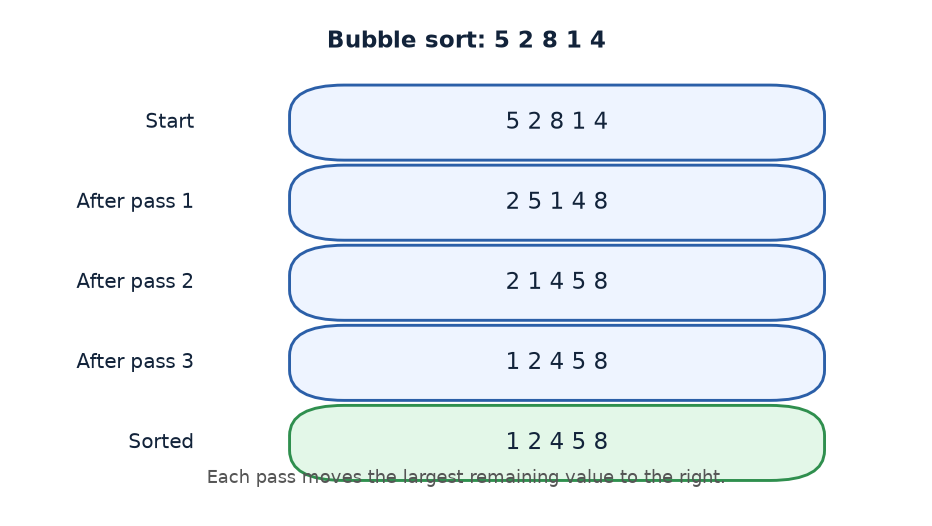
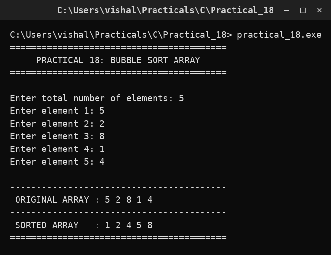

# Practical 18 — Bubble Sort Array

> Introduction to Programming with C · Lab Manual · B.Sc. (Artificial Intelligence), Semester I

## 📌 What this practical covers
- What an **array** is: a block of boxes sharing one name, indexed from 0.
- What **sorting** means and why we arrange data in order.
- The **bubble sort** idea: compare neighbours, swap if out of order.
- Why the largest value **"bubbles"** to the end on each pass.
- The **swap idiom** using a temporary variable.
- **Nested loops** and why the inner loop gets shorter each pass (`n - i - 1`).

## 🎯 Aim
To sort entered array elements in ascending order using bubble sort.

## 🧠 The big idea
An **array** is like a row of numbered lockers, all sharing one name (`arr`). Locker 0, locker 1, locker 2, and so on each hold one value. Instead of having fifty separate variables, you have one array and reach into a locker by its number.

**Sorting** means rearranging those values so they are in order — smallest to largest (ascending) here. **Bubble sort** does this the way you might tidy a line of people by height: walk down the line, and whenever two neighbours are standing in the wrong order, make them swap. Keep walking until the whole line is sorted. The name "bubble" comes from the fact that the **biggest value drifts to the end** of the row on each walk, exactly like a big air bubble rising to the top of a glass of water.

## 🔍 Deep dive

### What is an array?
An array stores many values of the **same type** in one **contiguous** (side-by-side) block of memory. Its index starts at **0**, so an array of `n` elements uses indices `0, 1, 2, ..., n-1`.

```c
int arr[50];   /* room for up to 50 integers */
```

`arr[0]` is the first element, `arr[1]` the second, and `arr[n-1]` the last. Reading the elements in a loop with `i` from `0` to `n-1` is the standard pattern:

```c
for (i = 0; i < n; i++)
    printf("%d ", arr[i]);
```

Note the condition `i < n` (not `i <= n`): with indices starting at 0, the last valid index is `n - 1`.

### The bubble sort idea
Bubble sort repeatedly compares **adjacent pairs** of elements. If a pair is in the wrong order (`arr[j] > arr[j+1]`), it swaps them. One full sweep from left to right is called a **pass**. After each pass, the largest remaining value has moved to the rightmost unsorted position.

```c
for (i = 0; i < n - 1; i++)
{
    for (j = 0; j < n - i - 1; j++)
    {
        if (arr[j] > arr[j + 1])
        {
            temp = arr[j];
            arr[j] = arr[j + 1];
            arr[j + 1] = temp;
        }
    }
}
```

### Why the largest "bubbles" to the end
During a pass, every time a bigger value meets a smaller one on its right, they swap. So a large value keeps moving right, one step per comparison, until it meets an even larger value (or reaches the end). By the time the pass finishes, the **largest value of that pass is parked at the last position**. The next pass therefore only needs to sort the remaining, smaller values — the end is already correct.

### The swap idiom
You cannot swap two values directly (`arr[j] = arr[j+1]; arr[j+1] = arr[j];` would lose the first value). You need a **temporary** holding spot:

```c
temp = arr[j];        /* save the left value */
arr[j] = arr[j + 1];  /* move the right value left */
arr[j + 1] = temp;    /* drop the saved value on the right */
```

This three-step dance is the classic swap and appears everywhere in programming.

### Nested loops and the shrinking inner loop
The **outer loop** (`i`) counts the passes — there are `n - 1` of them (after `n-1` passes everything is in place). The **inner loop** (`j`) walks the array comparing neighbours. Its limit is `n - i - 1`, not `n - 1`:

- After pass 0, the largest value is fixed at the last spot, so pass 1 need not touch it.
- After pass `i`, the last `i` positions are already sorted, so the inner loop stops `i` steps earlier.

This shrinking saves comparisons. `n - i - 1` is exactly "walk up to the last **unsorted** pair."

### Cost of the algorithm
Bubble sort is simple but not fast. In the worst case it makes roughly `n(n-1)/2` comparisons, which grows like **O(n²)**. For a small lab array (say 5 elements → up to 10 comparisons) that is fine; for large data, faster sorts (like quicksort or merge sort) are used.

## 📖 Key terms
| Term | Meaning |
| :--- | :--- |
| Array | A contiguous block of same-type values under one name, indexed from 0. |
| Element | One value stored in an array slot, e.g. `arr[3]`. |
| Index | The position number of an element; starts at 0. |
| Sorting (ascending) | Arranging values from smallest to largest. |
| Pass | One full left-to-right sweep comparing neighbours. |
| Swap | Exchanging two values, done via a temporary variable. |
| Nested loops | A loop inside a loop — the outer counts passes, the inner walks pairs. |
| O(n²) | Rough measure: work grows with the square of the size. |

## 🖼️ Diagram


## 🧮 Dry run (worked example)
Sort the array **5 2 8 1 4** (`n = 5`). We show the array after each pass.

**Pass 0 (`i = 0`, inner `j` runs 0..3):**
- j=0: compare 5,2 → 5>2 → swap → **2 5 8 1 4**
- j=1: compare 5,8 → 5>8? no → **2 5 8 1 4**
- j=2: compare 8,1 → 8>1 → swap → **2 5 1 8 4**
- j=3: compare 8,4 → 8>4 → swap → **2 5 1 4 8**

End of pass 0: the largest (8) has bubbled to the end.

**Pass 1 (`i = 1`, inner `j` runs 0..2):**
- j=0: compare 2,5 → no swap → **2 5 1 4 8**
- j=1: compare 5,1 → swap → **2 1 5 4 8**
- j=2: compare 5,4 → swap → **2 1 4 5 8**

End of pass 1: 5 is now in place.

**Pass 2 (`i = 2`, inner `j` runs 0..1):**
- j=0: compare 2,1 → swap → **1 2 4 5 8**
- j=1: compare 2,4 → no swap → **1 2 4 5 8**

End of pass 2: 4 in place.

**Pass 3 (`i = 3`, inner `j` runs 0..0):**
- j=0: compare 1,2 → no swap → **1 2 4 5 8**

End of pass 3: fully sorted.

**Final sorted array: 1 2 4 5 8.** ✅ (The outer loop runs `n-1 = 4` passes.)

## ⌨️ Reading the code
```c
#include <stdio.h>
#include <conio.h>
void main()
{
    int arr[50], n, i, j, temp;
    clrscr();
    printf("Enter total number of elements: "); scanf("%d", &n);
    for (i = 0; i < n; i++)
    {
        printf("Enter element %d: ", i + 1); scanf("%d", &arr[i]);
    }
    printf(" ORIGINAL ARRAY : ");
    for (i = 0; i < n; i++) printf("%d ", arr[i]);
    for (i = 0; i < n - 1; i++)
    {
        for (j = 0; j < n - i - 1; j++)
        {
            if (arr[j] > arr[j + 1])
            {
                temp = arr[j];
                arr[j] = arr[j + 1];
                arr[j + 1] = temp;
            }
        }
    }
    printf("\n SORTED ARRAY   : ");
    for (i = 0; i < n; i++) printf("%d ", arr[i]);
    getch();
}
```

- `#include <stdio.h>` / `#include <conio.h>` bring in the input/output and screen functions.
- `int arr[50], n, i, j, temp;` declares an array of up to 50 integers, the element count `n`, two loop counters, and a `temp` for swapping.
- `clrscr();` clears the screen.
- `scanf("%d", &n);` reads how many elements the user wants.
- The first `for` loop reads `n` elements; note it prints "element 1", "element 2"… using `i + 1`, since the user counts from 1 but the array indexes from 0. `&arr[i]` gives `scanf` the address of each slot.
- `printf(" ORIGINAL ARRAY : ")` followed by a loop prints the array **before** sorting.
- The **nested loops** do the sorting: the outer runs the passes, the inner walks the unsorted part comparing `arr[j]` and `arr[j+1]`, swapping when out of order.
- `printf("\n SORTED ARRAY : ")` prints the array **after** sorting.
- `getch();` holds the output window open.

## 🔑 Syntax cheat-sheet
| Syntax | Meaning |
| :--- | :--- |
| `int arr[50];` | Declare an array of 50 integers. |
| `arr[i]` | The element at index `i` (0-based). |
| `scanf("%d", &arr[i]);` | Read a value into slot `i`. |
| `for (i = 0; i < n; i++)` | Walk all `n` elements (indices 0..n-1). |
| `for (j = 0; j < n - i - 1; j++)` | Inner pass over the unsorted part. |
| `arr[j] > arr[j + 1]` | Are the neighbours out of order? |
| `temp = a; a = b; b = temp;` | The three-step swap idiom. |

## 🖨️ Output


## ⚠️ Common mistakes
- **Using `i <= n` in a loop.** Indices run 0..n-1; `<= n` reads one element past the end, giving garbage or a crash.
- **Wrong inner limit.** `j < n` instead of `j < n - i - 1` compares already-sorted elements and can read past the end.
- **Swapping without `temp`.** `arr[j] = arr[j+1]; arr[j+1] = arr[j];` overwrites a value — the first element is lost.
- **Looping the outer `n` times instead of `n - 1`.** The extra pass does nothing useful (harmless but wasteful).
- **Reading into `arr` without `&`.** `scanf("%d", arr[i])` is wrong; it must be `&arr[i]`.

## ✅ Key takeaways
- An **array** is a contiguous block of same-type values indexed from **0 to n-1**.
- **Bubble sort** compares **adjacent pairs** and swaps them when out of order.
- Each pass **bubbles the largest remaining value** to the end, so the inner loop shrinks (`n - i - 1`).
- Swapping needs a **temporary variable** — never overwrite a value before saving it.
- Bubble sort is simple but **O(n²)**; fine for small arrays, slow for large ones.

## 🏋️ Try it yourself
1. Change the comparison to `arr[j] < arr[j + 1]` to sort the array in **descending** order, and verify the result.
2. Add a check at the start of each pass: if **no swap** happened, the array is already sorted — `break` out early (this is the "optimised bubble sort").
3. Modify the program to **print the array after every pass**, so you can watch the largest value bubble to the end step by step.
