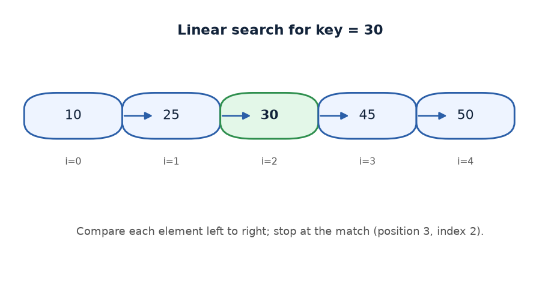
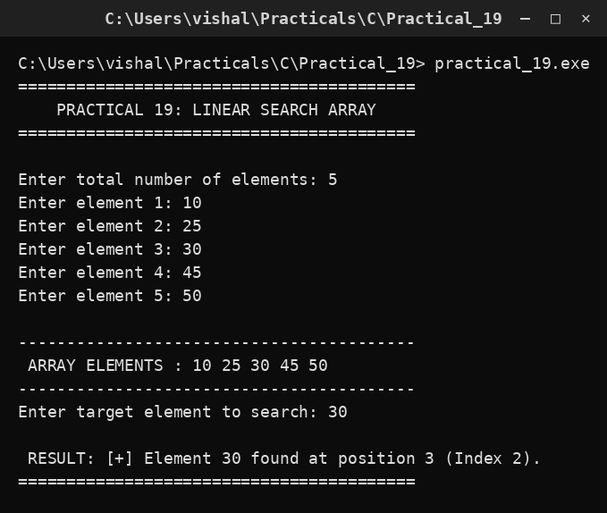

# Practical 19 — Linear Search Array

> **Introduction to Programming with C — Lab Manual**  
> B.Sc. (Artificial Intelligence), Semester I

---

## 🎯 Aim

To search an array for a target value using linear search.

## 📌 Objective

Traverse the array in order and report the position of the target.

## 🧠 Concept in simple words

The program reads the array and a search key, then checks each element one by one. When it finds a match it prints the position (counting from 1) and the index (counting from 0) and stops. If it reaches the end without a match it reports that the element was not found. The best case checks only the first element; the worst case checks all of them.

## 🔑 Basic concepts used

| Concept | Meaning |
| :--- | :--- |
| `Linear search` | Check each element from the start until a match is found. |
| `Index vs position` | Index counts from 0; position counts from 1. |
| `Flag` | found tells whether the key was located. |
| `break` | Stops the loop at the first match. |

## ▶️ How to use

Run and enter 5 elements such as 10 25 30 45 50 and search key 30; the program reports the match at position 3.

### Main file

[`practical_19.c`](./practical_19.c)

## 🖨️ Output

## ✅ Conclusion

Linear search is simple and works on any array, though it can be slow for large data.
