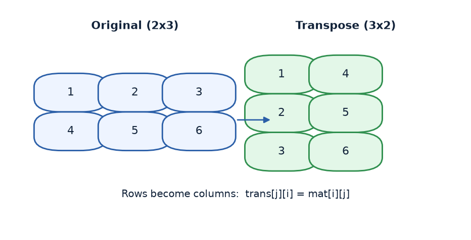
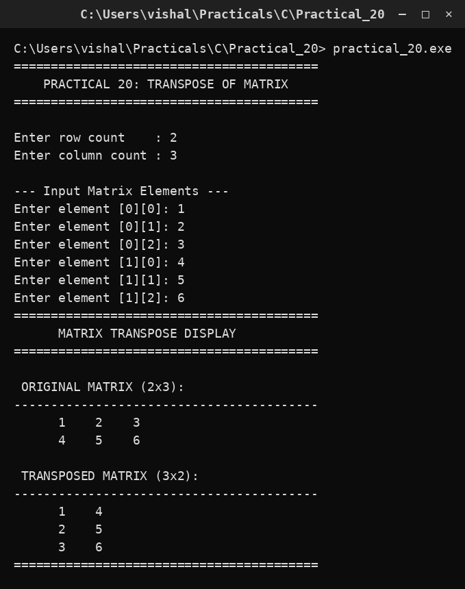

# Practical 20 — Transpose of a Matrix

> Introduction to Programming with C · Lab Manual · B.Sc. (Artificial Intelligence), Semester I

## 📌 What this practical covers
- What a **2D array** (a matrix) is and how to declare one in C.
- How the two-index notation `mat[i][j]` picks out **row i, column j**.
- What the **transpose** of a matrix means: rows become columns.
- The one-line rule that does the whole job: `trans[j][i] = mat[i][j];`.
- Why the **shape changes** from `r × c` to `c × r`.
- Using **nested loops** to read a matrix and to print it back in a neat grid.

## 🎯 Aim
To read a matrix from the user and display its transpose.

## 🧠 The big idea
A matrix is just a table of numbers — like a spreadsheet or a class attendance register. Rows go across, columns go down. In C we store this table in a **two-dimensional array** `mat[10][10]`, which is really an array of arrays: `mat[0]` is the first row, `mat[1]` the second row, and so on. To reach one cell you give two numbers — `mat[i][j]` means "row number i, column number j".

The **transpose** of a matrix is what you get when you flip it along its main diagonal: whatever was lying across (a row) now stands up (a column), and vice-versa. Think of turning a photograph 90° so that the people who were side-by-side are now one behind the other. A `2 × 3` table becomes a `3 × 2` table — the number of rows and columns simply swap places.

## 🔍 Deep dive

### 2D arrays: a table inside the computer
`int mat[10][10];` asks the computer to reserve space for 100 integers arranged as 10 rows and 10 columns. We only use the part we need. C counts from **0**, so a matrix with `r` rows has valid row indices `0` to `r-1`, and a matrix with `c` columns has valid column indices `0` to `c-1`. Reaching outside these bounds reads or writes "garbage" memory — a very common bug.

### Reading the matrix with nested loops
To fill every cell we need two loops: an **outer** loop that walks the rows and an **inner** loop that walks the columns of that row.

```c
for (i = 0; i < r; i++)
    for (j = 0; j < c; j++)
    { printf("Enter element [%d][%d]: ", i, j); scanf("%d", &mat[i][j]); }
```

The outer loop fixes the row `i`; the inner loop then visits every column `j` in that row. Together they touch all `r × c` cells exactly once.

### The transpose rule
This single assignment does all the work:

```c
trans[j][i] = mat[i][j];
```

Read it carefully: the element that lives at **row i, column j** in the original is placed at **row j, column i** in the transpose. The two indices are simply **swapped**. Because every original cell is copied to a mirrored position, the whole table flips.

### Why the shape changes from r×c to c×r
The original has `r` rows and `c` columns. After swapping the indices, whatever had index `j` up to `c-1` now acts as a **row** index, and whatever had index `i` up to `r-1` now acts as a **column** index. So the transpose has `c` rows and `r` columns. That is why we print the transposed matrix with the loops written as `for (i = 0; i < c; i++)` (c rows) and `for (j = 0; j < r; j++)` (r columns) — the limits are exchanged.

### Printing a grid neatly
`printf("%4d ", mat[i][j])` prints each number right-aligned in a field 4 characters wide. This keeps the columns straight, so a matrix looks like a proper table instead of a jumble. The `printf("\n")` after the inner loop ends the row before the next one begins.

## 📖 Key terms
| Term | Meaning |
| :--- | :--- |
| 2D array | An array of arrays; a table of values reached with two indices. |
| Matrix | A rectangular grid of numbers arranged in rows and columns. |
| Row index | The first index `i`; selects which horizontal line you are on. |
| Column index | The second index `j`; selects which vertical line you are on. |
| Transpose | The matrix you get by swapping rows and columns (index-swap). |
| Nested loop | A loop placed inside another loop; used to scan a 2D grid. |
| `clrscr()` | Clears the screen (Turbo C / conio). |
| `getch()` | Waits for a key press so the output does not vanish. |

## 🖼️ Diagram


## 🧮 Dry run (worked example)
Take a `2 × 3` matrix (r = 2, c = 3):

```
mat = [[1, 2, 3],
       [4, 5, 6]]
```

Now apply `trans[j][i] = mat[i][j];` for every cell:

| i | j | `mat[i][j]` | goes to `trans[j][i]` |
| :--- | :--- | :--- | :--- |
| 0 | 0 | 1 | trans[0][0] = 1 |
| 0 | 1 | 2 | trans[1][0] = 2 |
| 0 | 2 | 3 | trans[2][0] = 3 |
| 1 | 0 | 4 | trans[0][1] = 4 |
| 1 | 1 | 5 | trans[1][1] = 5 |
| 1 | 2 | 6 | trans[2][1] = 6 |

Filling `trans` row by row:

```
trans = [[1, 4],
         [2, 5],
         [3, 6]]
```

The original `2 × 3` became a `3 × 2` — exactly as expected. The first **row** `1 2 3` is now the first **column** `1 2 3`, and the second row `4 5 6` is the second column.

## ⌨️ Reading the code
- `int r, c, i, j, mat[10][10], trans[10][10];` — declare the counts, the loop counters, and two 10×10 integer tables.
- `clrscr();` — wipe the console before we begin.
- The first nested loop **reads** `r` and `c`, then fills `mat` cell by cell.
- The second nested loop copies each cell across the diagonal: `trans[j][i] = mat[i][j];`.
- `clrscr();` — clear the screen again so only the results show.
- The next nested loop **prints** the original matrix `r × c`.
- The last nested loop **prints** the transpose, but note the swapped limits — `i < c` and `j < r` — because the shape is now `c × r`.
- `getch();` — pause so the user can read the output.

## 🔑 Syntax cheat-sheet
| Syntax | Meaning |
| :--- | :--- |
| `int mat[10][10];` | Declare a 10×10 integer 2D array. |
| `mat[i][j]` | The element at row i, column j (both start at 0). |
| `for (i = 0; i < r; i++)` | Loop over the rows. |
| `for (j = 0; j < c; j++)` | Loop over the columns of the current row. |
| `trans[j][i] = mat[i][j];` | The transpose rule: swap the two indices. |
| `printf("%4d ", x)` | Print x in a 4-wide field, right aligned. |
| `printf("\n")` | Move to the next line (end of a row). |

## 🖨️ Output


## ⚠️ Common mistakes
- Swapping the loops in the transpose step — writing `trans[i][j] = mat[j][i]` instead. This often runs but silently corrupts or reads uninitialised cells.
- Forgetting to swap the loop limits when printing the transpose (`i < r` instead of `i < c`), which prints a wrongly shaped grid.
- Off-by-one errors: using `<=` instead of `<` in the loop conditions and stepping one cell past the matrix.
- Declaring `mat` and `trans` as the same variable name, or forgetting to declare `trans` at all.
- Entering more than 10 rows or columns, which overflows the declared `[10][10]` array.

## ✅ Key takeaways
- A matrix is stored as a **2D array**, indexed as `mat[row][column]`.
- The **transpose** is produced by swapping the two indices: `trans[j][i] = mat[i][j]`.
- A transpose turns an `r × c` matrix into a `c × r` matrix — the dimensions exchange.
- **Nested loops** are the standard tool for reading, processing, and printing any 2D grid.
- `%4d` keeps printed matrices aligned so they look like real tables.

## 🏋️ Try it yourself
1. Modify the program so it works for a matrix that is **square** (say 3×3) and check that the transpose's main diagonal is unchanged.
2. Print the transpose **without** a second array, by printing `mat[j][i]` directly in the printing loop. Compare the two approaches.
3. Extend the program to check whether a square matrix is **symmetric** (equal to its own transpose).
