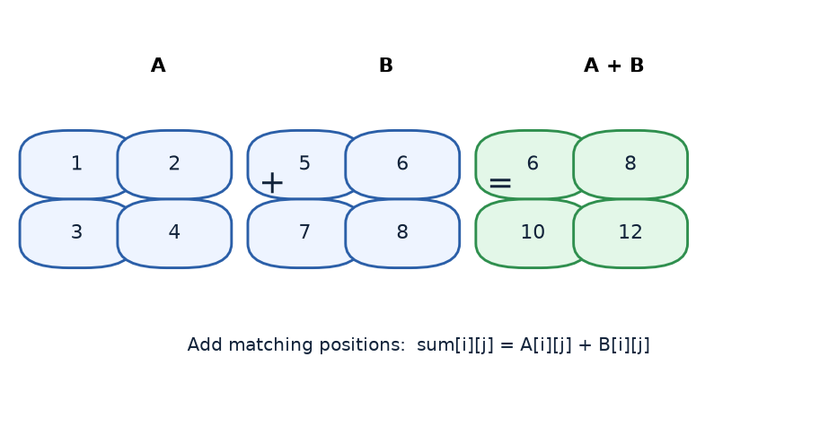
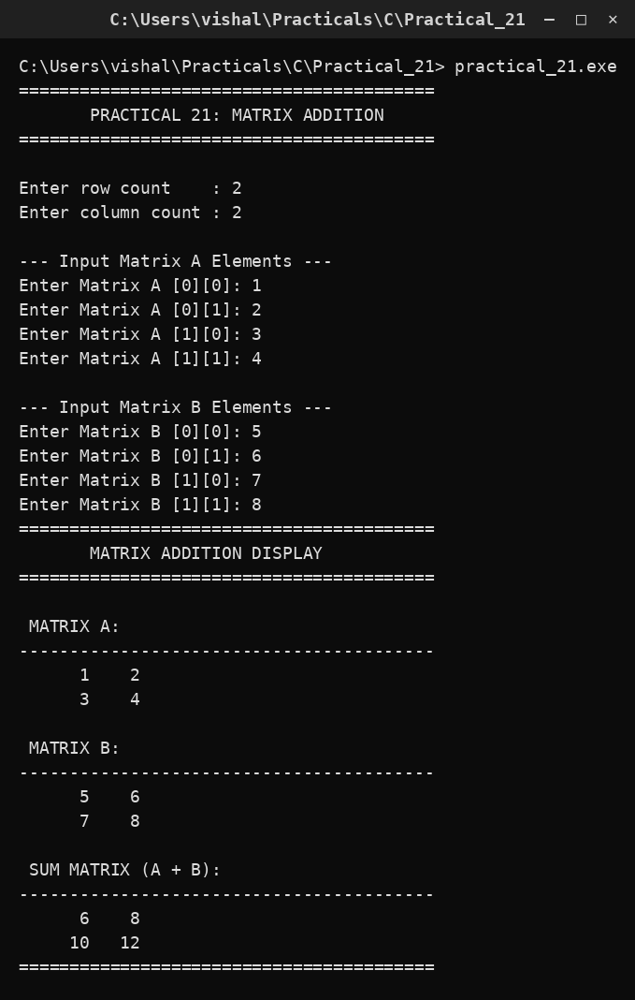

# Practical 21 — Matrix Addition

> **Introduction to Programming with C — Lab Manual**  
> B.Sc. (Artificial Intelligence), Semester I

---

## 🎯 Aim

To read two matrices of equal dimensions and display their sum.

## 📌 Objective

Add two matrices element by element using nested loops.

## 🧠 Concept in simple words

Two matrices can be added only when they have the same number of rows and columns. The program reads both matrices and computes sum[i][j] = A[i][j] + B[i][j] for every position, storing the result in a third matrix. It then prints A, B and the sum so the element-by-element addition is easy to check.

## 🔑 Basic concepts used

| Concept | Meaning |
| :--- | :--- |
| `Matrix addition` | sum[i][j] = A[i][j] + B[i][j] |
| `Equal dimensions` | Both matrices must have the same rows and columns. |
| `Third matrix` | Stores the result without changing the inputs. |
| `Nested loops` | Visit every row and column. |

## ▶️ How to use

Run and enter 2 rows, 2 columns and the values 1 2 3 4 then 5 6 7 8; the program prints the sum matrix.

### Main file

[`practical_21.c`](./practical_21.c)

## 🖨️ Output

## ✅ Conclusion

Matrices are added position by position, which a pair of nested loops performs directly.
