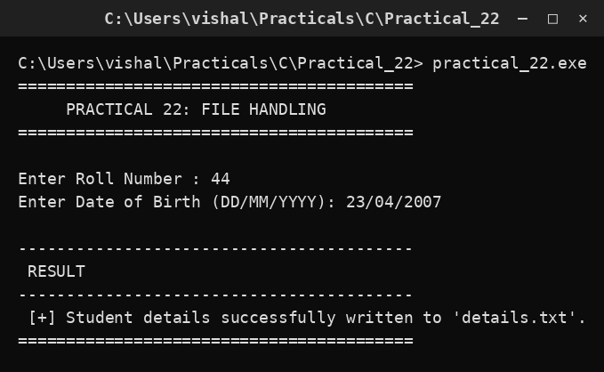

# Practical 22 — File Handling (fprintf / fscanf)

> **Introduction to Programming with C — Lab Manual**  
> B.Sc. (Artificial Intelligence), Semester I

---

## 🎯 Aim

To write student details to a text file and read them back using fprintf() and fscanf().

## 📌 Objective

Learn how data is saved to and read from a file on disk.

## 🧠 Concept in simple words

The program opens a file in write mode with fopen(), writes a student's roll number and date of birth using fprintf(), closes the file, then reopens it in read mode and reads the values back with fscanf(). A file must always be opened before use and closed afterwards so the data is saved and the resources released. The FILE pointer returned by fopen() is checked for NULL in case the file could not be opened.

## 🔑 Basic concepts used

| Concept | Meaning |
| :--- | :--- |
| `FILE pointer` | A handle to an open file, e.g. FILE *fp. |
| `fopen("file","w")` | Opens a file for writing; 'r' reads, 'a' appends. |
| `fprintf()` | Writes formatted text to a file. |
| `fscanf()` | Reads formatted text from a file. |
| `fclose()` | Closes the file and flushes the data. |

## ▶️ How to use

Run and enter roll number 44 and date of birth 23/04/2007; the details are written to details.txt.

### Main file

[`practical_22.c`](./practical_22.c)

## 🖨️ Output

## ✅ Conclusion

File handling lets a program keep its data after it stops running, using just open, read/write and close.
