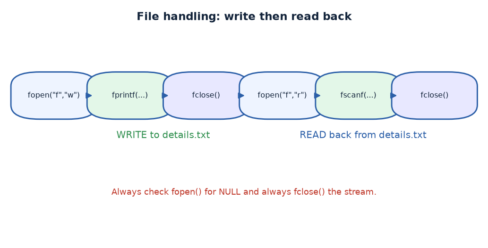

# Practical 22 — File Handling (fprintf / fscanf)

> Introduction to Programming with C · Lab Manual · B.Sc. (Artificial Intelligence), Semester I

## 📌 What this practical covers
- **Why files exist**: data that survives after the program ends.
- The **FILE pointer** — a handle that lets C talk to a file on disk.
- **`fopen()`** and its modes: `"r"` read, `"w"` write/overwrite, `"a"` append.
- **`fprintf()`** — write formatted text to a file (like `printf`, but to a file).
- **`fscanf()`** — read formatted text back from a file (like `scanf`, but from a file).
- **`fclose()`** — flush the buffer and release the file.
- Why the **`NULL` check** after `fopen()` is essential.

## 🎯 Aim
To write student details to a text file and read them back using `fprintf()` and `fscanf()`.

## 🧠 The big idea
Everything a normal C program computes lives in **RAM**, and RAM is wiped clean the moment the program exits. If you run the program again, yesterday's numbers are gone. A **file** is the computer's notebook: it lives on the disk and keeps its contents long after the program has stopped. This "survival of data" is called **persistence**, and it is why every real application — a banking system, a game save, a student database — stores its information in files.

To use a file, C does not hand you the file itself; it hands you a **FILE pointer** — a small handle, like a library membership card. You use the card to ask for the file: open it, write to it or read from it, then close it. `fprintf()` and `fscanf()` are simply the file versions of the `printf()` and `scanf()` you already know — the same `%d`, `%s` format codes, but pointed at a file instead of the screen or keyboard.

## 🔍 Deep dive

### The FILE pointer
```c
FILE *filePointer;
```
`FILE` is a special type defined in `<stdio.h>`. A `FILE *` is a **pointer** — the address of an internal structure that keeps track of everything about your open file (its position, whether it is open for reading or writing, and so on). You never touch the insides of that structure; you only pass the pointer to functions like `fprintf` and `fclose`.

### Opening a file — and the modes
```c
filePointer = fopen("details.txt", "w");
```
`fopen()` opens the named file and returns a `FILE *`. If it fails (for example, the disk is full or the folder is protected), it returns **`NULL`**. The second argument is the **mode**:

| Mode | Meaning |
| :--- | :--- |
| `"r"` | **Read** an existing file. Fails if the file does not exist. |
| `"w"` | **Write**. Creates the file if missing, **erases** it if it already exists. |
| `"a"` | **Append**. Adds new data to the end, keeping old contents. |
| `"r+"` | Read and write an existing file. |

This practical uses `"w"`, so each run **overwrites** `details.txt` with fresh data. If you wanted to keep old records, you would use `"a"`.

### The NULL check — never skip it
```c
if (filePointer == NULL) { printf(" Error: Unable to create or open file on disk.\n"); getch(); return; }
```
If `fopen` failed, the pointer is `NULL`. Trying to write through a `NULL` pointer would crash the program. So we **check first**: if the file could not be opened, print a friendly message and stop. This single check is the difference between a graceful error and a mysterious crash.

### Writing with fprintf
```c
fprintf(filePointer, "Roll Number : %d\n", rollNumber);
fprintf(filePointer, "Date of Birth : %s\n", dateOfBirth);
```
`fprintf()` works exactly like `printf()` — same format string, same `%d`, `%s` — except the **first argument is the file pointer**. Whatever would have appeared on the screen is now written into the file. The `\n` at the end of each line keeps the entries tidy, one per line.

### Reading with fscanf
The mirror image is `fscanf()`:
```c
fscanf(filePointer, "%d", &rollNumber);
fscanf(filePointer, "%s", dateOfBirth);
```
It reads text from the file and converts it according to the format string, just as `scanf` reads from the keyboard. To read the data back you would reopen the file in mode `"r"` and use `fscanf` to pull the values out. (Note: the program above focuses on the **write** side; the read-back is the natural next step and uses the same pointer technique with mode `"r"`.)

### Closing with fclose
```c
fclose(filePointer);
```
When you write to a file, C often keeps the data in a temporary memory **buffer** for speed. `fclose()` **flushes** that buffer to disk (making sure nothing is lost) and **releases** the file so other programs can use it. Forgetting `fclose()` can mean your last lines never reach the disk. Always close what you open.

## 📖 Key terms
| Term | Meaning |
| :--- | :--- |
| File | A named collection of data stored on disk that outlives the program. |
| Persistence | Data surviving after the program stops running. |
| `FILE *` | A pointer/handle used to refer to an open file. |
| `fopen()` | Opens a file and returns a `FILE *` (or `NULL` on failure). |
| Mode | The string `"r"`, `"w"`, `"a"` telling how the file is used. |
| `fprintf()` | Writes formatted text to a file (like `printf`). |
| `fscanf()` | Reads formatted text from a file (like `scanf`). |
| `fclose()` | Flushes the buffer and closes the file. |
| `NULL` | The "no file" pointer returned when `fopen` fails. |

## 🖼️ Diagram


## 🧮 Dry run (worked example)
Suppose the user enters:

```
Enter Roll Number : 44
Enter Date of Birth (DD/MM/YYYY): 23/04/2007
```

Step by step:

1. `fopen("details.txt", "w")` opens (or creates) the file for writing. `filePointer` is not `NULL`, so the check passes.
2. `scanf` puts `44` into `rollNumber` and `23/04/2007` into the `dateOfBirth` string.
3. `fprintf(filePointer, "Roll Number : %d\n", rollNumber);` writes the line `Roll Number : 44` followed by a newline.
4. `fprintf(filePointer, "Date of Birth : %s\n", dateOfBirth);` writes `Date of Birth : 23/04/2007` followed by a newline.
5. `fclose(filePointer)` flushes these two lines to disk and closes the file.

The file `details.txt` on disk now contains:

```
Roll Number : 44
Date of Birth : 23/04/2007
```

Reading it back later with mode `"r"` and `fscanf(filePointer, "%d", &rollNumber)` would recover `44`, and `fscanf(filePointer, "%s", dateOfBirth)` would recover `23/04/2007`.

## ⌨️ Reading the code
- `FILE *filePointer; int rollNumber; char dateOfBirth[15];` — the file handle, an integer for the roll number, and a 15-character array for the date string.
- `clrscr();` — clear the screen.
- `filePointer = fopen("details.txt", "w");` — open the file for writing.
- The `if (filePointer == NULL)` block — the safety check; if the file cannot be opened, print an error, wait for a key, and return.
- `scanf` reads the roll number and the date of birth from the keyboard.
- The two `fprintf` calls write the two labelled lines into the file.
- `fclose(filePointer);` — flush and close.
- `printf(" [+] Student details successfully written to 'details.txt'.\n");` — confirm to the user.
- `getch();` — pause at the end.

## 🔑 Syntax cheat-sheet
| Syntax | Meaning |
| :--- | :--- |
| `FILE *fp;` | Declare a file handle. |
| `fp = fopen("name.txt", "w");` | Open a file for writing (creates/overwrites). |
| `fp = fopen("name.txt", "r");` | Open an existing file for reading. |
| `fp = fopen("name.txt", "a");` | Open a file to append at the end. |
| `if (fp == NULL) { ... }` | Check whether the open failed. |
| `fprintf(fp, "fmt", ...);` | Write formatted text to the file. |
| `fscanf(fp, "fmt", &var);` | Read formatted text from the file. |
| `fclose(fp);` | Flush and close the file. |

## 🖨️ Output


## ⚠️ Common mistakes
- **Not checking `fopen` for `NULL`** — writing through a failed pointer crashes the program.
- Using `"w"` when you meant `"a"`, which silently **erases** the file's previous contents.
- Forgetting `fclose()` — buffered data may never reach the disk.
- Passing the file pointer to `printf`/`scanf` (screen/keyboard) instead of `fprintf`/`fscanf` (file).
- Giving a string that is too long for `char dateOfBirth[15]`, causing an overflow.
- Opening a file in `"r"` mode when it does not exist yet — `fopen` returns `NULL`.

## ✅ Key takeaways
- Files give data **persistence** — it survives after the program ends.
- A **`FILE *`** is a handle you pass to file functions.
- `fopen` returns `NULL` on failure — **always check it**.
- Modes matter: `"r"` reads, `"w"` overwrites, `"a"` appends.
- `fprintf`/`fscanf` are the file twins of `printf`/`scanf`.
- `fclose` flushes the buffer and frees the file — always close what you open.

## 🏋️ Try it yourself
1. Add a **read-back** step: reopen `details.txt` in mode `"r"` and use `fscanf` to print the stored details on screen.
2. Change the mode to `"a"` and run the program twice — observe that both students are now stored.
3. Extend the file to hold **three** fields (roll number, name, and date of birth) and read them all back.
