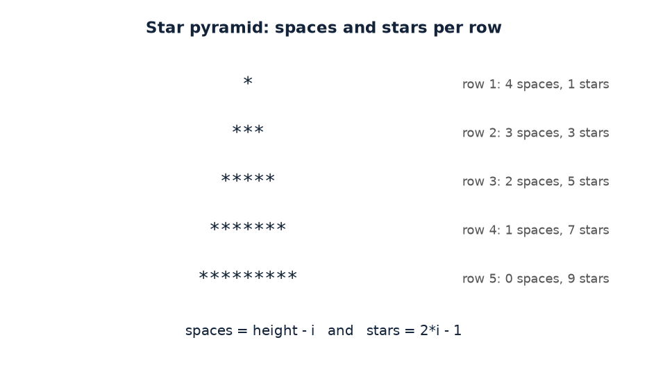
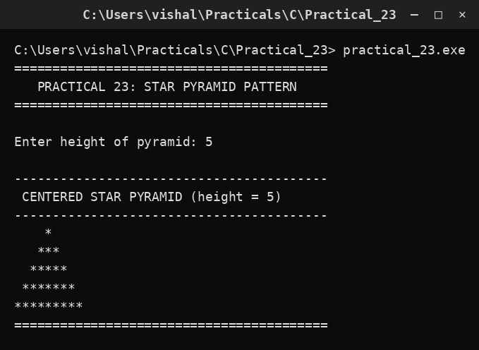

# Practical 23 — Star Pyramid Pattern

> Introduction to Programming with C · Lab Manual · B.Sc. (Artificial Intelligence), Semester I

## 📌 What this practical covers
- How **nested loops** print patterns row by row.
- The role of the **outer loop**: it walks down the rows.
- The role of the **inner loops**: they print the characters across a row.
- How **leading spaces** (`height - i`) centre the pyramid.
- How the **star count** follows the odd-number rule `2*i - 1`.
- Tracing a pattern row by row for `height = 5`.

## 🎯 Aim
To print a centred star pyramid using nested loops.

## 🧠 The big idea
A pattern on the screen is really a grid of characters, and any grid is drawn with **nested loops**: an outer loop that moves down the rows and an inner loop that fills each row. For a pyramid, each row has two parts — a run of **spaces** on the left (to push the stars to the centre) and a run of **stars** in the middle.

The trick is that both runs change as you go down. The top row needs the most spaces and the fewest stars; the bottom row needs no spaces and the most stars. If you can write down those two amounts as simple formulas in terms of the row number `i`, the loops almost write themselves. That is the whole art of pattern printing: **find the formula for each row**.

## 🔍 Deep dive

### The outer loop — choosing the row
```c
for (i = 1; i <= height; i++)
```
The outer loop counts the rows, from row 1 at the top to row `height` at the bottom. For a height of 5, `i` takes the values 1, 2, 3, 4, 5. Each pass through this loop builds **one complete line** of the pyramid.

### The first inner loop — leading spaces
```c
for (j = 1; j <= height - i; j++) printf(" ");
```
This prints `height - i` spaces. Notice how the count **shrinks** as `i` grows:

- Row 1 (i=1): `5 - 1 = 4` spaces
- Row 2 (i=2): `5 - 2 = 3` spaces
- Row 3 (i=3): `5 - 3 = 2` spaces
- Row 4 (i=4): `5 - 4 = 1` space
- Row 5 (i=5): `5 - 5 = 0` spaces

More spaces at the top pushes the first star to the right; fewer spaces lower down lets the stars spread outward. This is what creates the centred, triangular look.

### The second inner loop — the stars
```c
for (j = 1; j <= 2 * i - 1; j++) printf("*");
```
This prints `2*i - 1` stars. That expression always gives an **odd number**:

- Row 1 (i=1): `2·1 - 1 = 1` star
- Row 2 (i=2): `2·2 - 1 = 3` stars
- Row 3 (i=3): `2·3 - 1 = 5` stars
- Row 4 (i=4): `2·4 - 1 = 7` stars
- Row 5 (i=5): `2·5 - 1 = 9` stars

Each row adds exactly **2 more stars** than the row above, so the pyramid widens by one star on each side — a perfect triangle. The two inner loops work together: spaces pull in, stars push out, and the tip stays centred.

### Ending the row
```c
printf("\n");
```
After the spaces and stars for a row are printed, this moves the cursor to the next line so the following row starts fresh at the left margin.

### Why the pattern stays centred
For a given row, the total width is `spaces + stars = (height - i) + (2*i - 1) = height + i - 1`. Because the stars are always preceded by just enough spaces to push them under the tip of the row above, every row is symmetric about the same vertical centre line. That is why the figure looks like a neat triangle rather than a slanted blob.

## 📖 Key terms
| Term | Meaning |
| :--- | :--- |
| Nested loop | A loop inside another loop; the outer runs once per row, the inner runs per column. |
| Outer loop | The loop that iterates over the rows of the pattern. |
| Inner loop | A loop that prints the characters within a single row. |
| Leading spaces | Spaces printed before the stars to centre the row. |
| Odd number | A number of the form `2*i - 1`; the star count is always odd. |
| Row number `i` | Counts rows from the top, starting at 1. |
| `clrscr()` | Clears the screen (Turbo C / conio). |
| `getch()` | Waits for a key press so the output stays visible. |

## 🖼️ Diagram


## 🧮 Dry run (worked example)
Let `height = 5`. We trace each row, showing spaces, stars, and the final line.

| Row i | Spaces = height − i | Stars = 2·i − 1 | Line printed |
| :--- | :--- | :--- | :--- |
| 1 | 4 | 1 | `    *` |
| 2 | 3 | 3 | `   ***` |
| 3 | 2 | 5 | `  *****` |
| 4 | 1 | 7 | ` *******` |
| 5 | 0 | 9 | `*********` |

The full output is:

```
    *
   ***
  *****
 *******
*********
```

Reading down the spaces column: 4, 3, 2, 1, 0. Reading down the stars column: 1, 3, 5, 7, 9. Both follow their formulas exactly, and the result is a centred triangle.

## ⌨️ Reading the code
- `int height, i, j;` — the pyramid height and two loop counters.
- `clrscr();` — clear the screen.
- `printf("Enter height of pyramid: "); scanf("%d", &height);` — read how tall the pyramid should be.
- `for (i = 1; i <= height; i++)` — the **outer** loop, one pass per row.
- `for (j = 1; j <= height - i; j++) printf(" ");` — the **first inner** loop, printing the leading spaces.
- `for (j = 1; j <= 2 * i - 1; j++) printf("*");` — the **second inner** loop, printing the stars.
- `printf("\n");` — end the current row.
- `getch();` — pause at the end.

Note that the same counter `j` is reused by both inner loops; because each loop re-initialises `j = 1` and finishes before the next begins, this is perfectly safe.

## 🔑 Syntax cheat-sheet
| Syntax | Meaning |
| :--- | :--- |
| `for (i = 1; i <= height; i++)` | Outer loop: one iteration per row. |
| `for (j = 1; j <= height - i; j++)` | Inner loop: prints the leading spaces. |
| `printf(" ")` | Print a single space. |
| `for (j = 1; j <= 2 * i - 1; j++)` | Inner loop: prints an odd number of stars. |
| `printf("*")` | Print a single star. |
| `printf("\n")` | Move to the next line after a row. |
| `2 * i - 1` | Formula that gives 1, 3, 5, 7, … for i = 1, 2, 3, 4, … |

## 🖨️ Output


## ⚠️ Common mistakes
- Starting the outer loop at `i = 0` instead of `i = 1`; the formula `2*i - 1` then gives −1 on the first row and prints nothing.
- Using `height - i + 1` spaces, which over-indents and shifts the pyramid to the right.
- Writing the star loop as `j <= i` (giving 1, 2, 3 … stars) instead of `j <= 2*i - 1`, which produces a right triangle rather than a centred pyramid.
- Forgetting `printf("\n")`, so every row runs together on one long line.
- Reusing `j` without resetting it to 1 in the second inner loop — here each loop sets `j = 1` itself, but forgetting this elsewhere causes bugs.

## ✅ Key takeaways
- Any pattern is drawn with **nested loops**: outer for rows, inner for the contents of a row.
- The pyramid's centring comes from **`height - i` leading spaces**, which shrink as you go down.
- The star count **`2*i - 1`** is always odd and grows by 2 each row.
- Writing each row's amounts as **formulas in `i`** is the key skill in pattern printing.
- `printf("\n")` separates the rows.

## 🏋️ Try it yourself
1. Change the program to print an **inverted** pyramid (wide at the top, narrow at the bottom).
2. Print a **diamond** by combining an upright pyramid with an inverted one below it.
3. Make a **hollow** pyramid, where only the outline uses stars and the inside is spaces.
