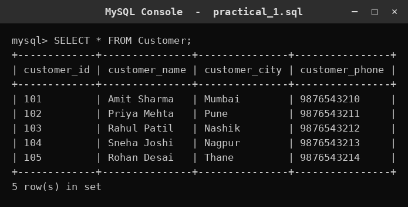
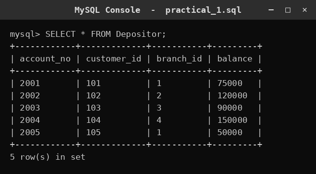
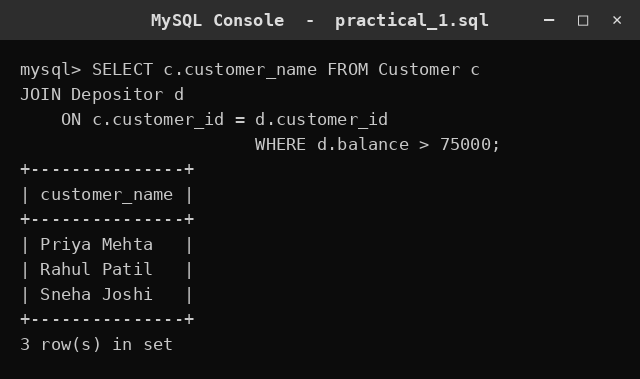

# SQL Practical 1 — DDL (CREATE) & DML (INSERT)

> SQL Lab · Lab Manual · B.Sc. (Artificial Intelligence), Semester I

## 📌 What this practical covers
- What a **database** and a **table** actually are, in plain words.
- The difference between **DDL** (commands that build the structure) and **DML** (commands that fill and read the data).
- How to create a database and a table using `CREATE DATABASE` and `CREATE TABLE`.
- Choosing sensible **data types** such as `INT`, `VARCHAR`, and `DECIMAL`.
- Why **PRIMARY KEY** and **FOREIGN KEY** matter, and how they link tables together.
- Inserting rows with `INSERT INTO` and reading them back with `SELECT` (including one join query).

## 🎯 Aim
To study DDL (CREATE) and DML (INSERT) commands in SQL.

## 🧠 The big idea
Think of a database as a **digital almirah** — a big steel cupboard with many labelled drawers. Each drawer is a **table**. One drawer is called `Customer`, another is called `Branch`, and so on. Inside a drawer you keep neatly arranged **rows**, and every row has the same set of **columns** (like a form where every slip has the same fields: name, city, phone).

Now, two different kinds of work happen in this almirah. First, you must **build the drawers and print the labels** — decide how many drawers there are, what each drawer is called, and which fields each slip will have. That construction work is **DDL** (Data Definition Language). Second, you **fill the drawers with slips and read them back** — that everyday work is **DML** (Data Manipulation Language). This practical does both: it builds the `Bank` database and then fills and reads it.

The key insight for a beginner is this: **DDL changes the shape of the almirah; DML changes the contents.** Building a drawer is a rare, careful act; putting slips in and taking them out happens all day long.

## 🔍 Deep dive

### What is a database and a table?
A **database** is an organised collection of related data stored so a computer can find and update it quickly. In a college lab you will use a **relational** database — the data lives in tables, and tables can be linked to each other.

A **table** is a grid:
- **Columns** (also called fields or attributes) define *what kind* of information is stored — e.g. `customer_name`, `customer_city`.
- **Rows** (also called records or tuples) are the actual entries — e.g. one row for customer Rohan, one for Priya.

Every column has a fixed **data type**, which means every value in that column is of the same kind (all whole numbers, or all text). This is what keeps a table trustworthy — you cannot accidentally store a phone number where a salary should go.

### DDL vs DML — two families of SQL commands
SQL commands are grouped by what they do to the data:

| Family | Full form | What it does | Examples |
| :--- | :--- | :--- | :--- |
| **DDL** | Data Definition Language | Defines or changes the **structure** (the drawers and labels) | `CREATE`, `ALTER`, `DROP`, `TRUNCATE` |
| **DML** | Data Manipulation Language | Works with the **data inside** (the slips) | `INSERT`, `SELECT`, `UPDATE`, `DELETE` |

So `CREATE TABLE` is DDL (it builds the drawer), while `INSERT INTO` and `SELECT` are DML (they fill and read the slips). Notice that the aim of this practical names exactly one DDL command (`CREATE`) and one DML command (`INSERT`) — that pairing is the heart of the exercise.

### Creating a database
A database is created with a single DDL statement:

```sql
CREATE DATABASE Bank;
```

After this, you tell the system to work inside it:

```sql
USE Bank;
```

`CREATE DATABASE Bank;` creates an empty almirah named `Bank`. `USE Bank;` opens that almirah so every following command applies to it. Without `USE`, the system would not know which database your tables belong to.

### Creating a table with CREATE TABLE
Here is the `Customer` table for the `Bank` database:

```sql
CREATE TABLE Customer (
    customer_id     INT PRIMARY KEY,
    customer_name   VARCHAR(50),
    customer_city   VARCHAR(30),
    customer_phone  VARCHAR(15)
);
```

Read it line by line:
- `customer_id INT PRIMARY KEY` — a whole number that uniquely identifies each customer.
- `customer_name VARCHAR(50)` — text up to 50 characters long.
- `customer_city VARCHAR(30)` — text up to 30 characters.
- `customer_phone VARCHAR(15)` — text up to 15 characters (phone numbers are treated as text, because we never do arithmetic on them and they may start with 0).

Each column name is followed by its **data type**, and columns are separated by commas. The whole list sits inside round brackets, and the statement ends with a semicolon.

### Understanding data types: INT, VARCHAR, DECIMAL
Choosing the right type is a real skill, not a formality.

- **`INT`** stores whole numbers (no decimal point) — e.g. `customer_id = 101`, `assets = 500000`. Use it for counts and identifiers.
- **`VARCHAR(n)`** stores variable-length text up to `n` characters — e.g. `'Rohan'`, `'Mumbai'`. "Variable" means it only uses as much space as the text needs, up to the limit.
- **`DECIMAL(p, s)`** stores exact numbers with a decimal point — `p` is the total number of digits and `s` is how many come after the point. So `DECIMAL(12, 2)` holds a value like `45000.00` with two decimal places. Money is stored as `DECIMAL`, never as a floating-point type, because rounding errors in money are unacceptable.

Example of the `Branch` table using all three ideas:

```sql
CREATE TABLE Branch (
    branch_id     INT PRIMARY KEY,
    branch_name   VARCHAR(40),
    branch_city   VARCHAR(30),
    assets        DECIMAL(12, 2)
);
```

### PRIMARY KEY and FOREIGN KEY — linking the drawers
A **PRIMARY KEY** is a column (or set of columns) whose value is *unique* for every row and can never be empty. It is the row's identity card. `customer_id` is the primary key of `Customer` — no two customers can share an id.

A **FOREIGN KEY** is a column in one table that points to the primary key of another table. It is how two drawers are linked. For example, the `Borrower` table records which customer took which loan:

```sql
CREATE TABLE Borrower (
    loan_no      INT PRIMARY KEY,
    customer_id  INT,
    branch_id    INT,
    loan_amount  DECIMAL(12, 2),
    FOREIGN KEY (customer_id) REFERENCES Customer(customer_id),
    FOREIGN KEY (branch_id)   REFERENCES Branch(branch_id)
);
```

Here `Borrower.customer_id` is a foreign key that **references** `Customer.customer_id`. This says: "a borrower must be a real customer who already exists." The database will refuse to insert a loan for a customer id that is not in `Customer`. That protection is the whole point of a foreign key — it keeps the data consistent across tables. The `Depositor` table is built the same way:

```sql
CREATE TABLE Depositor (
    account_no   INT PRIMARY KEY,
    customer_id  INT,
    branch_id    INT,
    balance      DECIMAL(12, 2),
    FOREIGN KEY (customer_id) REFERENCES Customer(customer_id),
    FOREIGN KEY (branch_id)   REFERENCES Branch(branch_id)
);
```

Notice the order of creation matters: `Customer` and `Branch` must exist **before** `Borrower` and `Depositor`, because the later tables point to the earlier ones.

### INSERT INTO — filling the drawers
Once a table exists, you add rows with `INSERT INTO`. There are two common forms.

**Form 1 — give values for every column, in order:**

```sql
INSERT INTO Customer
VALUES (101, 'Rohan Mehta', 'Mumbai', '9820011111');
```

**Form 2 — name the columns explicitly (safer and clearer):**

```sql
INSERT INTO Customer (customer_id, customer_name, customer_city, customer_phone)
VALUES (102, 'Priya Nair', 'Kochi', '9847022222');
```

The second form is preferred because the order of the values no longer has to match the table definition — you state exactly which column gets which value. Text values are wrapped in **single quotes**; numbers are written bare. Multiple rows can be inserted at once by separating the value groups with commas:

```sql
INSERT INTO Depositor VALUES (5001, 101, 1, 90000.00);
INSERT INTO Depositor VALUES (5002, 102, 2, 45000.00);
```

### SELECT — reading the data back
`SELECT` is the command that retrieves data. The simplest form reads every column of every row:

```sql
SELECT * FROM Customer;
```

The star `*` means "all columns". `FROM Customer` says which table to read. This returns the full drawer, top to bottom.

### Joining two tables (a first taste)
Because `Customer` and `Depositor` are linked by `customer_id`, you can combine them. This is called a **join**:

```sql
SELECT c.customer_name
FROM Customer c
JOIN Depositor d ON c.customer_id = d.customer_id
WHERE d.balance > 75000;
```

Read it in steps:
- `FROM Customer c` — start with the customer table, and call it `c` for short (an **alias**).
- `JOIN Depositor d ON c.customer_id = d.customer_id` — stick each customer to their deposit rows by matching the shared id. `d` is the alias for `Depositor`.
- `WHERE d.balance > 75000` — keep only the matched rows where the balance is above 75,000.

The result is the names of customers whose deposit balance exceeds 75,000. This one query shows why foreign keys are useful: the link column lets you combine information that lives in two different drawers.

## 📖 Key terms

| Term | Meaning |
| :--- | :--- |
| Database | An organised collection of related data, usually made of several tables. |
| Table | A grid of rows and columns that stores one kind of record. |
| Row (record) | One entry in a table, with a value for every column. |
| Column (field) | One attribute of a table, with a fixed data type. |
| DDL | Data Definition Language — commands that define structure (`CREATE`, `ALTER`, `DROP`). |
| DML | Data Manipulation Language — commands that work with data (`INSERT`, `SELECT`, `UPDATE`, `DELETE`). |
| Data type | The kind of value a column holds, e.g. `INT`, `VARCHAR`, `DECIMAL`. |
| `INT` | A whole number, with no decimal point. |
| `VARCHAR(n)` | Variable-length text up to `n` characters. |
| `DECIMAL(p, s)` | An exact number with `p` total digits and `s` decimal places. |
| PRIMARY KEY | A column whose value is unique and never empty; the row's identity. |
| FOREIGN KEY | A column that points to a primary key in another table, linking the two. |
| Alias | A short temporary name for a table or column, e.g. `Customer c`. |
| `SELECT` | The DML command that retrieves data. |
| Join | Combining rows from two or more tables using a shared column. |

## 🧾 Query-by-query walkthrough

### Query 1 — Show all customers
**What it does:** Retrieves every column of every row in the `Customer` table.
```sql
SELECT * FROM Customer;
```


### Query 2 — Show all depositors
**What it does:** Retrieves every column of every row in the `Depositor` table.
```sql
SELECT * FROM Depositor;
```


### Query 3 — Customers with a high balance
**What it does:** Joins `Customer` and `Depositor` on the shared customer id and lists the names of customers whose balance is greater than 75,000.
```sql
SELECT c.customer_name FROM Customer c JOIN Depositor d ON c.customer_id = d.customer_id WHERE d.balance > 75000;
```


## ⚠️ Common mistakes
- **Forgetting the semicolon** at the end of a statement — the system waits for more input and nothing runs.
- **Mismatched brackets or commas** in `CREATE TABLE` — a missing comma between columns, or a missing closing bracket, causes a syntax error.
- **Using the wrong data type** — storing a phone number as `INT` drops leading zeros, and storing money as a floating type can cause rounding errors.
- **Creating the child table first** — `Borrower` and `Depositor` reference `Customer` and `Branch`, so those parent tables must be created before them.
- **Text without single quotes** — writing `INSERT INTO Customer VALUES (101, Rohan, ...)` fails because `Rohan` is not a number; it must be `'Rohan'`.
- **Forgetting `USE Bank;`** — creating tables in the wrong database because the active database was never selected.

## ✅ Key takeaways
- A database is an organised set of tables; a table is a grid of rows and columns with fixed data types.
- **DDL builds the structure** (`CREATE`), and **DML fills and reads the data** (`INSERT`, `SELECT`).
- Choosing the correct data type (`INT`, `VARCHAR`, `DECIMAL`) keeps data accurate and prevents silent errors.
- A **PRIMARY KEY** uniquely identifies a row; a **FOREIGN KEY** links one table to another and protects consistency.
- `SELECT * FROM table;` reads everything, and a **join** combines linked tables using their shared key.

## 🏋️ Try it yourself
1. Create a new table `Account_Type (type_id INT PRIMARY KEY, type_name VARCHAR(30))` in the `Bank` database and insert three rows into it.
2. Insert a new customer with id `109` and city `Delhi`, then run `SELECT * FROM Customer;` to confirm the row appears.
3. Write a query to list the names of all customers who live in `Mumbai`.
4. Modify Query 3 to show customers whose balance is greater than 1,00,000 instead of 75,000.
