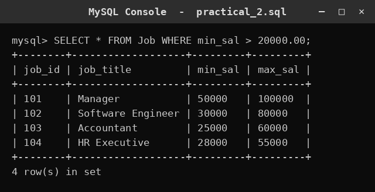
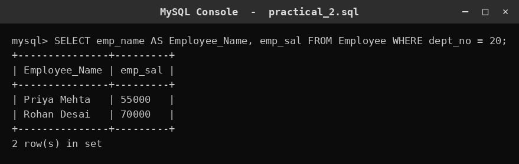
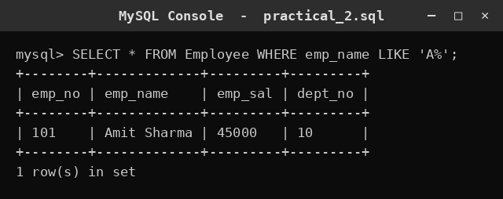

# SQL Practical 2 — Create Tables, Insert Data & Basic Queries

> SQL Lab · Lab Manual · B.Sc. (Artificial Intelligence), Semester I

## 📌 What this practical covers
- Creating the `Job` and `Employee` tables with **appropriate data types**.
- Inserting rows into those tables with `INSERT INTO`.
- Retrieving data with `SELECT`, and filtering rows using `WHERE`.
- Renaming output columns with **aliases** using `AS`.
- Pattern matching with the **`LIKE`** operator and the `%` wildcard.
- Combining these ideas into small, readable retrieval queries.

## 🎯 Aim
To create the given tables with appropriate data types, insert the data and perform basic retrieval queries.

## 🧠 The big idea
Imagine a company's records room. There are two ledgers: one that lists every **job** the company offers (with its salary range), and one that lists every **employee** (with their salary and department). This practical builds those two ledgers, fills them, and then asks simple questions of them — "Which jobs pay more than 20,000?", "Who works in department 20?", "Whose name starts with A?".

The big idea here is that a good table begins with **good type choices**. Before you can ask questions, you must decide what *kind* of value each column holds. Once the structure is right, `SELECT` lets you pull out exactly the rows and columns you need. The `WHERE` clause is the filter, `AS` is the relabelling sticker, and `LIKE` is the pattern-matcher. Learn these four and you can already answer a surprising number of real questions.

## 🔍 Deep dive

### Choosing appropriate data types
The word "appropriate" in the aim is doing real work. Every column should hold the natural kind of value for that field:

- **`job_id`, `dept_no`, `emp_no`** — these are identifiers, whole numbers. Use `INT`.
- **`job_title`, `emp_name`** — these are text of varying length. Use `VARCHAR(n)`.
- **`min_sal`, `max_sal`, `emp_sal`** — these are money, with two decimal places. Use `DECIMAL(10, 2)`.

Why does this matter? If you stored `emp_sal` as `INT`, you could not record `45678.50`. If you stored `emp_name` as a number, you could not store `'Anita'` at all. The type must match the data's true nature.

Here is the `Job` table:

```sql
CREATE TABLE Job (
    job_id     INT PRIMARY KEY,
    job_title  VARCHAR(40),
    min_sal    DECIMAL(10, 2),
    max_sal    DECIMAL(10, 2)
);
```

And here is the `Employee` table:

```sql
CREATE TABLE Employee (
    emp_no   INT PRIMARY KEY,
    emp_name VARCHAR(40),
    emp_sal  DECIMAL(10, 2),
    dept_no  INT
);
```

Notice both tables begin with a **PRIMARY KEY** on their id column — `job_id` and `emp_no`. This guarantees no two jobs and no two employees share the same id. The `dept_no` column is a plain `INT`: it groups employees into departments without being unique, so several employees can share the same department number.

### Inserting the data
With the structure ready, fill the tables using `INSERT INTO`. The clearest form names the columns:

```sql
INSERT INTO Job (job_id, job_title, min_sal, max_sal)
VALUES (1, 'Clerk', 15000.00, 30000.00);

INSERT INTO Job (job_id, job_title, min_sal, max_sal)
VALUES (2, 'Manager', 25000.00, 60000.00);

INSERT INTO Employee (emp_no, emp_name, emp_sal, dept_no)
VALUES (101, 'Anita Sharma', 32000.00, 20);

INSERT INTO Employee (emp_no, emp_name, emp_sal, dept_no)
VALUES (102, 'Rahul Verma', 28000.00, 20);
```

Two habits to build here:
- **Money is written with decimals** — `15000.00`, not `15000` — so it matches the `DECIMAL(10, 2)` column cleanly.
- **Text is in single quotes** — `'Clerk'`, `'Anita Sharma'` — while numbers are bare.

You can also insert several rows in one statement by listing multiple value groups:

```sql
INSERT INTO Job VALUES
    (3, 'Analyst', 22000.00, 45000.00),
    (4, 'Engineer', 30000.00, 70000.00);
```

### SELECT with WHERE — retrieving a subset
`SELECT` reads data; `WHERE` decides which rows you keep. The pattern is:

```sql
SELECT <columns> FROM <table> WHERE <condition>;
```

`WHERE` acts like a sieve. Only rows for which the condition is **true** pass through. For example, to see jobs whose minimum salary is above 20,000:

```sql
SELECT * FROM Job WHERE min_sal > 20000.00;
```

The comparison operators you will use most are `=` (equal), `>` and `<` (greater/less than), `>=` and `<=` (greater/less than or equal), and `<>` or `!=` (not equal). Notice that `>` is strict — a job with `min_sal = 20000.00` would **not** appear; you would need `>=` for that.

### Column aliases with AS
An **alias** gives a column (or table) a temporary, friendlier name in the output. Use the keyword `AS`:

```sql
SELECT emp_name AS Employee_Name, emp_sal
FROM Employee
WHERE dept_no = 20;
```

Here the output heading for `emp_name` becomes `Employee_Name`, which is more readable for a report. The alias changes only the **displayed heading**, never the underlying column. A handy detail: if an alias contains spaces, wrap it in double quotes or backticks, e.g. `AS "Employee Name"` — but a single word like `Employee_Name` needs no quotes.

Aliases are also used on tables (as seen in Practical 1, `Customer c`), which shortens long join queries.

### The LIKE operator and the % wildcard
`LIKE` is used for **pattern matching** on text. It is paired with two wildcards:
- **`%`** matches **any number of characters** (including zero).
- **`_`** matches **exactly one character**.

The pattern is written inside single quotes. For example:

```sql
SELECT * FROM Employee WHERE emp_name LIKE 'A%';
```

The pattern `'A%'` means "starts with the letter A, followed by anything". So `'Anita Sharma'` matches, but `'Rahul Verma'` does not. A few more patterns to fix the idea:

| Pattern | Matches |
| :--- | :--- |
| `'A%'` | Any name starting with A |
| `'%a'` | Any name ending with a |
| `'%an%'` | Any name containing "an" anywhere |
| `'A_ita%'` | Names like "Anita..." with exactly one character between A and ita |

`LIKE` is case sensitivity dependent on the database — in many systems `'a%'` and `'A%'` behave the same, but you should not rely on this without checking your system.

### Putting it together
These three queries show the natural progression: **filter by a number**, **select and rename specific columns**, and **filter by a text pattern**. That is a complete beginner's toolkit for reading a table.

## 📖 Key terms

| Term | Meaning |
| :--- | :--- |
| Data type | The kind of value a column holds, e.g. `INT`, `VARCHAR`, `DECIMAL`. |
| `INT` | A whole number, used for ids, department numbers, and counts. |
| `VARCHAR(n)` | Variable-length text up to `n` characters. |
| `DECIMAL(p, s)` | An exact number with `p` total digits and `s` decimal places; used for money. |
| PRIMARY KEY | A column whose value is unique and never empty; the row's identity. |
| `INSERT INTO` | The DML command that adds rows to a table. |
| `SELECT` | The DML command that retrieves data. |
| `WHERE` | A clause that keeps only the rows satisfying a condition. |
| Condition | A true/false test, e.g. `min_sal > 20000.00`. |
| Alias | A temporary output name for a column or table, given with `AS`. |
| `LIKE` | An operator for pattern matching on text. |
| `%` wildcard | In `LIKE`, matches any number of characters (including none). |
| `_` wildcard | In `LIKE`, matches exactly one character. |

## 🧾 Query-by-query walkthrough

### Query 1 — Jobs paying above 20,000
**What it does:** Lists every column of every job whose minimum salary is greater than 20,000.00.
```sql
SELECT * FROM Job WHERE min_sal > 20000.00;
```


### Query 2 — Employees of department 20
**What it does:** Shows each employee's name (renamed to `Employee_Name`) and salary for department number 20.
```sql
SELECT emp_name AS Employee_Name, emp_sal FROM Employee WHERE dept_no = 20;
```


### Query 3 — Employees whose name starts with A
**What it does:** Lists every column for employees whose name begins with the letter A, using the `%` wildcard.
```sql
SELECT * FROM Employee WHERE emp_name LIKE 'A%';
```


## ⚠️ Common mistakes
- **Using the wrong data type** — storing salaries in `INT` loses the decimal part; storing names in a numeric type fails outright.
- **Forgetting single quotes around text** — `LIKE 'A%'` and `'Clerk'` need quotes; a bare `A%` is a syntax error.
- **Confusing `>` with `>=`** — `>` excludes rows that equal the boundary value, which often surprises beginners.
- **Assuming `LIKE 'A%'` is case-sensitive** — behaviour varies by database, so test it on your system before relying on it.
- **Mixing up `=` and `LIKE`** — `=` matches an exact whole value, while `LIKE` is for patterns with wildcards.
- **Aliasing the wrong column** — the alias must sit right after the column it renames; putting it elsewhere changes nothing.

## ✅ Key takeaways
- "Appropriate data types" means matching each column to its true kind of value: `INT` for ids, `VARCHAR` for text, `DECIMAL` for money.
- `INSERT INTO` fills a table, and a well-named column list makes inserts safe and readable.
- `WHERE` is the filter that keeps only the rows satisfying a condition.
- `AS` renames a column in the output for clarity, without changing the stored data.
- `LIKE` with the `%` wildcard matches text patterns, such as names starting with a given letter.

## 🏋️ Try it yourself
1. Add a new job with id `5`, title `'Technician'`, and a salary range of 18000.00 to 35000.00.
2. Write a query to list all employees whose salary is greater than 30,000.
3. Show the job titles of all jobs whose maximum salary is 50,000 or more (hint: use `>=`).
4. Use `LIKE` to find all employees whose name contains the letter `a` anywhere.
5. Display `emp_name` as `Name` and `dept_no` as `Department` for every employee using aliases.
