# SQL Practical 3 — DML, Aggregate Functions & Sorting

> **SQL Lab — Lab Manual**  
> B.Sc. (Artificial Intelligence), Semester I

---

## 🎯 Aim

To perform DML commands, aggregate functions and sorting concepts on the created tables.

## 📌 Objective

Modify data with UPDATE and DELETE, summarise it with aggregate functions, and order it with ORDER BY.

## 🧠 Concept in simple words

This practical uses UPDATE to change rows and DELETE to remove them, and then summarises data with the aggregate functions COUNT, MAX, MIN, AVG and SUM. GROUP BY produces one summary row per group, HAVING filters those groups, and ORDER BY sorts the output. Together these commands cover the full set of operations needed to maintain and summarise a table.

## 🔑 Basic concepts used

| Concept | Meaning |
| :--- | :--- |
| `UPDATE ... SET` | Changes the values of existing rows. |
| `DELETE FROM` | Removes rows from a table. |
| `COUNT / SUM / AVG / MAX / MIN` | Aggregate functions that collapse many rows into one value. |
| `GROUP BY` | Forms one group per distinct value and aggregates each group. |
| `HAVING` | Filters groups after aggregation (WHERE filters rows before). |
| `ORDER BY` | Sorts the result, ASC or DESC. |
| `LIMIT` | Keeps only the first N rows. |

## ▶️ How to use

Run the script in MySQL and compare each result with the query above it.

### Script file

[`practical_3.sql`](./practical_3.sql)

## 🧾 Queries & Output

### Query 1

**What this does:** Displays all books before any change.

```sql
SELECT * FROM Book;
```


### Query 2

**What this does:** UPDATE changes the price of book 103 to 580.

```sql
UPDATE Book SET Price = 580 WHERE Book_ID = 103;
```

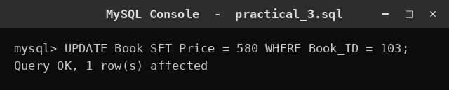

### Query 3

**What this does:** Displays the books again to confirm the update.

```sql
SELECT * FROM Book;
```

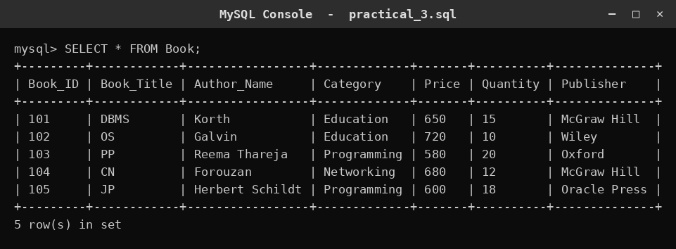

### Query 4

**What this does:** DELETE removes book 105.

```sql
DELETE FROM Book WHERE Book_ID = 105;
```

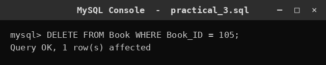

### Query 5

**What this does:** Displays the remaining books.

```sql
SELECT * FROM Book;
```

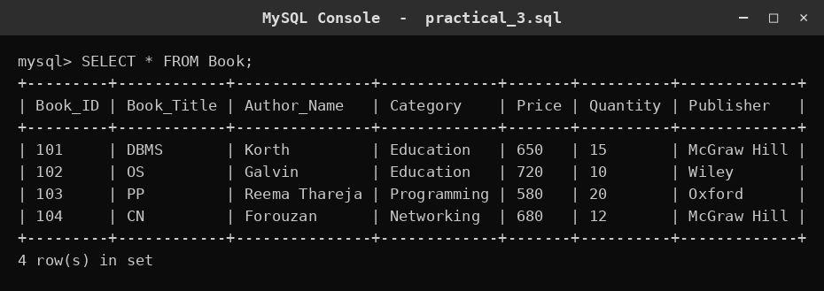

### Query 6

**What this does:** Shows only the title and author columns.

```sql
SELECT Book_Title, Author_Name FROM Book;
```

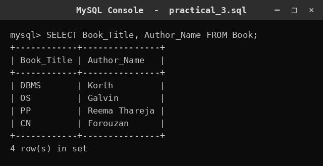

### Query 7

**What this does:** Keeps only books priced above 600.

```sql
SELECT * FROM Book WHERE Price > 600;
```

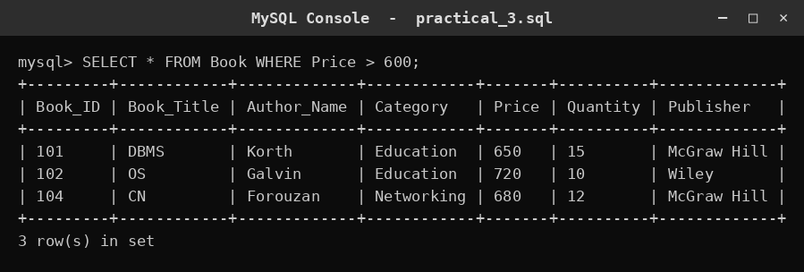

### Query 8

**What this does:** Sorts all books by price, cheapest first.

```sql
SELECT * FROM Book ORDER BY Price ASC;
```

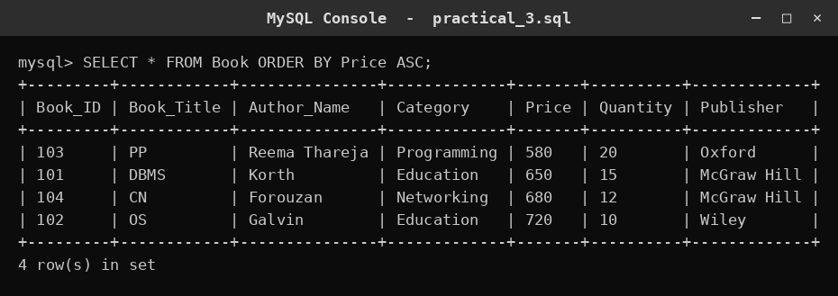

### Query 9

**What this does:** Sorts all books by quantity, highest first.

```sql
SELECT * FROM Book ORDER BY Quantity DESC;
```

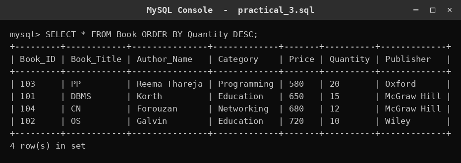

### Query 10

**What this does:** Displays all employees.

```sql
SELECT * FROM Employee;
```

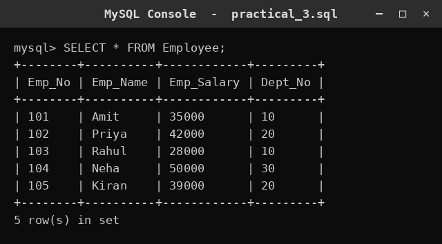

### Query 11

**What this does:** COUNT(*) counts the total number of employees.

```sql
SELECT COUNT(*) AS Total_Employees
FROM Employee;
```

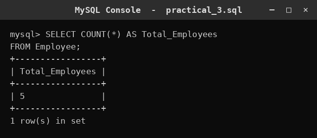

### Query 12

**What this does:** MAX gives the highest salary.

```sql
SELECT MAX(Emp_Salary) AS Highest_Salary
FROM Employee;
```


### Query 13

**What this does:** MIN gives the lowest salary.

```sql
SELECT MIN(Emp_Salary) AS Lowest_Salary
FROM Employee;
```

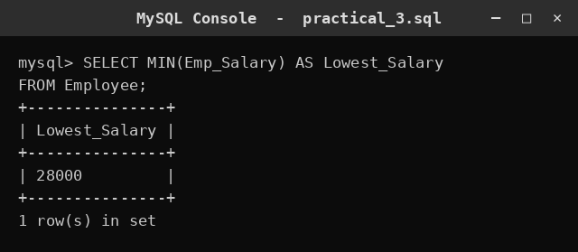

### Query 14

**What this does:** AVG gives the average salary.

```sql
SELECT AVG(Emp_Salary) AS Average_Salary
FROM Employee;
```

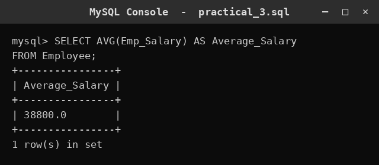

### Query 15

**What this does:** SUM gives the total of all salaries.

```sql
SELECT SUM(Emp_Salary) AS Total_Salary
FROM Employee;
```

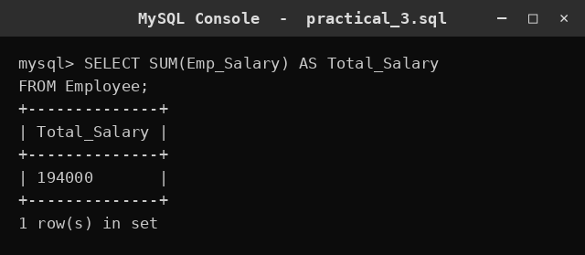

### Query 16

**What this does:** GROUP BY dept_no counts employees in each department.

```sql
SELECT Dept_No, COUNT(*) AS Employee_Count
FROM Employee
GROUP BY Dept_No;
```

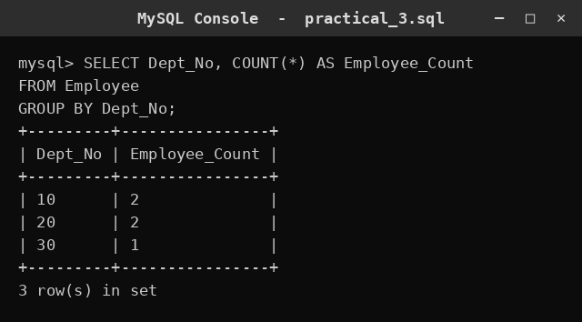

### Query 17

**What this does:** GROUP BY dept_no totals the salaries in each department.

```sql
SELECT Dept_No, SUM(Emp_Salary) AS Total_Salary
FROM Employee
GROUP BY Dept_No;
```

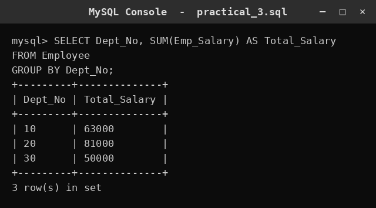

### Query 18

**What this does:** GROUP BY dept_no averages the salaries in each department.

```sql
SELECT Dept_No, AVG(Emp_Salary) AS Average_Salary
FROM Employee
GROUP BY Dept_No;
```

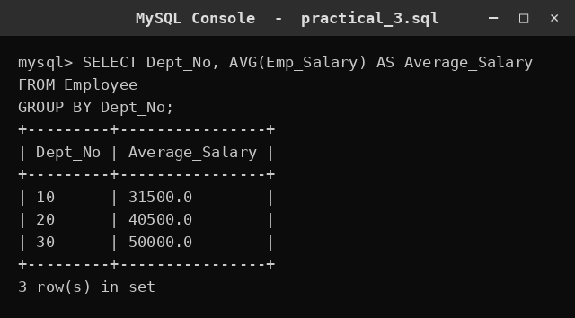

### Query 19

**What this does:** GROUP BY dept_no finds the highest salary in each department.

```sql
SELECT Dept_No, MAX(Emp_Salary) AS Highest_Salary
FROM Employee
GROUP BY Dept_No;
```

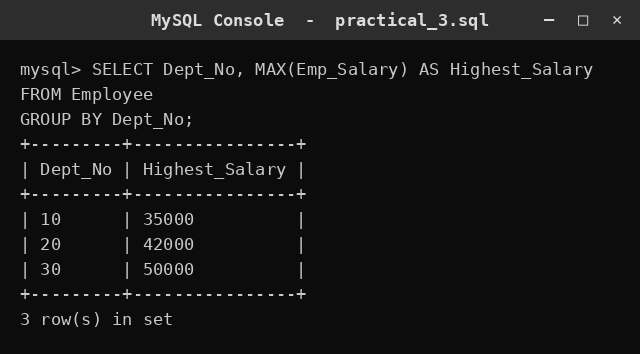

### Query 20

**What this does:** GROUP BY dept_no finds the lowest salary in each department.

```sql
SELECT Dept_No, MIN(Emp_Salary) AS Lowest_Salary
FROM Employee
GROUP BY Dept_No;
```

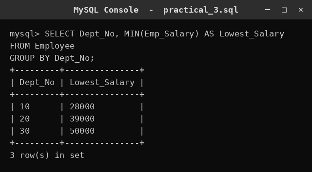

### Query 21

**What this does:** HAVING keeps only departments that have more than 2 employees.

```sql
SELECT Dept_No, COUNT(*) AS Employee_Count
FROM Employee
GROUP BY Dept_No
HAVING COUNT(*) > 2;
```

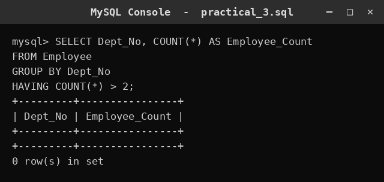

### Query 22

**What this does:** HAVING keeps only departments whose average salary is above 40000.

```sql
SELECT Dept_No, AVG(Emp_Salary) AS Average_Salary
FROM Employee
GROUP BY Dept_No
HAVING AVG(Emp_Salary) > 40000;
```

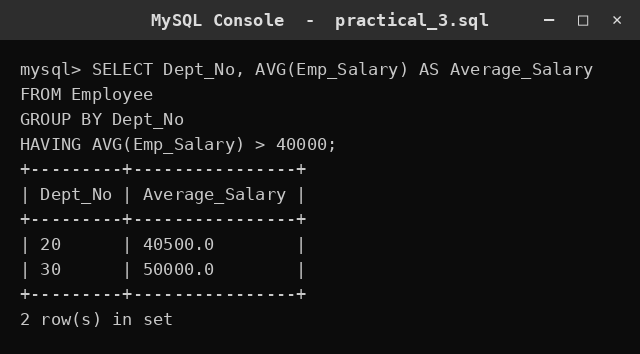

### Query 23

**What this does:** Sorts employees by salary ascending.

```sql
SELECT *
FROM Employee
ORDER BY Emp_Salary ASC;
```


### Query 24

**What this does:** Sorts employees by salary descending.

```sql
SELECT *
FROM Employee
ORDER BY Emp_Salary DESC;
```

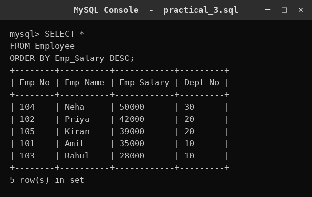

### Query 25

**What this does:** Sorts employees by name alphabetically.

```sql
SELECT *
FROM Employee
ORDER BY Emp_Name ASC;
```


### Query 26

**What this does:** Sorts employees by department number.

```sql
SELECT *
FROM Employee
ORDER BY Dept_No ASC;
```

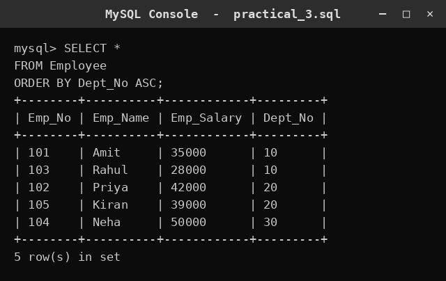

### Query 27

**What this does:** Shows name and salary, highest salary first.

```sql
SELECT Emp_Name, Emp_Salary
FROM Employee
ORDER BY Emp_Salary DESC;
```

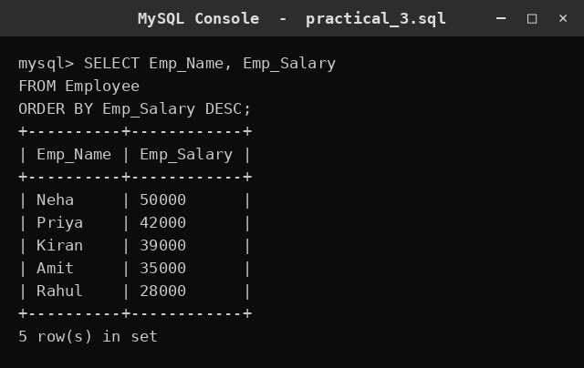

### Query 28

**What this does:** Keeps employees earning above 35000 and sorts them by salary.

```sql
SELECT *
FROM Employee
WHERE Emp_Salary > 35000
ORDER BY Emp_Salary ASC;
```

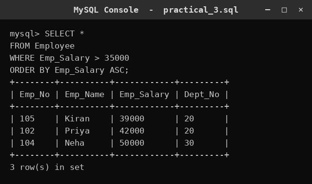

### Query 29

**What this does:** LIMIT 3 shows only the three highest-paid employees.

```sql
SELECT *
FROM Employee
ORDER BY Emp_Salary DESC
LIMIT 3;
```

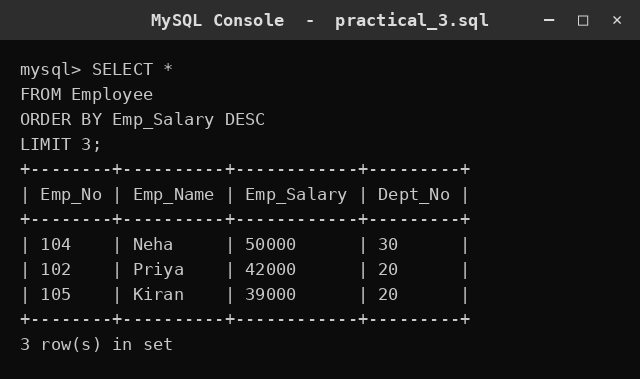

## ✅ Conclusion

UPDATE and DELETE maintain the data, while aggregates, grouping and sorting turn it into useful summaries.
