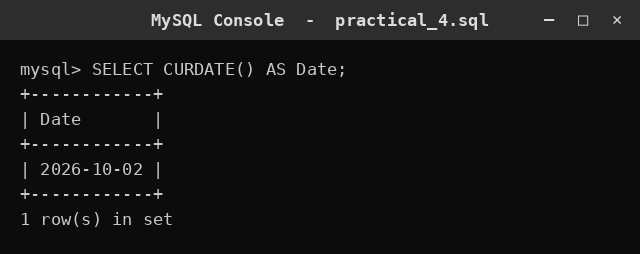
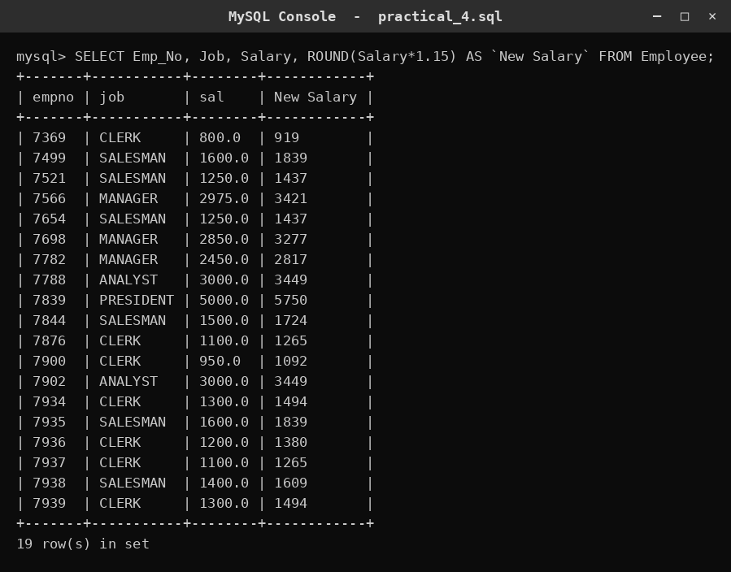
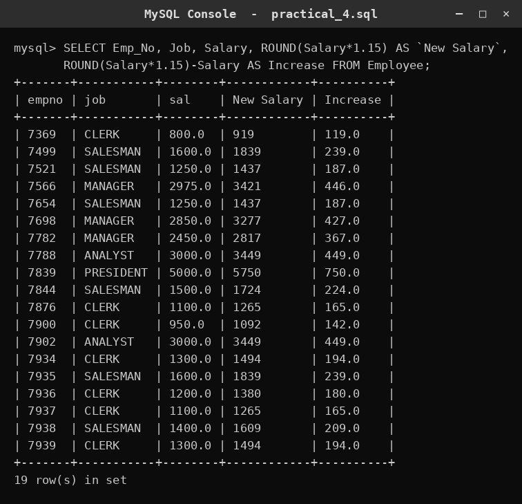
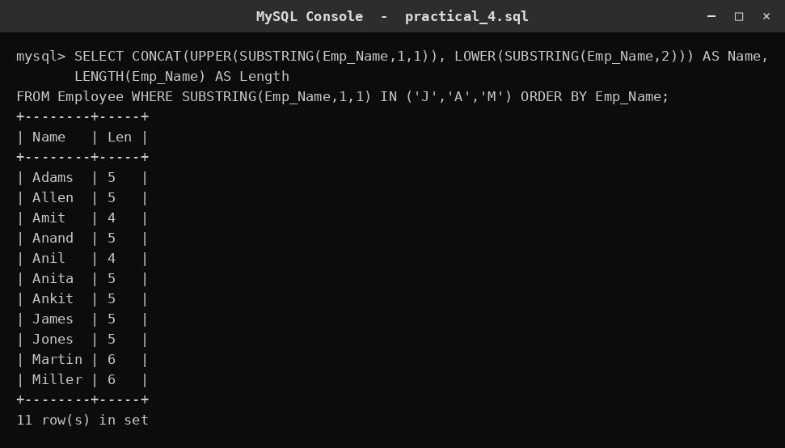
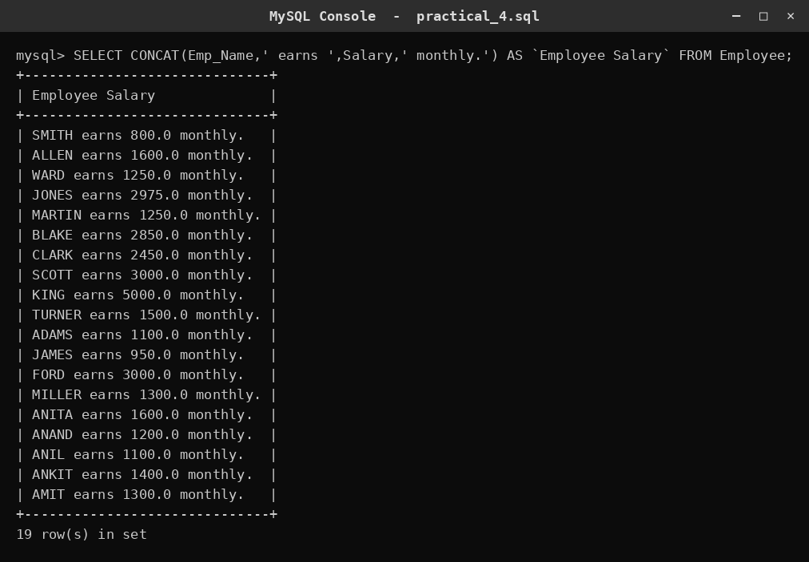
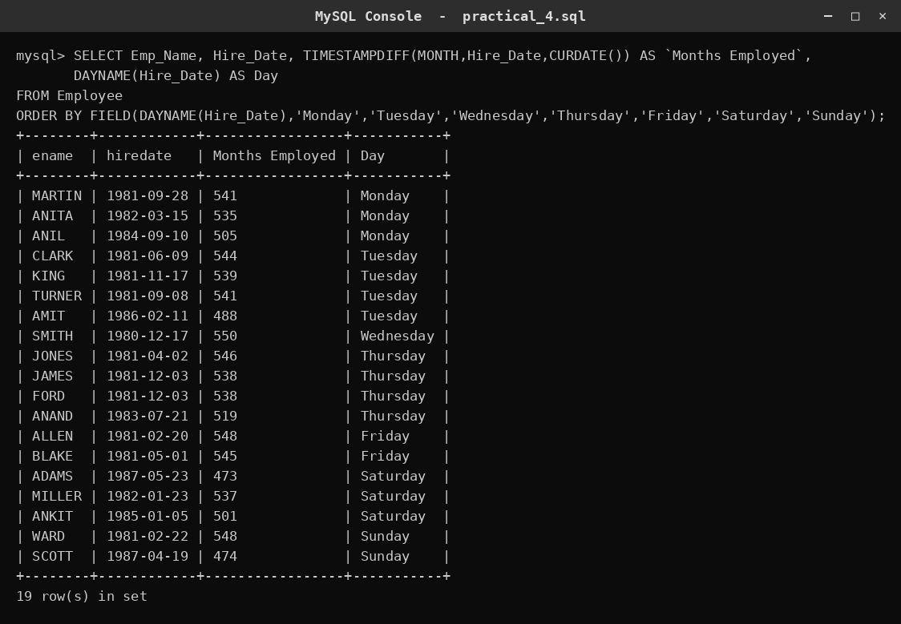
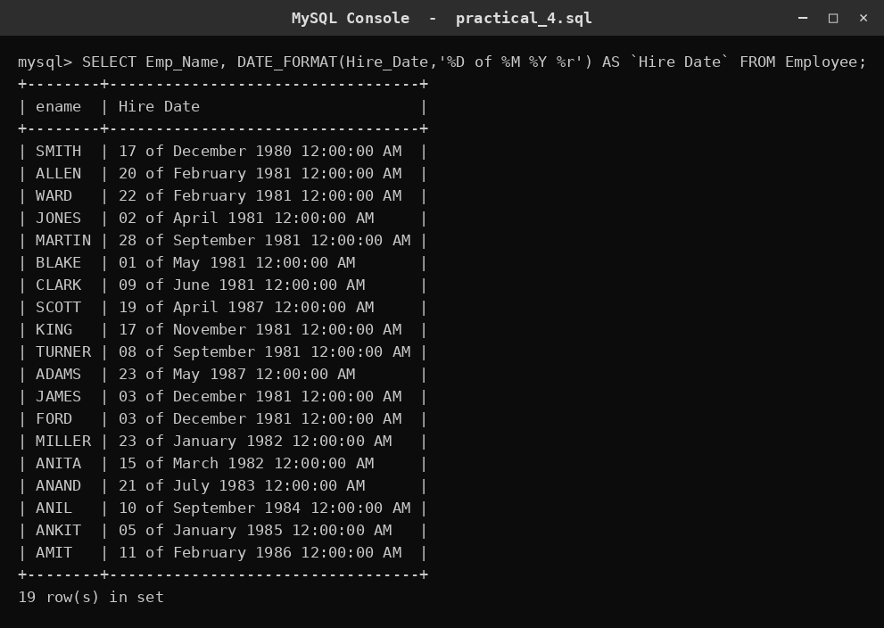
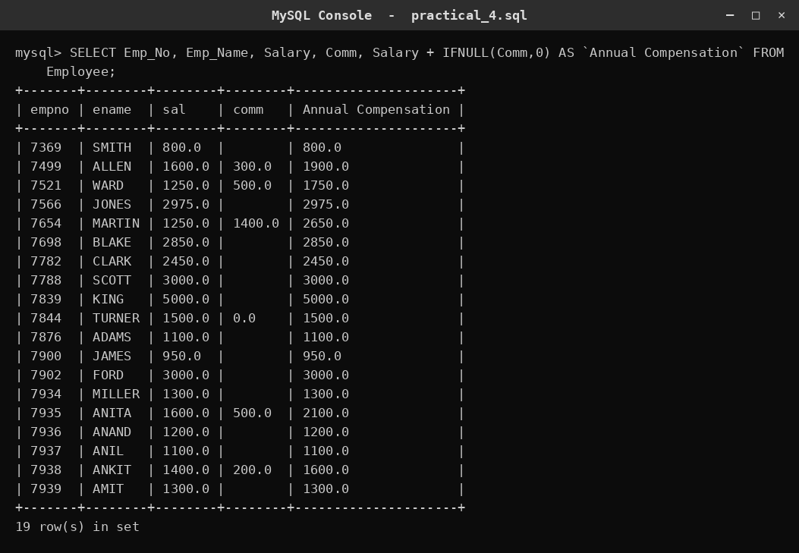

# SQL Practical 4 — Single-Row Functions

> SQL Lab · Lab Manual · B.Sc. (Artificial Intelligence), Semester I

## 📌 What this practical covers
- What a **single-row function** is, and how it differs from an aggregate function
- **Character functions:** UPPER, LOWER, SUBSTRING, CONCAT, LENGTH
- **Number functions:** ROUND, and doing arithmetic on columns
- **Date functions:** CURDATE, TIMESTAMPDIFF, DAYNAME, DATE_FORMAT
- **Handling NULL** values with IFNULL
- **Nesting** functions and using them in SELECT, WHERE and ORDER BY

## 🎯 Aim
To study single-row functions in SQL.

## 🧠 The big idea
A **single-row function** takes *one row's worth of input* and gives back *one value for that same row*. If a table has 10 employees, `UPPER(Emp_Name)` still produces 10 answers — one clean, transformed value sitting next to each employee. It never merges rows together; it works row by row.

Think of it like a **photocopier with an editing pen**. Every row goes in on its own, gets a small edit (made uppercase, rounded, reformatted, given a default if blank), and comes out as one value on its own line. Contrast that with an **aggregate function** like `SUM` or `AVG`, which is more like a *weighing scale*: you pour many rows in and get back a **single** number for the whole group. Single-row functions = one in, one out. Aggregate functions = many in, one out.

## 🔍 Deep dive

### One row in, one value out
A single-row (or "scalar") function is applied to a value in each row and returns exactly one value for that row. The number of rows never changes.

```sql
SELECT Emp_Name, LENGTH(Emp_Name) FROM Employee;
```

If `Employee` has 5 rows, you get 5 rows back — each name paired with its character count. The function "LENGTH" ran 5 times, once per row.

### Character (text) functions
These reshape text. The most useful ones:

- **UPPER(text)** — makes everything uppercase.
- **LOWER(text)** — makes everything lowercase.
- **SUBSTRING(text, start, length)** — pulls out a piece. `SUBSTRING('SMITH',1,1)` = `'S'` (start at position 1, take 1 character). Note SQL counts positions starting at **1**, not 0.
- **CONCAT(a, b, ...)** — glues strings together. `CONCAT('S','MITH')` = `'SMITH'`.
- **LENGTH(text)** — counts characters.

Example — proper-case a name (first letter big, rest small):

```sql
SELECT CONCAT(UPPER(SUBSTRING(Emp_Name,1,1)), LOWER(SUBSTRING(Emp_Name,2)))
FROM Employee;
```

Here we **nest**: the inner functions (`SUBSTRING`) run first, then `UPPER`/`LOWER`, then `CONCAT` glues the pieces. SQL always evaluates the innermost bracket first.

### Number functions
- **ROUND(number, decimals)** — rounds to a given number of decimals. `ROUND(123.456, 1)` = `123.5`. With no second argument, it rounds to the nearest whole number: `ROUND(123.456)` = `123`.

You can also do plain arithmetic (`+ - * /`) on numeric columns, and the result is a new column. A common task is a salary raise:

```sql
SELECT Salary, ROUND(Salary * 1.15) AS `New Salary` FROM Employee;
```

`Salary * 1.15` = old salary plus 15%. ROUND cleans it to a whole rupee.

### Date functions
Dates are stored as real date values, not text, so SQL gives you tools to read and format them.

- **CURDATE()** — today's date (the server's current date).
- **TIMESTAMPDIFF(unit, start, end)** — the difference between two dates, measured in a unit such as `MONTH`, `YEAR`, or `DAY`. `TIMESTAMPDIFF(MONTH, Hire_Date, CURDATE())` = how many whole months the employee has worked.
- **DAYNAME(date)** — the weekday name, e.g. `'Monday'`.
- **DATE_FORMAT(date, format)** — turns a date into a custom text string. Format codes: `%D` = day with suffix (1st, 2nd…), `%M` = full month name, `%Y` = 4-digit year, `%r` = time in 12-hour AM/PM form.

```sql
SELECT DATE_FORMAT(Hire_Date, '%D of %M %Y %r') FROM Employee;
-- gives something like: 17th of December 1980 12:00:00 AM
```

### Conversion and NULL handling
A **NULL** is "unknown / not filled in" — it is not zero and not an empty string. If you add a NULL to a number, the whole result becomes NULL. That is dangerous in arithmetic.

- **IFNULL(value, fallback)** — if `value` is NULL, use `fallback` instead; otherwise keep `value`. `IFNULL(Comm, 0)` treats a missing commission as 0 so the addition still works.

```sql
SELECT Salary, Comm, Salary + IFNULL(Comm, 0) AS `Annual Compensation` FROM Employee;
```

Without IFNULL, every employee who has no commission would show a NULL total.

### Nesting functions
Functions can sit inside each other; the **innermost runs first**. Reading order for `CONCAT(UPPER(SUBSTRING(Emp_Name,1,1)), LOWER(SUBSTRING(Emp_Name,2)))`:

1. `SUBSTRING(Emp_Name,1,1)` → first letter
2. `UPPER(...)` → that letter, big
3. `SUBSTRING(Emp_Name,2)` → the rest of the name
4. `LOWER(...)` → the rest, small
5. `CONCAT(...)` → join the two parts

### Where you can use them
Single-row functions are allowed in several places:
- **SELECT** — to show a transformed value as a column.
- **WHERE** — to filter on a transformed value, e.g. `WHERE SUBSTRING(Emp_Name,1,1) IN ('J','A','M')` keeps only names starting with J, A or M.
- **ORDER BY** — to sort by a computed value, e.g. `ORDER BY LENGTH(Emp_Name)`.

## 📖 Key terms

| Term | Meaning |
| :--- | :--- |
| Single-row function | A function that takes one row's value and returns one value for that row (row count unchanged). |
| Aggregate function | A function that takes many rows and returns one summary value (e.g. SUM, AVG, COUNT). |
| SUBSTRING(text, start, length) | Extracts part of a string; positions start at 1. |
| CONCAT(a, b, ...) | Joins several strings into one. |
| LENGTH(text) | Number of characters in a string. |
| ROUND(number, d) | Rounds a number to d decimal places. |
| CURDATE() | The current (today's) date. |
| TIMESTAMPDIFF(unit, a, b) | Whole units (MONTH, YEAR, DAY…) between two dates. |
| DAYNAME(date) | The weekday name of a date. |
| DATE_FORMAT(date, fmt) | Formats a date as a custom string. |
| NULL | An unknown / missing value — not zero. |
| IFNULL(value, fallback) | Replaces NULL with a fallback value. |
| Nesting | Placing one function inside another; innermost runs first. |

## 🧾 Query-by-query walkthrough

### Query 1 — Today's date
**What it does:** Prints the server's current date as a single column named `Date`.
```sql
SELECT CURDATE() AS `Date`;
```


### Query 2 — A 15% raise, rounded
**What it does:** Shows each employee's salary and the salary after a 15% increase, rounded to a whole number.
```sql
SELECT Emp_No, Job, Salary, ROUND(Salary * 1.15) AS `New Salary` FROM Employee;
```


### Query 3 — The size of the increase
**What it does:** Adds one more column that subtracts the old salary from the new one to show the actual raise amount.
```sql
SELECT Emp_No, Job, Salary, ROUND(Salary * 1.15) AS `New Salary`, ROUND(Salary * 1.15) - Salary AS Increase FROM Employee;
```


### Query 4 — Proper-case names, filtered and sorted
**What it does:** Capitalises the first letter and lowercases the rest, shows the name length, keeps only names starting with J, A or M, and sorts by name.
```sql
SELECT CONCAT(UPPER(SUBSTRING(Emp_Name,1,1)), LOWER(SUBSTRING(Emp_Name,2))) AS Name, LENGTH(Emp_Name) AS Length FROM Employee WHERE SUBSTRING(Emp_Name,1,1) IN ('J','A','M') ORDER BY Emp_Name;
```


### Query 5 — A sentence from columns
**What it does:** Builds a readable sentence by concatenating the name, the text `' earns '`, the salary and `' monthly.'`.
```sql
SELECT CONCAT(Emp_Name, ' earns ', Salary, ' monthly.') AS `Employee Salary` FROM Employee;
```


### Query 6 — Months employed and weekday, sorted by day
**What it does:** Computes whole months since hire, shows the weekday of hire, and orders rows Monday-to-Sunday using FIELD.
```sql
SELECT Emp_Name, Hire_Date, TIMESTAMPDIFF(MONTH, Hire_Date, CURDATE()) AS `Months Employed`, DAYNAME(Hire_Date) AS Day FROM Employee ORDER BY FIELD(DAYNAME(Hire_Date),'Monday','Tuesday','Wednesday','Thursday','Friday','Saturday','Sunday');
```


### Query 7 — A formatted hire date
**What it does:** Reformats each hire date into a friendly string like `17th of December 1980 12:00:00 AM`.
```sql
SELECT Emp_Name, DATE_FORMAT(Hire_Date, '%D of %M %Y %r') AS `Hire Date` FROM Employee;
```


### Query 8 — Compensation with NULL handled
**What it does:** Adds salary and commission, using IFNULL so employees with no commission still get a proper total instead of NULL.
```sql
SELECT Emp_No, Emp_Name, Salary, Comm, Salary + IFNULL(Comm, 0) AS `Annual Compensation` FROM Employee;
```


## ⚠️ Common mistakes
- Forgetting that **SUBSTRING positions start at 1**, not 0 — `SUBSTRING('SMITH',0,1)` does not give `'S'`.
- Assuming **NULL behaves like 0**; any arithmetic with a NULL turns the whole result into NULL unless you wrap it in IFNULL.
- Mixing up **single-row and aggregate functions** — you cannot put a plain column next to `SUM()` without a GROUP BY.
- Using the wrong **TIMESTAMPDIFF unit** or swapping the start and end dates, which gives a negative or wrong count.
- Writing **date format codes from memory** — `%d` (day number), `%D` (day with suffix), `%m` (month number) and `%M` (month name) are different and easy to confuse.

## ✅ Key takeaways
- Single-row functions transform one row into one value; aggregates collapse many rows into one.
- Character, number and date functions let you reshape, round and reformat data on the fly.
- Functions can be **nested**, and the innermost bracket is evaluated first.
- Always handle **NULL** explicitly with IFNULL before doing arithmetic.
- Single-row functions work in **SELECT, WHERE and ORDER BY**, not just in the display list.

## 🏋️ Try it yourself
1. Show each employee's name in uppercase and the number of characters in it, sorted longest name first.
2. Show each employee's salary and salary after a 10% cut, rounded, plus the amount of the cut.
3. Display each employee's hire date as `%W, %D %M %Y` (full weekday, day, month, year).
4. Show `Salary + IFNULL(Comm, 0)` for everyone, but only for employees whose job is `'SALESMAN'`.
