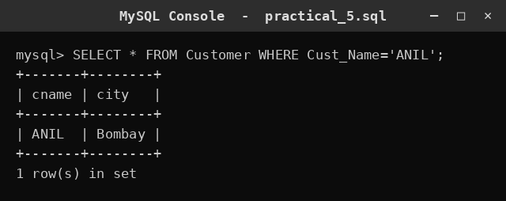
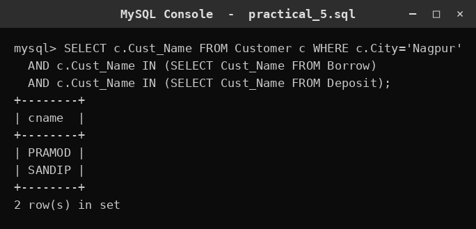
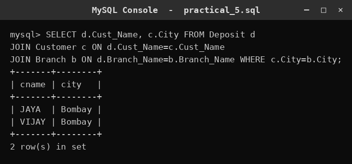
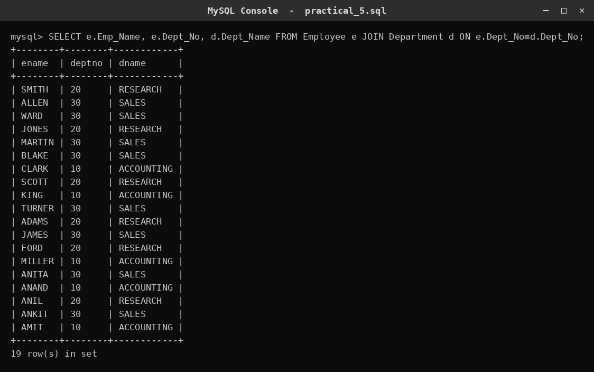
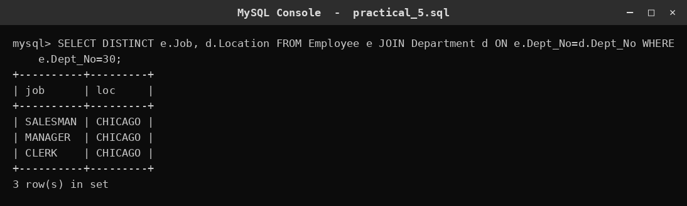
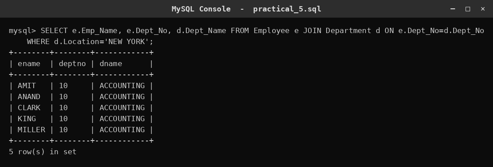
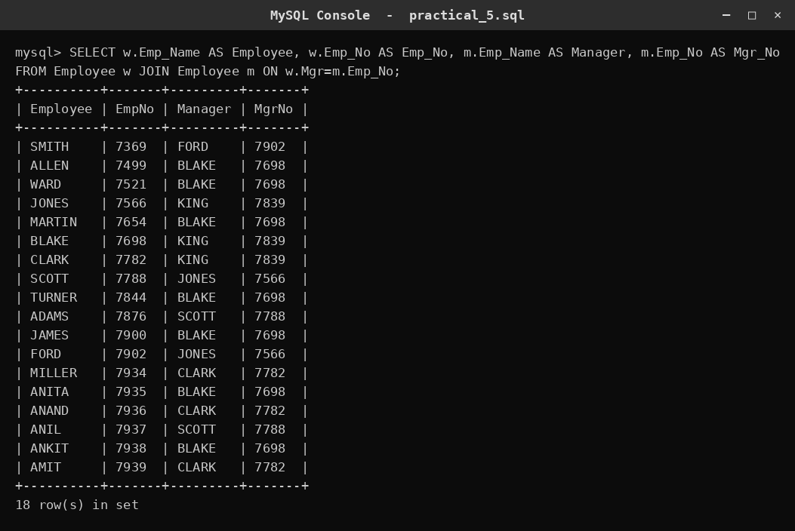
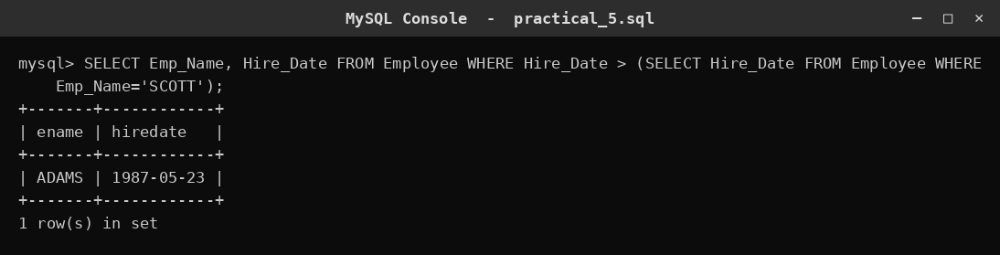

# SQL Practical 5 — Joins (Data from Multiple Tables)

> SQL Lab · Lab Manual · B.Sc. (Artificial Intelligence), Semester I

## 📌 What this practical covers
- Why joins exist and what problem they solve
- The **INNER JOIN / equi-join** and the **ON** condition
- Using **table aliases** to keep queries short and clear
- The **SELF-JOIN** — joining a table to itself (employee to manager)
- **Multi-table joins** linking three tables at once
- The difference between **inner** and **outer** joins

## 🎯 Aim
To display data from multiple tables using joins.

## 🧠 The big idea
In a good database we **do not repeat information**. The employee's department name is stored once, in the `Department` table, and the `Employee` table keeps only the department number. This keeps data tidy — change the department name in one place and everyone sees it. But it creates a new need: to *read* a full sentence like "SCOTT works in RESEARCH", we must **combine** two tables.

A **join** does exactly that. It uses a **common column** (a key) that both tables share — here, `Dept_No` — to match each employee with the correct department.

Think of two attendance registers: one lists students with a *class code*, another lists each *class code* with the teacher's name. To find "which teacher does Riya have?", you look up Riya's class code in the first register, then find that code in the second. A join is that lookup done automatically for every row, matching the codes.

## 🔍 Deep dive

### Why joins exist
Storing the same department name on every employee row would waste space and risk mistakes (change it in one row, forget the others). Instead we store the **key** (`Dept_No`) and look up the details only when needed. A join is the bridge between a table that *has the key* and a table that *explains the key*.

### INNER JOIN (equi-join)
An **INNER JOIN** returns only the rows where the key matches in **both** tables. Rows with no match are dropped.

```sql
SELECT e.Emp_Name, d.Dept_Name
FROM Employee e
JOIN Department d ON e.Dept_No = d.Dept_No;
```

- `FROM Employee e` — the first table, given the short alias `e`.
- `JOIN Department d` — the second table, aliased `d`.
- `ON e.Dept_No = d.Dept_No` — the matching rule. Only employees whose `Dept_No` exists in `Department` appear.

"Equi-join" just means the ON condition uses **equality** (`=`).

### The ON condition
`ON` is the *match rule*. It compares a column from each table. A wrong ON (or forgetting it) is the most common join bug — without it, you get a **cartesian product**: every employee paired with every department, which is meaningless.

### Table aliases
An **alias** is a short nickname for a table (`Employee e`). It saves typing and, crucially, lets you say *which table* a column comes from: `e.Dept_No` vs `d.Dept_No`. When both tables have a column with the same name (like `Dept_No` or `Cust_Name`), the alias is the only way to tell them apart.

### SELF-JOIN
A **self-join** joins a table to itself. The classic case: an employee's `Mgr` column stores the **Emp_No of their manager**, who is also an employee in the same table. To show the manager's *name*, we join `Employee` to `Employee`.

```sql
SELECT w.Emp_Name AS Employee, m.Emp_Name AS Manager
FROM Employee w
JOIN Employee m ON w.Mgr = m.Emp_No;
```

The trick is two **different aliases** (`w` = worker, `m` = manager) so SQL can treat the one table as if it were two. `w.Mgr = m.Emp_No` means "the worker's manager number equals the manager's own employee number".

### Multi-table joins
You can chain joins. Each `JOIN … ON …` adds one more table. Query 3 links `Deposit`, `Customer` and `Branch` in one go — first matching deposits to customers by name, then matching deposits to branches by branch name.

```sql
SELECT d.Cust_Name, c.City
FROM Deposit d
JOIN Customer c ON d.Cust_Name = c.Cust_Name
JOIN Branch b ON d.Branch_Name = b.Branch_Name
WHERE c.City = b.City;
```

### Inner vs outer joins
- **INNER JOIN** — keeps only matching rows. If a customer has no deposit, they vanish from the result.
- **LEFT (OUTER) JOIN** — keeps *all* rows from the left table, filling unmatched right-side columns with NULL. Use it when you want "everyone, even those with no match".
- **RIGHT JOIN** — the mirror image: all rows from the right table.

For this practical we use INNER JOIN, where both sides must match.

### Subqueries as an alternative
Sometimes you do not need a join at all — a **subquery** (a query inside a query) can answer the question. Query 2 finds customers who both borrow and deposit, using `IN (SELECT …)`. Query 8 finds employees hired after SCOTT, using a subquery to get SCOTT's date first. A join and a subquery can often give the same answer; the join is usually clearer when you need columns from both tables.

## 📖 Key terms

| Term | Meaning |
| :--- | :--- |
| Join | Combining rows from two or more tables using a matching condition. |
| Key / common column | The column both tables share, used to match rows (e.g. Dept_No). |
| INNER JOIN | Returns only rows that match in both tables. |
| Equi-join | A join whose ON condition uses equality (=). |
| ON | The condition that says how the two tables are matched. |
| Table alias | A short nickname for a table (e.g. Employee e). |
| SELF-JOIN | Joining a table to itself, using two aliases. |
| Cartesian product | Every row paired with every row — the result of a missing/incorrect ON. |
| LEFT / RIGHT OUTER JOIN | Keeps all rows from one side, filling the other side with NULL. |
| Subquery | A query nested inside another query. |

## 🧾 Query-by-query walkthrough

### Query 1 — Find one customer
**What it does:** Shows every column of the customer named ANIL from the Customer table.
```sql
SELECT * FROM Customer WHERE Cust_Name = 'ANIL';
```


### Query 2 — Nagpur customers who both borrow and deposit
**What it does:** Uses two subqueries to keep only Nagpur customers whose name appears in both Borrow and Deposit.
```sql
SELECT c.Cust_Name FROM Customer c WHERE c.City = 'Nagpur' AND c.Cust_Name IN (SELECT Cust_Name FROM Borrow) AND c.Cust_Name IN (SELECT Cust_Name FROM Deposit);
```


### Query 3 — Deposits in a customer's own city
**What it does:** Joins Deposit, Customer and Branch, then keeps only rows where the customer's city equals the branch's city.
```sql
SELECT d.Cust_Name, c.City FROM Deposit d JOIN Customer c ON d.Cust_Name = c.Cust_Name JOIN Branch b ON d.Branch_Name = b.Branch_Name WHERE c.City = b.City;
```


### Query 4 — Each employee with their department name
**What it does:** Joins Employee to Department on Dept_No to show the employee's name beside the department name.
```sql
SELECT e.Emp_Name, e.Dept_No, d.Dept_Name FROM Employee e JOIN Department d ON e.Dept_No = d.Dept_No;
```


### Query 5 — Jobs and location in department 30
**What it does:** Shows the distinct job titles and the location for department number 30.
```sql
SELECT DISTINCT e.Job, d.Location FROM Employee e JOIN Department d ON e.Dept_No = d.Dept_No WHERE e.Dept_No = 30;
```


### Query 6 — Employees in NEW YORK
**What it does:** Joins Employee and Department and keeps only rows where the department's location is NEW YORK.
```sql
SELECT e.Emp_Name, e.Dept_No, d.Dept_Name FROM Employee e JOIN Department d ON e.Dept_No = d.Dept_No WHERE d.Location = 'NEW YORK';
```


### Query 7 — Employee and their manager (self-join)
**What it does:** Joins Employee to itself to print each worker next to their manager's name and number.
```sql
SELECT w.Emp_Name AS Employee, w.Emp_No AS Emp_No, m.Emp_Name AS Manager, m.Emp_No AS Mgr_No FROM Employee w JOIN Employee m ON w.Mgr = m.Emp_No;
```


### Query 8 — Employees hired after SCOTT
**What it does:** A subquery fetches SCOTT's hire date, then the outer query lists everyone hired later than that date.
```sql
SELECT Emp_Name, Hire_Date FROM Employee WHERE Hire_Date > (SELECT Hire_Date FROM Employee WHERE Emp_Name = 'SCOTT');
```


## ⚠️ Common mistakes
- **Forgetting the ON condition** (or writing it wrong), which produces a cartesian product — every row paired with every row.
- Not using **aliases**, then getting "ambiguous column" errors because both tables have a column with the same name.
- Confusing **INNER JOIN with LEFT JOIN** — an inner join silently drops unmatched rows, which surprises people who expected to see everyone.
- Joining on the **wrong column** (e.g. matching a name where you meant a number), which gives wrong matches or none at all.
- In a **self-join**, using the same alias for both copies, or matching `w.Emp_No = m.Emp_No` instead of `w.Mgr = m.Emp_No`.

## ✅ Key takeaways
- Joins combine tables through a **shared key**, so data can stay un-repeated in the database.
- **INNER JOIN** keeps only matching rows; **outer joins** keep all rows from one side.
- **Aliases** make multi-table queries readable and remove ambiguity.
- A **self-join** (two aliases on one table) answers "who reports to whom" questions.
- A **subquery** can often replace a join; choose whichever is clearer for the question.

## 🏋️ Try it yourself
1. Show each employee's name and department name, but only for departments located in CHICAGO.
2. List every deposit's amount along with the customer's city (join Deposit to Customer).
3. Show each employee's name and their manager's name, only where the manager is in the same department.
4. Use a subquery to list customers who have a deposit but no borrow entry.
