# SQL Practical 6 — Group Functions (Aggregating Data)

> SQL Lab · Lab Manual · B.Sc. (Artificial Intelligence), Semester I

## 📌 What this practical covers
- The five core group (aggregate) functions: `SUM`, `MAX`, `MIN`, `AVG`, `COUNT`
- How a group function turns *many rows into one single summary value*
- Using `GROUP BY` so the database gives you *one result row per group*
- Using `HAVING` to filter whole groups, and how it differs from `WHERE`
- Combining group functions with `JOIN`s across the `Deposit`, `Customer` and `Branch` tables
- Rounding results, naming them with aliases, and ordering the output

## 🎯 Aim
To apply group functions to aggregate data in SQL.

## 🧠 The big idea
So far, every query you wrote returned rows that looked like the rows in the table — if you selected 10 employees, you got 10 lines back. A **group function** breaks that rule on purpose. It looks at a whole column of many rows and squeezes it down into **one number**. Ask "what is the total salary of all employees?" and you do not want a list of salaries; you want a single value. That is exactly what `SUM(Salary)` gives you.

Think of a classroom of 40 students. `COUNT(*)` tells you how many students there are, `MAX(Marks)` is the topper's score, `MIN(Marks)` is the lowest, `AVG(Marks)` is the class average, and `SUM(Marks)` is the total of all marks. Each of these is **one number describing the whole class**. Now imagine you sort the students into four houses and ask the same questions *for each house separately* — that is what `GROUP BY` does. It splits the rows into buckets and runs the group function inside each bucket, giving you one summary row per bucket. `HAVING` is the final filter that lets you keep only the buckets you care about.

## 🔍 Deep dive

### What a group function really does
A group function (also called an **aggregate function**) takes a *set* of values — usually one column across many rows — and returns a *single* value. Because of this, you cannot mix a group function freely with a normal column in the same `SELECT` list: the normal column would have many values while the group function has only one. The one exception is when you also use `GROUP BY`, because then the normal column is *the thing you are grouping by*, and it holds the same value inside each group.

```sql
-- This is fine: one summary value from the whole table.
SELECT SUM(Salary) FROM Employee;

-- This is NOT allowed on its own, because Dept_No has many rows
-- while SUM(Salary) has just one:
SELECT Dept_No, SUM(Salary) FROM Employee;   -- error

-- But this IS allowed: Dept_No is the grouping key.
SELECT Dept_No, SUM(Salary) FROM Employee GROUP BY Dept_No;
```

### The five core group functions
| Function | What it answers | Example |
| :--- | :--- | :--- |
| `SUM(col)` | Total of all values | `SUM(Amount)` = total money deposited |
| `MAX(col)` | Largest value | `MAX(Salary)` = highest salary |
| `MIN(col)` | Smallest value | `MIN(Salary)` = lowest salary |
| `AVG(col)` | Mean (total ÷ count) | `AVG(Salary)` = average salary |
| `COUNT(*)` | Number of rows | how many employees exist |

`SUM`, `AVG`, `MAX` and `MIN` work on numbers. `MAX` and `MIN` also work on text and dates (for example `MAX(Hire_Date)` = the most recent joining date, because dates are ordered in time). `COUNT` works on anything.

### COUNT(*) versus COUNT(column)
`COUNT(*)` counts **rows**, including rows that contain `NULL`. `COUNT(column)` counts only the rows where that column is **not `NULL`**. In the `Employee` table, `Comm` (commission) is often `NULL` for employees who earn no commission. So `COUNT(*)` counts every employee, but `COUNT(Comm)` counts only those who actually receive a commission. Knowing the difference prevents a very common bug.

```sql
SELECT COUNT(*)    AS total_employees,   -- all rows
       COUNT(Comm) AS paid_commission    -- only non-NULL commissions
FROM Employee;
```

### GROUP BY — one row per group
`GROUP BY` tells SQL to collect rows that share the same value(s) in the listed column(s) into a group, then apply the group function once per group. The column you group by appears in the output exactly once per group, so you get **one row per distinct group**.

```sql
-- One row for every department, showing that department's average salary.
SELECT Dept_No, AVG(Salary)
FROM Employee
GROUP BY Dept_No;
```

If `Employee` has rows for departments 10, 20 and 30, this returns three rows — one per department — no matter how many employees each department has.

### HAVING — filtering after grouping
You cannot use `WHERE` to filter on a group function, because `WHERE` runs *before* the groups even exist. To keep only some groups, use `HAVING`, which runs *after* grouping. `HAVING AVG(Salary) > 2000` means "keep only the departments whose average salary crosses 2000".

```sql
SELECT Dept_No, AVG(Salary)
FROM Employee
GROUP BY Dept_No
HAVING AVG(Salary) > 2000;
```

### WHERE versus HAVING — the golden rule
This is the single most important idea in this practical.

- **`WHERE` filters rows *before* grouping.** It decides which rows are allowed into the groups in the first place.
- **`HAVING` filters groups *after* grouping.** It decides which finished groups are shown.

A useful mental picture: `WHERE` is the gate that decides who enters the room; `GROUP BY` is the seating into groups; `HAVING` is the bouncer who throws out entire groups that do not qualify. Because of this ordering, `WHERE` can never see a group function, and `HAVING` can see both group functions and (in many databases) the grouping columns.

```sql
-- WHERE removes the PRESIDENT row before grouping;
-- HAVING then keeps only job groups whose total salary exceeds 3000.
SELECT Job, SUM(Salary)
FROM Employee
WHERE Job <> 'PRESIDENT'
GROUP BY Job
HAVING SUM(Salary) > 3000;
```

### Grouping by more than one column
You may list several columns in `GROUP BY`. Then a "group" is a *combination* of values — for example, one group per (department, job) pair. The output has one row for each distinct combination that actually appears in the table.

```sql
SELECT Dept_No, Job, SUM(Salary)
FROM Employee
GROUP BY Dept_No, Job;
```

### Group functions with JOINs
A group function does not have to work on a single table. You can `JOIN` tables first, and then aggregate over the joined result. This lets you answer questions like "total deposits made in Nagpur", where the *amount* lives in `Deposit` but the *city* lives in `Customer`.

```sql
SELECT SUM(d.Amount)
FROM Deposit d
JOIN Customer c ON d.Cust_Name = c.Cust_Name
WHERE c.City = 'Nagpur';
```

### Doing maths on the results (ROUND, arithmetic, ordering)
- `ROUND(x, 2)` rounds a number to 2 decimal places — handy because `AVG` often produces long decimals.
- You can do arithmetic on aggregates directly: `MAX(Salary) - MIN(Salary)` is the salary *range*.
- `AS name` gives a column a friendly heading. In MySQL, headings that contain spaces must be wrapped in backticks, e.g. `` AS `Total Deposit` ``.
- You can `ORDER BY` a group function to sort the grouped output.

```sql
SELECT MAX(Salary) - MIN(Salary) AS DIFFERENCE FROM Employee;

SELECT Job, SUM(Salary) AS total
FROM Employee
GROUP BY Job
ORDER BY SUM(Salary);
```

## 📖 Key terms
| Term | Meaning |
| :--- | :--- |
| Group function (aggregate function) | A function that takes many rows and returns one summary value (`SUM`, `MAX`, `MIN`, `AVG`, `COUNT`). |
| `SUM` | Adds up all the values in a column. |
| `AVG` | The arithmetic mean = total ÷ number of rows. |
| `MAX` / `MIN` | The largest / smallest value in a column. |
| `COUNT(*)` | Counts rows, including those with `NULL`s. |
| `COUNT(col)` | Counts only rows where `col` is not `NULL`. |
| `GROUP BY` | Splits rows into groups so a group function runs once per group. |
| `HAVING` | Filters whole groups *after* grouping (used with group functions). |
| `WHERE` | Filters individual rows *before* grouping. |
| Alias (`AS`) | A temporary name given to a column in the result. |
| `ROUND(x, n)` | Rounds `x` to `n` decimal places. |
| `NULL` | "No value"; ignored by most group functions. |

## 🧾 Query-by-query walkthrough

### Query 1 — Total deposits after a date
**What it does:** Adds up the `Amount` of every deposit made after 1 Jan 1996, giving one grand total.
```sql
SELECT SUM(Amount) AS `Total Deposit` FROM Deposit WHERE Act_Date > '1996-01-01';
```
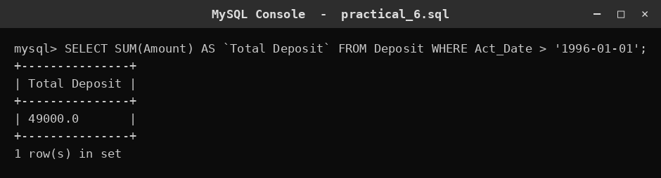

### Query 2 — Total deposits made in Nagpur
**What it does:** Joins `Deposit` with `Customer` to find the city of each depositor, keeps only Nagpur, and sums those amounts.
```sql
SELECT SUM(d.Amount) AS `Total Deposit` FROM Deposit d JOIN Customer c ON d.Cust_Name = c.Cust_Name WHERE c.City = 'Nagpur';
```
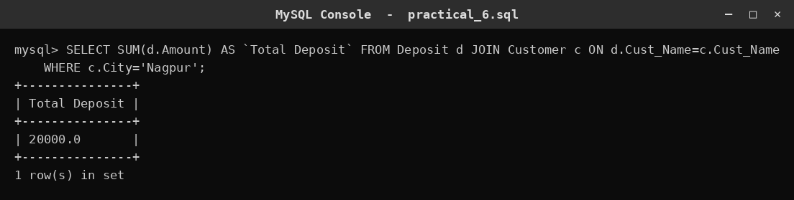

### Query 3 — Largest single deposit in Bombay
**What it does:** Joins the two tables, restricts to customers in Bombay, and returns the biggest single deposit amount.
```sql
SELECT MAX(d.Amount) AS `Max Deposit` FROM Deposit d JOIN Customer c ON d.Cust_Name = c.Cust_Name WHERE c.City = 'Bombay';
```
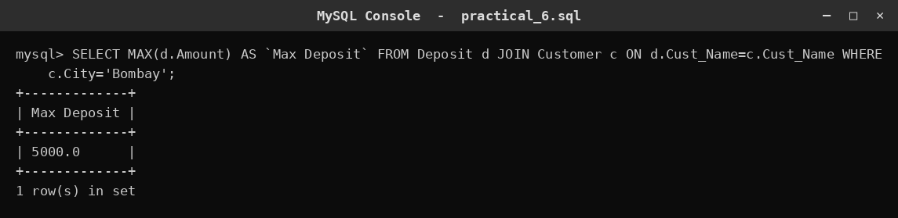

### Query 4 — Salary summary of all employees
**What it does:** Produces four numbers in one row: the highest, lowest, total and rounded-average salary.
```sql
SELECT MAX(Salary) AS Highest, MIN(Salary) AS Lowest, SUM(Salary) AS Sum, ROUND(AVG(Salary), 2) AS Average FROM Employee;
```
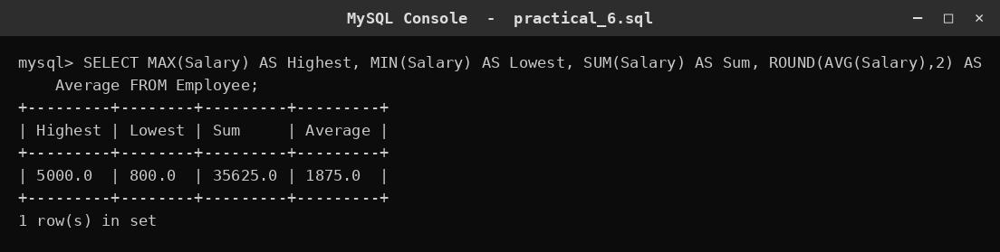

### Query 5 — Salary range
**What it does:** Subtracts the lowest salary from the highest to show the spread (range) of salaries.
```sql
SELECT MAX(Salary) - MIN(Salary) AS DIFFERENCE FROM Employee;
```
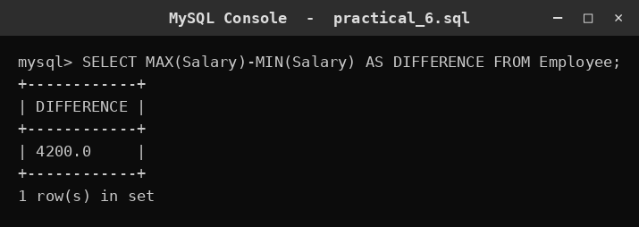

### Query 6 — Hiring counts per year
**What it does:** Counts all employees, then uses the trick that a true comparison equals 1, summing to count hires in each of the years 1995–1998.
```sql
SELECT COUNT(*) AS Total, SUM(YEAR(Hire_Date) = 1995) AS `1995`, SUM(YEAR(Hire_Date) = 1996) AS `1996`, SUM(YEAR(Hire_Date) = 1997) AS `1997`, SUM(YEAR(Hire_Date) = 1998) AS `1998` FROM Employee;
```
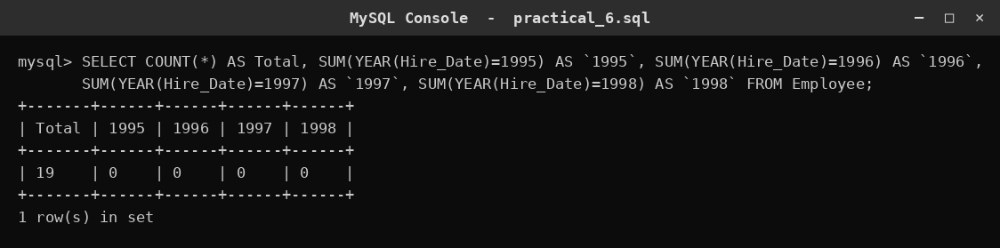

### Query 7 — Average salary per department
**What it does:** Groups employees by `Dept_No` and shows the rounded average salary of each department (one row per department).
```sql
SELECT ROUND(AVG(Salary), 2) AS `Average Salary` FROM Employee GROUP BY Dept_No;
```
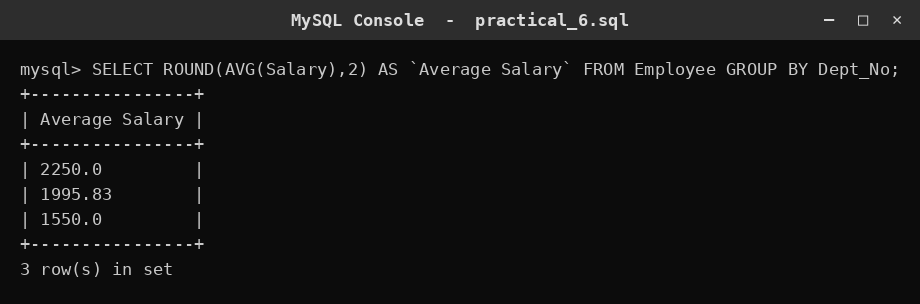

### Query 8 — Total salary per department and job
**What it does:** Groups by two columns at once — department *and* job — giving the total salary for each distinct combination.
```sql
SELECT Dept_No, Job, SUM(Salary) AS `Total Salary` FROM Employee GROUP BY Dept_No, Job;
```
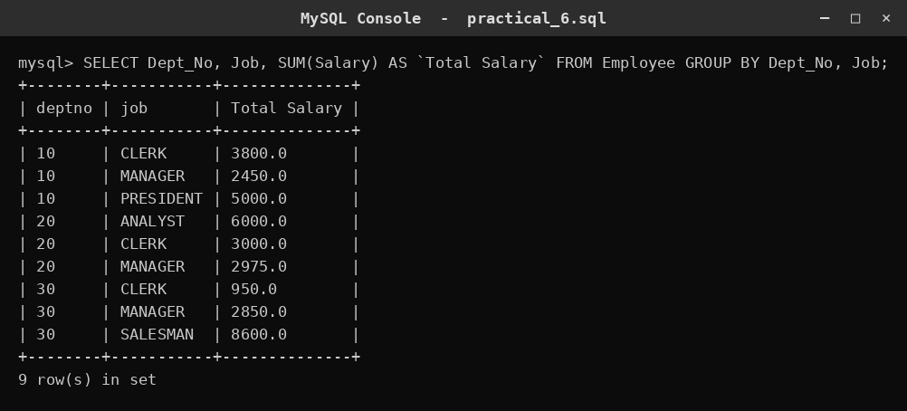

### Query 9 — Departments whose average salary beats 2000
**What it does:** Groups by department, then uses `HAVING` to keep only departments whose average salary is greater than 2000.
```sql
SELECT ROUND(AVG(Salary), 2) AS `Average Salary` FROM Employee GROUP BY Dept_No HAVING AVG(Salary) > 2000;
```
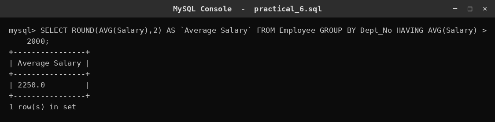

### Query 10 — High-paying jobs, President excluded
**What it does:** Uses `WHERE` to drop the PRESIDENT before grouping, groups the rest by job, keeps job groups totalling over 3000, and sorts them.
```sql
SELECT Job, SUM(Salary) AS `Total Salary` FROM Employee WHERE Job <> 'PRESIDENT' GROUP BY Job HAVING SUM(Salary) > 3000 ORDER BY SUM(Salary);
```
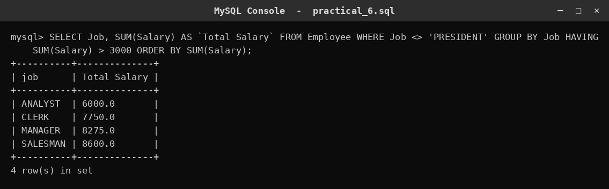

### Query 11 — Bombay branches with big deposits
**What it does:** Joins `Deposit` with `Branch`, keeps only Bombay branches, groups by branch name, and shows branches whose total deposits exceed 5000.
```sql
SELECT b.Branch_Name, SUM(d.Amount) AS `Total Deposit` FROM Deposit d JOIN Branch b ON d.Branch_Name = b.Branch_Name WHERE b.City = 'Bombay' GROUP BY b.Branch_Name HAVING SUM(d.Amount) > 5000;
```
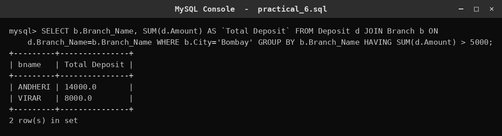

## ⚠️ Common mistakes
- **Putting a group function in `WHERE`.** `WHERE AVG(Salary) > 2000` fails. Aggregate conditions belong in `HAVING`.
- **Forgetting `GROUP BY`.** `SELECT Dept_No, SUM(Salary) FROM Employee;` errors because `Dept_No` has many values but `SUM` has one. Add `GROUP BY Dept_No`.
- **Confusing `COUNT(*)` with `COUNT(Comm)`.** The first counts every row; the second skips rows where `Comm` is `NULL`.
- **Mixing up `WHERE` and `HAVING` order.** `WHERE` filters rows *before* grouping; `HAVING` filters groups *after*. Swapping them changes the answer or breaks the query.
- **Forgetting to round `AVG`.** Averages often print long decimals; wrap them in `ROUND(AVG(x), 2)`.
- **Headings with spaces without backticks.** `` AS Total Deposit `` fails; write `` AS `Total Deposit` ``.

## ✅ Key takeaways
- Group functions (`SUM`, `MAX`, `MIN`, `AVG`, `COUNT`) collapse many rows into **one** value.
- `GROUP BY` gives **one output row per group**; without it, an aggregate summarises the whole table.
- `WHERE` filters **rows before** grouping; `HAVING` filters **groups after** grouping.
- Group functions work happily after `JOIN`s, so you can aggregate across related tables.
- `COUNT(*)` counts rows; `COUNT(col)` counts only non-`NULL` values.
- `ROUND`, arithmetic and `ORDER BY` let you polish and sort aggregated output.

## 🏋️ Try it yourself
1. Show the total commission (`SUM(Comm)`) paid to all employees, and the number of employees who actually earn a commission.
2. List each `Branch_Name` with its total deposit amount, but show only branches whose total is above 4000, sorted from largest to smallest.
3. For every `Job`, display the highest and lowest salary, and the difference between them.
