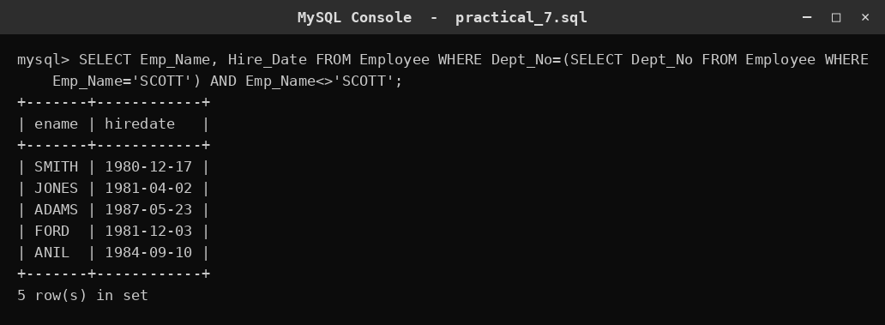
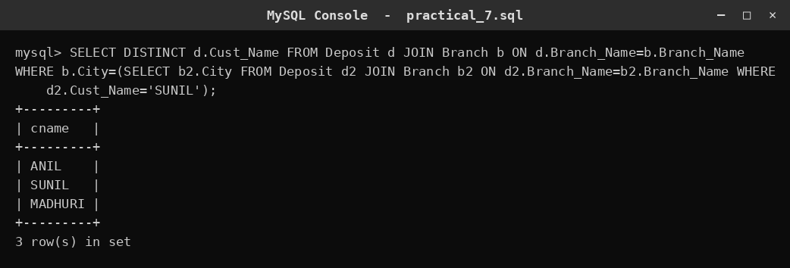
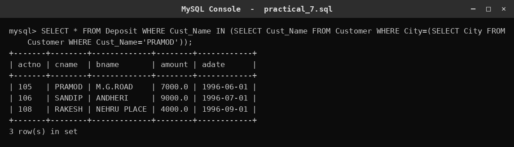
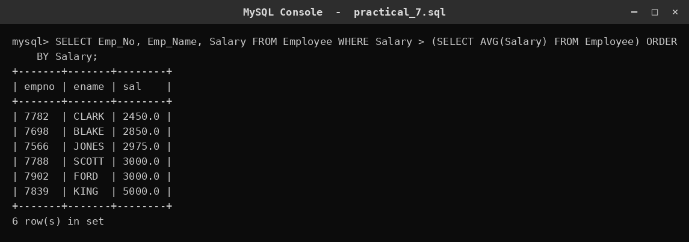
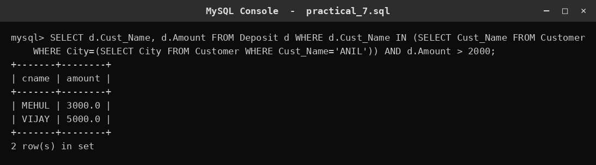
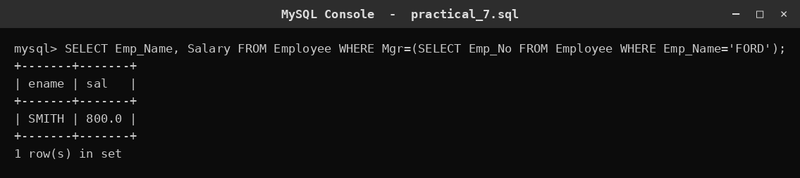
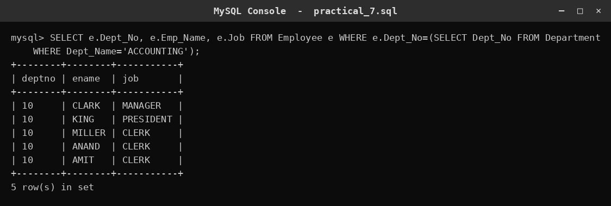
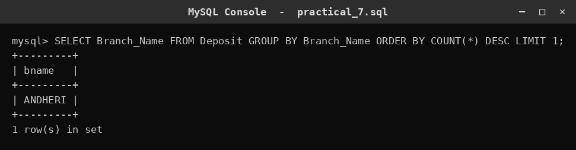
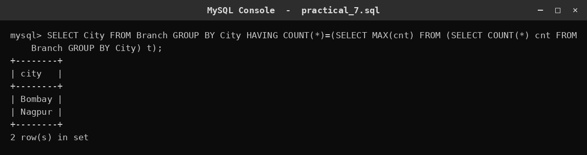
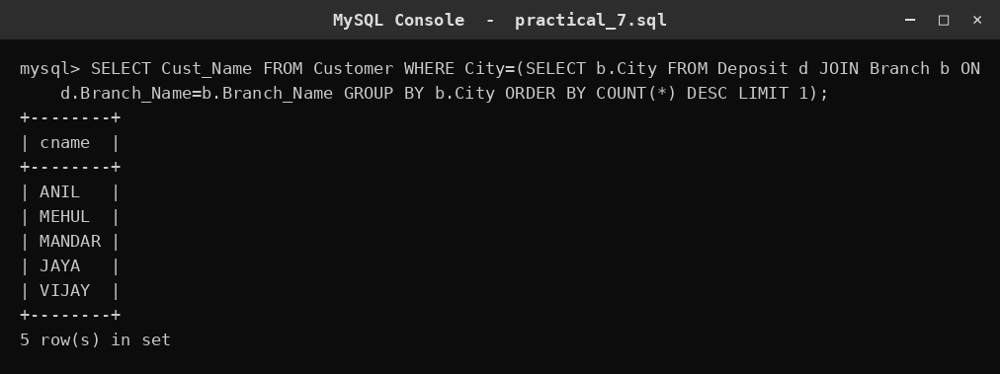

# SQL Practical 7 — Sub-queries

> **SQL Lab — Lab Manual**  
> B.Sc. (Artificial Intelligence), Semester I

---

## 🎯 Aim

To solve queries using the concept of sub-queries.

## 📌 Objective

Nest one query inside another to supply values or sets of values to the outer query.

## 🧠 Concept in simple words

A sub-query is a SELECT statement written inside another statement. A single-row sub-query returns one value and is compared with =, > or <; a multiple-row sub-query returns several values and is used with IN; and a correlated sub-query refers to a column of the outer query and is re-evaluated for each row. Sub-queries solve problems such as 'find employees who earn more than the average' where the value needed is not known in advance.

## 🔑 Basic concepts used

| Concept | Meaning |
| :--- | :--- |
| `Sub-query` | A query nested inside another query. |
| `Single-row sub-query` | Returns exactly one value, compared with =, >, <. |
| `Multiple-row sub-query` | Returns several values, used with IN. |
| `Correlated sub-query` | Refers to the outer query and runs once per row. |

## ▶️ How to use

Run the script in MySQL; each query below contains an inner query that feeds the outer one.

### Script file

[`practical_7.sql`](./practical_7.sql)

## 🧾 Queries & Output

### Query 1

**What this does:** Finds employees in the same department as SCOTT, excluding SCOTT.

```sql
SELECT Emp_Name, Hire_Date FROM Employee WHERE Dept_No=(SELECT Dept_No FROM Employee WHERE Emp_Name='SCOTT') AND Emp_Name<>'SCOTT';
```



### Query 2

**What this does:** Finds depositors whose branch city is the same as SUNIL's branch city.

```sql
SELECT DISTINCT d.Cust_Name FROM Deposit d JOIN Branch b ON d.Branch_Name=b.Branch_Name
WHERE b.City=(SELECT b2.City FROM Deposit d2 JOIN Branch b2 ON d2.Branch_Name=b2.Branch_Name WHERE d2.Cust_Name='SUNIL');
```



### Query 3

**What this does:** Finds deposits of customers who live in the same city as PRAMOD.

```sql
SELECT * FROM Deposit WHERE Cust_Name IN (SELECT Cust_Name FROM Customer WHERE City=(SELECT City FROM Customer WHERE Cust_Name='PRAMOD'));
```



### Query 4

**What this does:** Lists employees earning more than the average salary, sorted by salary.

```sql
SELECT Emp_No, Emp_Name, Salary FROM Employee WHERE Salary > (SELECT AVG(Salary) FROM Employee) ORDER BY Salary;
```



### Query 5

**What this does:** Lists depositors who live in ANIL's city and have deposited more than 2000.

```sql
SELECT d.Cust_Name, d.Amount FROM Deposit d WHERE d.Cust_Name IN (SELECT Cust_Name FROM Customer WHERE City=(SELECT City FROM Customer WHERE Cust_Name='ANIL')) AND d.Amount > 2000;
```



### Query 6

**What this does:** Lists employees who report to FORD (their manager is FORD).

```sql
SELECT Emp_Name, Salary FROM Employee WHERE Mgr=(SELECT Emp_No FROM Employee WHERE Emp_Name='FORD');
```



### Query 7

**What this does:** Lists employees in the ACCOUNTING department.

```sql
SELECT e.Dept_No, e.Emp_Name, e.Job FROM Employee e WHERE e.Dept_No=(SELECT Dept_No FROM Department WHERE Dept_Name='ACCOUNTING');
```



### Query 8

**What this does:** Finds the branch with the highest number of depositors.

```sql
SELECT Branch_Name FROM Deposit GROUP BY Branch_Name ORDER BY COUNT(*) DESC LIMIT 1;
```



### Query 9

**What this does:** Finds the cities that have the maximum number of branches.

```sql
SELECT City FROM Branch GROUP BY City HAVING COUNT(*)=(SELECT MAX(cnt) FROM (SELECT COUNT(*) cnt FROM Branch GROUP BY City) t);
```



### Query 10

**What this does:** Finds customers living in the city that has the most depositors.

```sql
SELECT Cust_Name FROM Customer WHERE City=(SELECT b.City FROM Deposit d JOIN Branch b ON d.Branch_Name=b.Branch_Name GROUP BY b.City ORDER BY COUNT(*) DESC LIMIT 1);
```



## ✅ Conclusion

Sub-queries let a query answer a question whose answer depends on another query's result.
