# SQL Practical 8 — Manipulating Data (UPDATE & DELETE)

> **SQL Lab — Lab Manual**  
> B.Sc. (Artificial Intelligence), Semester I

---

## 🎯 Aim

To manipulate data using UPDATE and DELETE statements with conditions and sub-queries.

## 📌 Objective

Change and remove rows safely using a precise WHERE clause.

## 🧠 Concept in simple words

This practical modifies data with UPDATE ... SET and removes data with DELETE, both controlled by a WHERE condition that may itself contain a sub-query. Because a single statement can affect many rows at once, the WHERE clause must be written carefully. Displaying the table before and after each change makes the effect easy to verify.

## 🔑 Basic concepts used

| Concept | Meaning |
| :--- | :--- |
| `UPDATE ... SET` | Changes column values of the rows that match WHERE. |
| `DELETE FROM` | Removes the rows that match WHERE. |
| `Sub-query in WHERE` | Supplies the rows to be changed or deleted. |
| `CASE in UPDATE` | Sets different values for different rows in one statement. |

## ▶️ How to use

Run the script in MySQL and compare the deposit and borrowing tables before and after each statement.

### Script file

[`practical_8.sql`](./practical_8.sql)

## 🧾 Queries & Output

### Query 1

**What this does:** Gives 10% interest to every depositor by multiplying each amount by 1.10.

```sql
UPDATE Deposit SET Amount = Amount * 1.10;
```

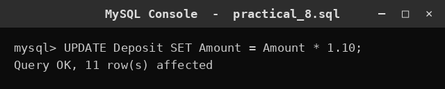

### Query 2

**What this does:** Shows all deposit records after the first update.

```sql
SELECT * FROM Deposit;
```

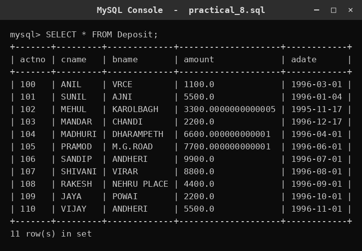

### Query 3

**What this does:** Gives 10% interest only to depositors of branch VRCE.

```sql
UPDATE Deposit SET Amount = Amount * 1.10 WHERE Branch_Name='VRCE';
```

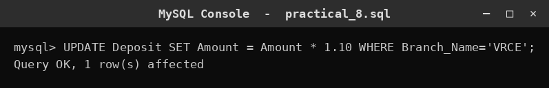

### Query 4

**What this does:** Gives 10% interest to depositors who live in Nagpur and bank at a Bombay branch.

```sql
UPDATE Deposit SET Amount = Amount * 1.10
WHERE Cust_Name IN (SELECT Cust_Name FROM Customer WHERE City='Nagpur')
  AND Branch_Name IN (SELECT Branch_Name FROM Branch WHERE City='Bombay');
```

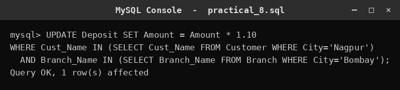

### Query 5

**What this does:** Sets employees doing SCOTT's job to TURNER's department number.

```sql
UPDATE Employee SET Dept_No=(SELECT Dept_No FROM (SELECT Dept_No FROM Employee WHERE Emp_No=7844) t)
WHERE Job=(SELECT Job FROM (SELECT Job FROM Employee WHERE Emp_No=7788) t2);
```

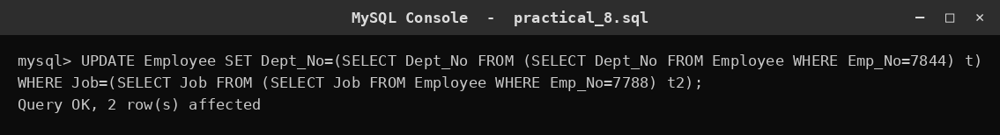

### Query 6

**What this does:** Transfers Rs.10 from ANIL to SUNIL when they share a branch, using CASE.

```sql
UPDATE Deposit SET Amount = CASE WHEN Cust_Name='ANIL' THEN Amount-10 WHEN Cust_Name='SUNIL' THEN Amount+10 ELSE Amount END
WHERE Branch_Name IN (SELECT Branch_Name FROM (SELECT Branch_Name FROM Deposit WHERE Cust_Name='ANIL') t)
  AND Branch_Name IN (SELECT Branch_Name FROM (SELECT Branch_Name FROM Deposit WHERE Cust_Name='SUNIL') t2);
```

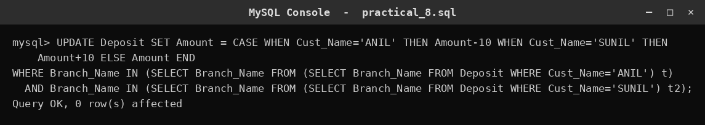

### Query 7

**What this does:** Adds Rs.100 to the largest depositor in each branch.

```sql
UPDATE Deposit d JOIN (SELECT Branch_Name, MAX(Amount) AS mx FROM Deposit GROUP BY Branch_Name) m
  ON d.Branch_Name=m.Branch_Name AND d.Amount=m.mx
SET d.Amount = d.Amount + 100;
```

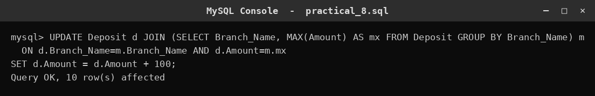

### Query 8

**What this does:** Deletes depositors of branches that have between 1 and 3 customers.

```sql
DELETE FROM Deposit WHERE Branch_Name IN (SELECT Branch_Name FROM (SELECT Branch_Name FROM Deposit GROUP BY Branch_Name HAVING COUNT(*) BETWEEN 1 AND 3) t);
```

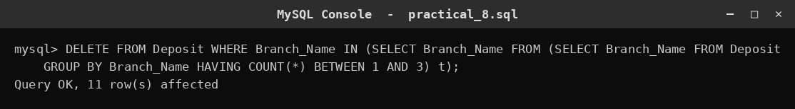

### Query 9

**What this does:** Deletes VIJAY's deposit.

```sql
DELETE FROM Deposit WHERE Cust_Name='VIJAY';
```

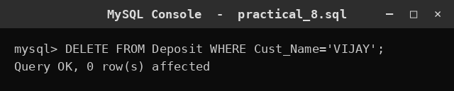

### Query 10

**What this does:** Deletes borrowers of branches whose average loan is below 1000.

```sql
DELETE FROM Borrow WHERE Branch_Name IN (SELECT Branch_Name FROM (SELECT Branch_Name FROM Borrow GROUP BY Branch_Name HAVING AVG(Amount) < 1000) t);
```

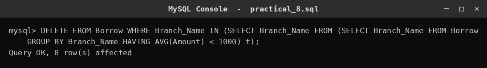

### Query 11

**What this does:** Shows all remaining borrowing records.

```sql
SELECT * FROM Borrow;
```

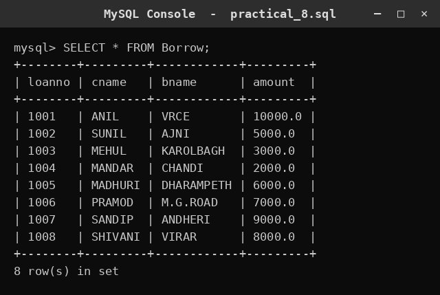

## ✅ Conclusion

UPDATE and DELETE are powerful but must be paired with a correct WHERE clause so only the intended rows change.
