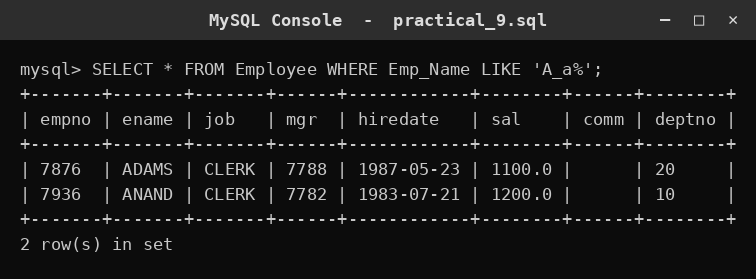
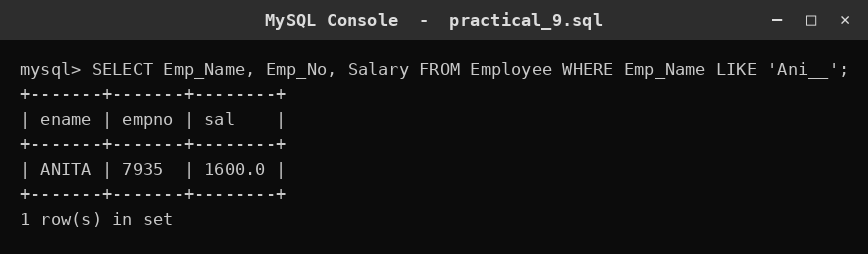
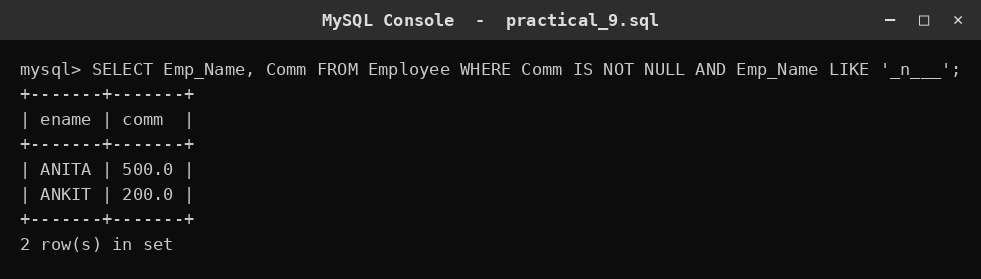
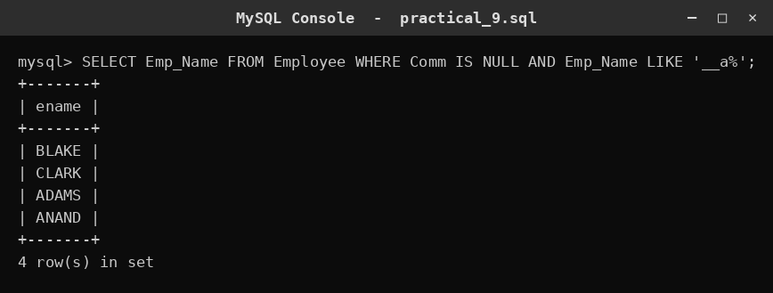
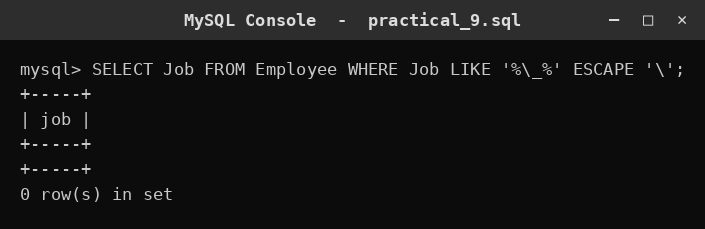

# SQL Practical 9 — LIKE Predicate

> **SQL Lab — Lab Manual**  
> B.Sc. (Artificial Intelligence), Semester I

---

## 🎯 Aim

To study the various options of the LIKE predicate in SQL.

## 📌 Objective

Match text patterns using the % and _ wildcards and the ESCAPE clause.

## 🧠 Concept in simple words

LIKE matches text against a pattern using two wildcards: % matches any number of characters (including none) and _ matches exactly one character. The ESCAPE clause lets a wildcard be treated as a normal character, for example to search for a real underscore. Combining wildcards builds patterns such as names starting with a letter, of a fixed length, or with a character in a given position.

## 🔑 Basic concepts used

| Concept | Meaning |
| :--- | :--- |
| `%` | Matches any sequence of characters (including none). |
| `_` | Matches exactly one character. |
| `LIKE 'A_a%'` | Starts with A, any 2nd character, 'a' third, then anything. |
| `ESCAPE` | Makes the next wildcard a literal character. |

## ▶️ How to use

Run the script in MySQL; each query below matches a different text pattern.

### Script file

[`practical_9.sql`](./practical_9.sql)

## 🧾 Queries & Output

### Query 1

**What this does:** LIKE 'A_a%' finds names that start with A and have 'a' as the third character.

```sql
SELECT * FROM Employee WHERE Emp_Name LIKE 'A_a%';
```



### Query 2

**What this does:** LIKE 'Ani__' finds 5-letter names beginning with 'Ani'.

```sql
SELECT Emp_Name, Emp_No, Salary FROM Employee WHERE Emp_Name LIKE 'Ani__';
```



### Query 3

**What this does:** Finds 5-letter names whose second character is 'n' and that have a commission.

```sql
SELECT Emp_Name, Comm FROM Employee WHERE Comm IS NOT NULL AND Emp_Name LIKE '_n___';
```



### Query 4

**What this does:** Finds names whose third character is 'a' and that have no commission.

```sql
SELECT Emp_Name FROM Employee WHERE Comm IS NULL AND Emp_Name LIKE '__a%';
```



### Query 5

**What this does:** Uses ESCAPE to search for a literal underscore in the job column.

```sql
SELECT Job FROM Employee WHERE Job LIKE '%\_%' ESCAPE '\';
```



## ✅ Conclusion

The % and _ wildcards turn LIKE into a flexible tool for pattern-matching text.
